The Kunpeng Ascend Developer Conference (KADC) 2026 was held in Beijing from May 22 to 23. OpenAtom openEuler took part in the Kunpeng Summit, technical sessions, livestreams, innovation exhibition, and CodeLab, sharing its latest technologies and ecosystem practices in areas such as SuperPoD OS and agent infrastructure innovation.

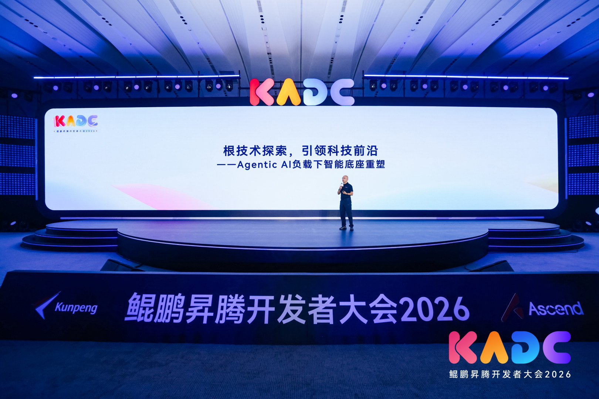

*▲ Hu Xinwei, OpenAtom openEuler Technical Committee Chairperson*

At the Kunpeng Summit, Hu Xinwei delivered a keynote titled “*Exploring Core Technologies and Advancing Innovation Frontiers: Reshaping Intelligent Infrastructure for Agentic AI Workloads*”.

In his keynote, Hu Xinwei reviewed the evolution of openEuler. The first phase focused on resource abstraction, enabling unified computing resource scheduling and collaboration across scenarios.

The second phase focused on heterogeneous convergence. Based on UnifiedBus interconnect technology, openEuler enables memory pooling and integrated computing within nodes by addressing communication and memory barriers between heterogeneous computing resources.

Looking ahead, OSs will evolve from passive execution platforms into proactive infrastructure managers capable of understanding intent and managing AI agent lifecycles. The openEuler community will continue working with ecosystem partners to explore OS capabilities for the agentic AI era.

## openEuler Technical Session: Advancing SuperPoD OS Infrastructure for Agentic AI

At the openEuler technical session, eight technical experts shared the latest progress and best practices in areas including SuperPoD OS and agentic AI.

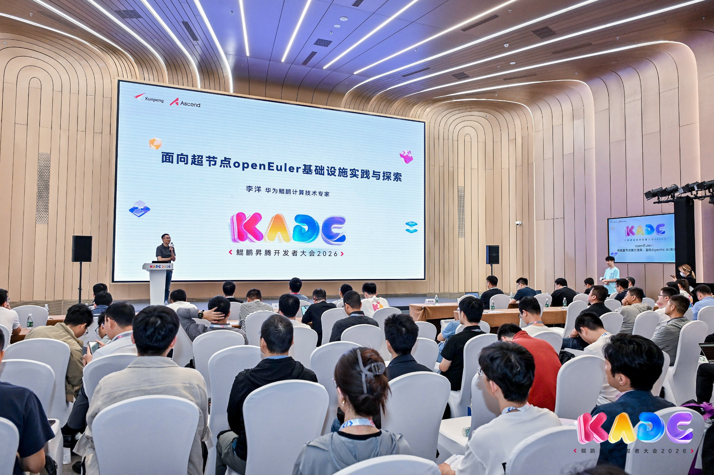

*▲ Li Yang, OpenAtom openEuler Maintainer*

The rapid development of agentic AI introduces new requirements for underlying hardware and software infrastructure.

In December 2025, the openEuler community released openEuler 24.03 LTS SP3, the first OS for SuperPoD. The release introduced three key capabilities:

- Global resource abstraction

- Heterogeneous computing resource interconnect

- Efficient and compatible scheduling interfaces

openEuler 24.03 LTS SP4 release further improves usability and reliability while enhancing latency performance:

- For usability, openEuler 24.03 LTS SP4 components support simplified installation and deployment, enabling an out-of-the-box experience.

- For reliability, openEuler 24.03 LTS SP4 can detect cross-node faults and reduce fault notification latency to less than 500 ms.

- For latency performance, openEuler 24.03 LTS SP4 leverages the UnifiedBus Memory Development Kit (UMDK) to support low-latency communication for large-scale containers.

For serverless computing on SuperPoD, openEuler leverages openYuanrong, an open-source serverless distributed computing engine, to enable efficient utilization of SuperPoD resources for workloads such as AI agents, inference, reinforcement learning, and generative recommendation across scenarios.

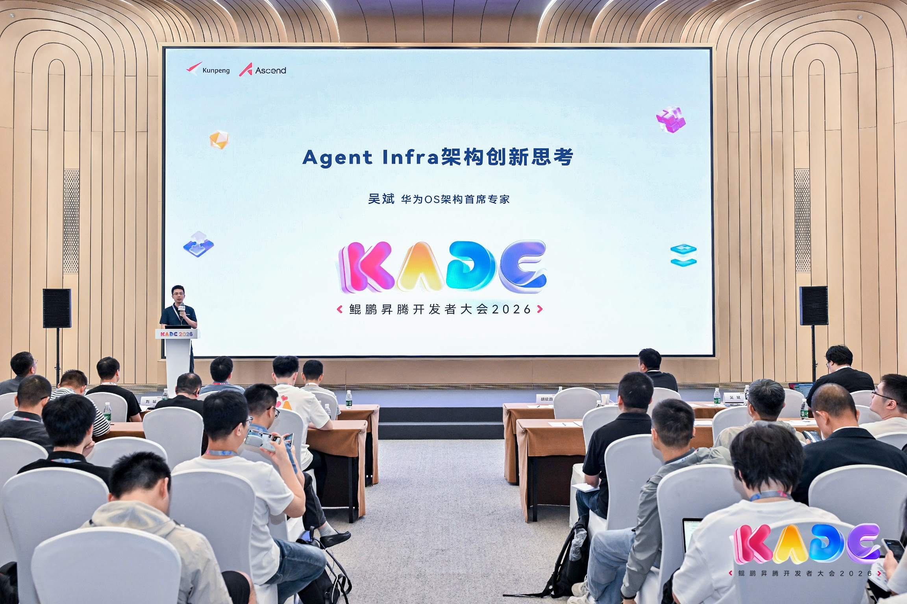

*▲ Wu Bin, OpenAtom openEuler Maintainer*

To address challenges in enterprise AI agent deployment, the openEuler community developed a lightweight agent sandbox runtime to provide a secure and efficient execution environment.

The lightweight agent sandbox runtime improves cold start performance through hardware-software co-optimization for image snapshots, combined with remote lazy loading and layered on-demand loading. Leveraging Kunpeng SuperPoD for image snapshot sharing and distribution, it avoids redundant image pulls and accelerates multi-sandbox startup while maintaining security.

For token efficiency, the solution introduces three optimization mechanisms:

- KVC-Gateway for precise scheduling

- LMCache for multi-level memory pooling and reuse

- Bifrost for elastic response

Together, these mechanisms help reduce token consumption growth as workloads scale.

Based on these efforts, the openEuler community has developed a complete agent infrastructure software stack.

At the bottom layer, the agent kernel enables native scheduling and security capabilities within the SuperPoD OS kernel. The middle layer, the agent service, abstracts security, memory, sandbox, and other capabilities into POSIX primitives, allowing developers to integrate capabilities instead of building components from scratch. The upper layer supports various AI agent applications.

For security, openEuler provides a controlled, observable, and recoverable execution environment:

- Before execution, prompt injection detection and hardware RoT are used to align agent intent with actual behavior.

- During execution, three-level dynamic sandboxes (Conch, session, and tool sandboxes) intercept high-risk operations in real time with complete audit trails.

- After execution, lightweight file snapshots enable rollback within milliseconds.

Facing the rapid development of embodied AI, the openEuler community released an out-of-the-box embedded OS version, extending openEuler capabilities to edge and embedded scenarios. It provides a lightweight, full-stack open-source software stack for robots, supporting flexible configuration to meet diverse hardware requirements.

With its flexible architecture, openEuler continues to extend AI infrastructure capabilities toward edge scenarios.

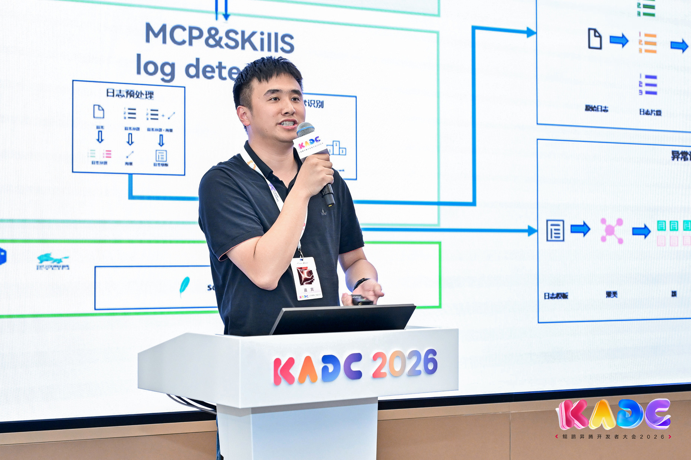

*▲ Hou Jian, OpenAtom openEuler Technical Committee Member*

As a core contributor to the openEuler community, KylinSoft shared its exploration of AI-native OS technologies in the keynote “*Exploring Practices of KylinOS in the AI Era*” delivered by Hou Jian.

In the AI era, KylinOS is evolving in two key areas. First, OS interaction is evolving from an enhanced shell to a context-aware shell. Through full-scenario context awareness and AI agent-native transformation, the OS gains stronger AI understanding and responsiveness.

Second, foundational capabilities are evolving from a general-purpose foundation toward domain-specific operations. By integrating an OS-specific knowledge base, the system provides more accurate support for O&M tasks.

In practical deployments, the intelligent O&M system provides capabilities including:

1.  Intelligent fault diagnosis, enabling second-level detection and cross-domain root cause analysis.

2.  Automated toolchains, with MCP encapsulating more than 500 frequently used commands.

3.  More than 30 skills covering over 80% of common issue scenarios.

4.  Integration of more than 100,000 multi-source knowledge entries to build an enterprise-level O&M knowledge base.

5.  An over 85% match rate for recommended solutions, enabling automated retrieval and reuse of solutions for similar issues.

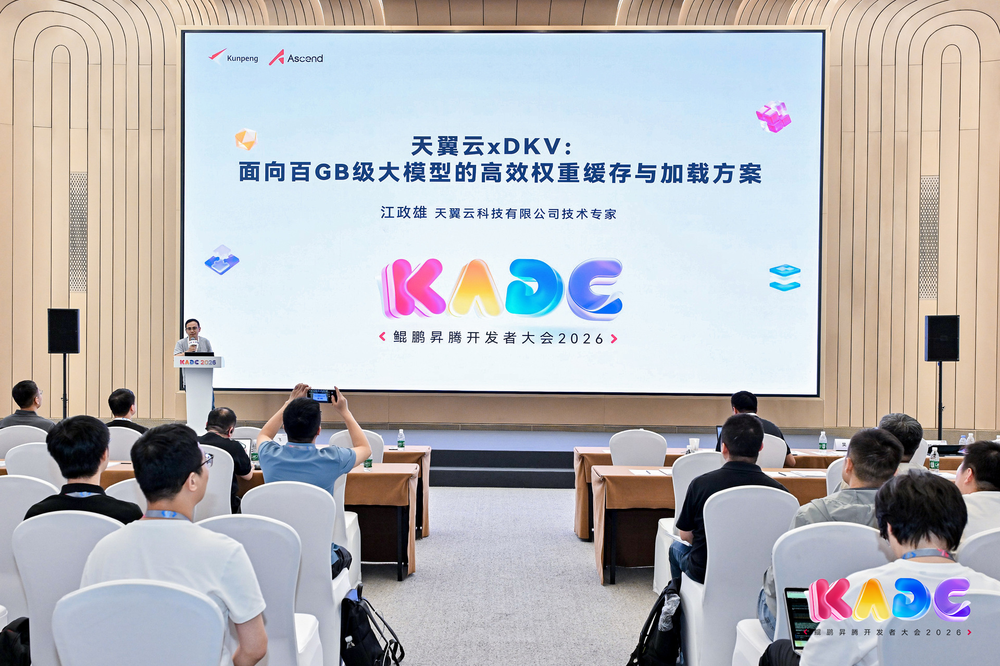

*▲ Jiang Zhengxiong, OpenAtom openEuler AI Joint Working Group Member*

Jiang Zhengxiong introduced eSurfing Cloud xDKV, an efficient weight caching and loading solution designed for models with hundreds of gigabytes of parameters.

The solution addresses challenges such as slow container cold starts, resource waste, and inflexible architectures during model deployment. Based on Kunpeng, Ascend, openEuler, and associated hardware and software, it provides an integrated solution covering storage infrastructure, data processing, loading optimization, and cluster scheduling.

During model download, the solution performs pre-caching. During model partitioning and warm-up, it enables fine-grained sharding and structured organization. During model loading, it optimizes the process from multi-level data paths to direct GPU memory access, improving overall efficiency throughout the model lifecycle.

For high-traffic scenarios such as major promotions or sudden traffic spikes, the solution supports elastic model cache preloading. Nodes can activate cached models during peak periods and release resources during low-demand periods, improving hardware utilization and enabling on-demand compute allocation.

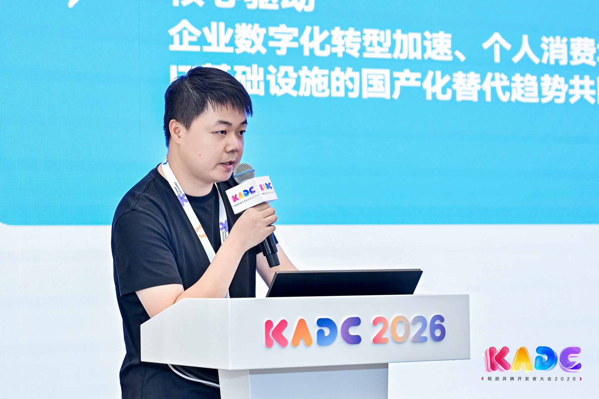

*▲ Liu Bin, Terminal Platform Technical Expert, Kylinsec*

Liu Bin shared Kylinsec’s practice in developing intelligent cloud terminals with an ASR/NLU framework built on openEuler.

Built on openEuler, the solution delivers high-performance, secure, and reliable voice and intent recognition capabilities, featuring four key technologies:

- Real-time kernel scheduling optimization: Prioritizes critical workloads under high load, allowing voice services to receive faster kernel-level responses and reducing latency.

- Load-aware compute coordination: Leverages openEuler’s resource management capabilities to dynamically coordinate computing resources based on application requirements.

- Efficient heterogeneous inference: Through unified accelerator interfaces, models can run transparently across CPU, GPU, and NPU, improving inference efficiency.

- Memory and security optimization: Uses intelligent hot/cold memory management to optimize non-sensitive data performance, while combining confidential computing and TEE technologies to isolate and protect critical data.

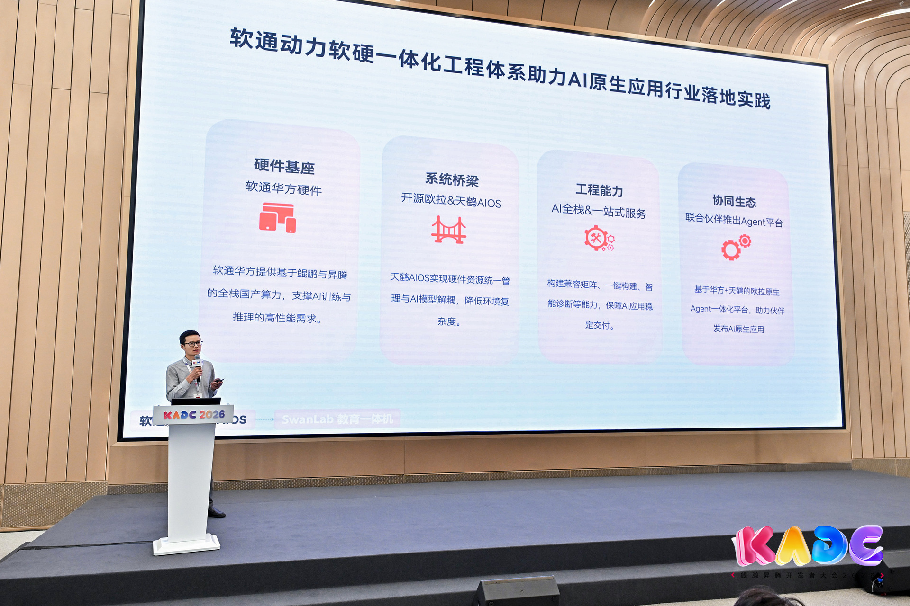

*▲ Li Chengpeng, OpenAtom openEuler Globalization Working Group Member*

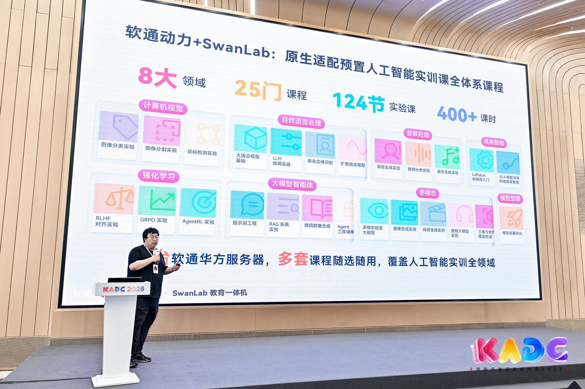

*▲ Han Xiangyu, Head of Education Solutions, SwanLab*

Li Chengpeng and Han Xiangyu delivered a keynote titled “*iSOFTSTONE HUAFANG + Tianhe OS + SwanLab: Accelerating AI-Native Application Engineering*”. The session explored the journey from AI research to industrial-scale application.

Built on Kunpeng and Ascend hardware platforms and openEuler-based Tianhe OS, iSOFTSTONE HUAFANG collaborates with SwanLab to deliver a full-stack AI application solution. It enables integrated training and inference workflows and supports a wide range of education scenarios, accelerating the large-scale adoption of AI-native applications.

## openEuler DevFest Livestream: Advancing Agent Infra Technologies

The livestream invited four technical experts to share the latest progress from openEuler and openFuyao in building agent infrastructure.

Topics included agent development tools, SuperPoD sandbox runtime, full-lifecycle sandbox security technologies, end-to-end observable sandbox technologies, and token scheduling mechanisms based on KV cache data affinity. These technologies improve AI agent security and runtime efficiency.

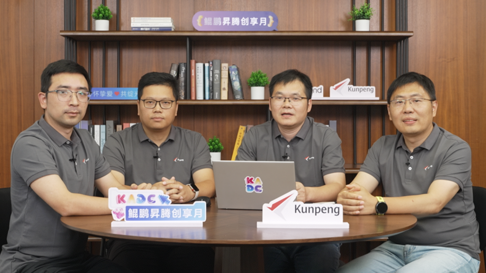

*▲ Livestream*

## Exhibition Highlights: Latest Ecosystem Innovation Showcase

At the openEuler Innovation Exhibition Area, the community joined ecosystem partners including KylinSoft and UnionTech to showcase their latest technology achievements.

KylinSoft exhibited KylinOS V11, which features a high-performance kernel, an independently-developed architecture, and native support for AI compute scheduling. The system provides three-layer security protection, cross-architecture compatibility, and an intuitive desktop experience, meeting compliance requirements for critical scenarios and supporting digital transformation across industries.

Built on Kunpeng and Ascend hardware platforms and UOS, UnionTech provides simplified deployment, no-code knowledge base construction, and end-to-end hardware and software support, backed by comprehensive O&M services to accelerate enterprise-level model application.

In addition, openEuler showcased its latest innovations, including the first embedded OS release for embodied AI. The release was demonstrated on site and attracted strong interest and engagement.

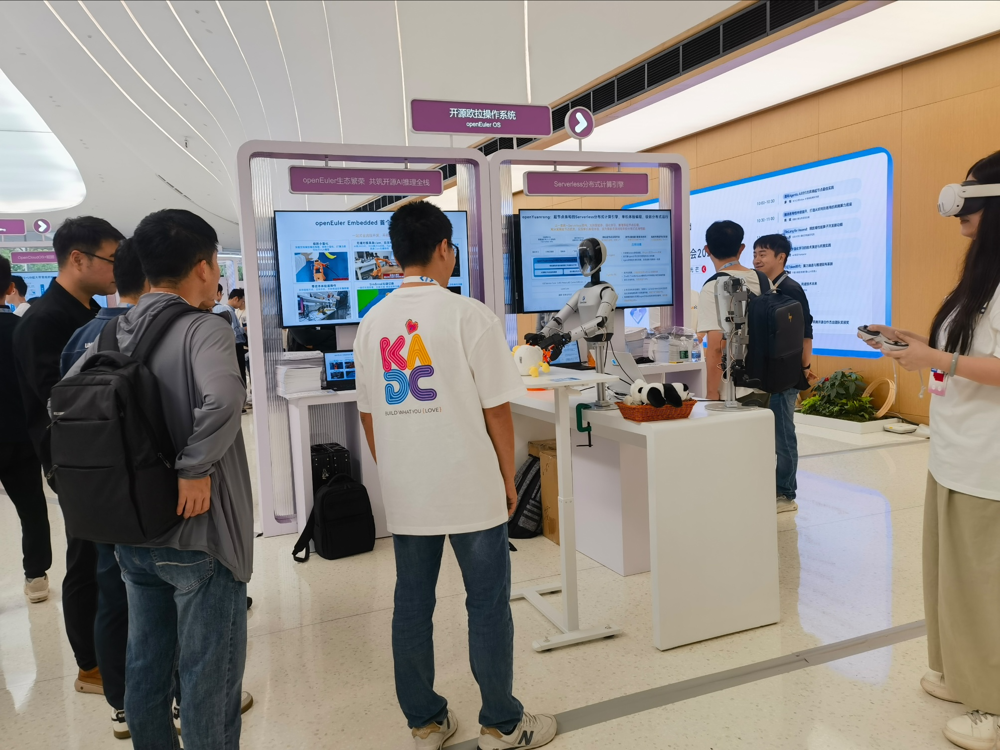

*▲ openEuler Technology Innovation Exhibition Area*

## CodeLab: Getting Started with openEuler Community Development

At the CodeLab hands-on area, many developers tried the intelligent assistant in openEuler DevStation.

With the AI assistant, developers can use AI to assist with code reviews and kernel CVE remediation in the openEuler community.

For developers who have never contributed to the openEuler community before, these capabilities significantly lower the barrier to their first contribution and help them quickly get started with openEuler community development.

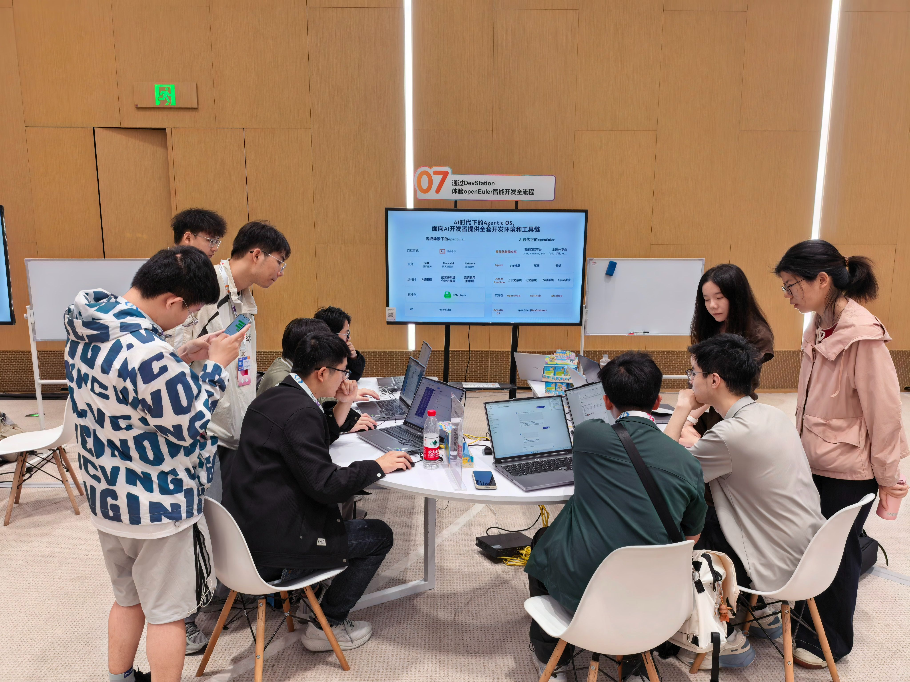

*▲CodeLab hands-on session*

From keynote sessions and technical discussions to ecosystem showcases and hands-on developer experiences, openEuler presented its latest technologies and community practices throughout KADC 2026.

As AI technologies and AI agents continue to advance, the openEuler community will collaborate with ecosystem partners to shape the future of AI infrastructure.
