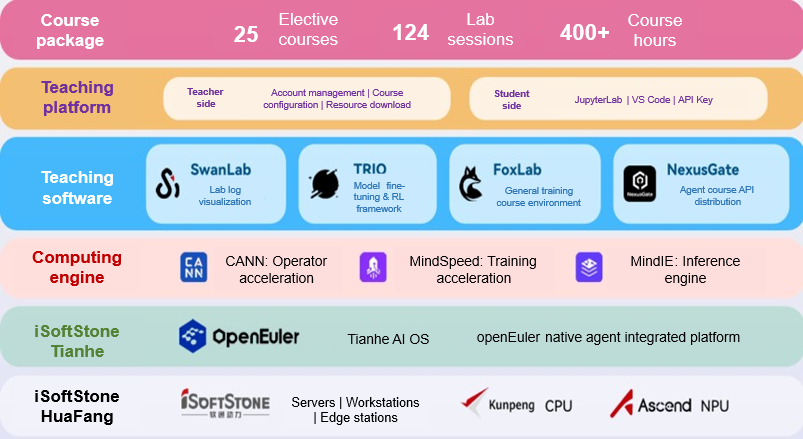
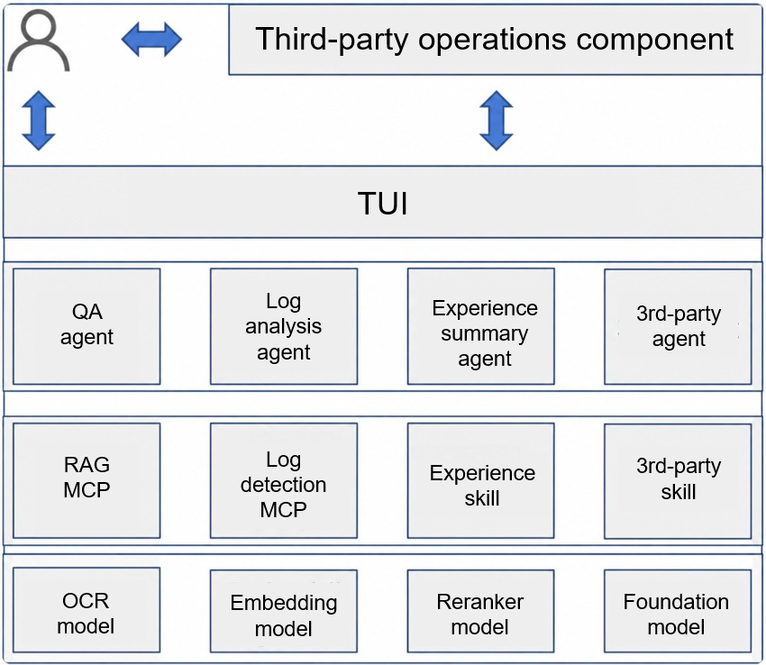
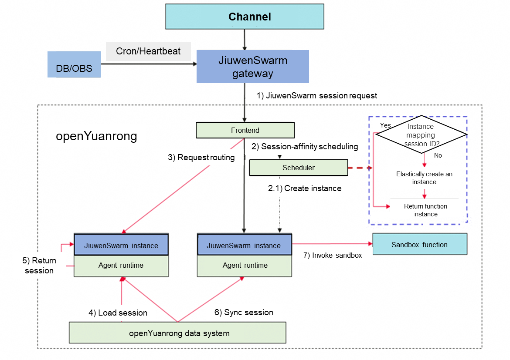

## Overview

In May 2026, the openEuler community kept advancing in technology and ecosystem. By month-end, we had over 7.11 million users and more than 27,000 developers. On the technology front, we successfully completed the first commercial in-orbit mission of the openEuler-based aerospace-grade embedded satellite OS, coupled with continued breakthroughs in agent infrastructure, intelligent operations, and embodied AI. On the ecosystem front, we actively engaged in the Kunpeng Ascend Developer Conference (KADC), partnering with industry peers to explore AI-driven OS innovation. Meanwhile, we kept improving container images, hardware/software compatibility, and security governance to underpin the digital and intelligent transformation across diverse sectors.

## Community Scale

As of May 31, 2026, the openEuler community had cumulatively reached over 7.11 million users, with more than 27,000 contributing developers. The community counted 2,157 organization members, 110 SIGs, 284,000 PRs, 146,400 issues, and 5,084,700 comments.

## Community Events

### Successful In-Orbit Operation of openEuler-Based Aerospace-Grade Embedded Satellite OS

An aerospace-grade embedded OS powered by openEuler is now operating stably in orbit aboard a commercial experimental satellite, which is the first successful practice of such application for openEuler-based embedded OSs. This proven capability of openEuler-based satellite OSs is important for highly reliable and real-time space intelligence, and can bolster independent innovations in commercial aerospace.

### Two DCIC Awards for HopeRun with openEuler Embedded Adaptation

At the 2026 Digital China Innovation Contest (DCIC) amid the 9th Digital China Summit held in Fuzhou during April 29–30, HopeRun Information Technology, a core openEuler ecosystem partner, won the Second Prize in the General Industry Competition and the Security and Trustworthiness Excellence Award in the Information Technology Application Innovation Track. The award-winning project is openEuler Embedded adaptation and enhancement, which is set to be a new paradigm for AI deployment in intelligent equipment. These awards underline openEuler’s value for technical innovation and ecosystem development in embedded systems, edge intelligence, and industry AI.

### openEuler at KADC for SuperPoD OS and Agent Infrastructure Innovation

At the KADC 2026 during May 22–23, openEuler was featured across the conference program to showcase cutting-edge technical achievements and ecosystem practices. The community participated extensively in various segments, from the Kunpeng Summit and breakout session to DevFest livestream, innovation exhibits, and CodeLab. Centered around key directions such as SuperPoD OS and agent infrastructure, we joined industry luminaries, ecosystem partners, and developers to explore innovative technologies for computing.

### iSoftStone HuaFang Hardware + iSoftStone Tianhe AI OS for Accelerated Engineering Implementation of AI-Native Applications

During the KADC 2026 on May 22, iSoftStone shared their innovative technologies and practices. In the openEuler breakout session, iSoftStone and Emotion Machine systematically presented their software/hardware integrated engineering system and ecosystem collaboration approach. The speech focused on the core challenges of productionizing AI projects — moving from lab prototypes to real-world industrial deployment. Leveraging iSoftStone’s HuaFang hardware and Tianhe AI OS as well as Emotion Machine’s SwanLab, this approach is set to accelerate scaled implementation of AI-native applications through end-to-end support from development to production.

### openEuler IB-Robot at KADC 2026

At the KADC 2026 expo, the openEuler community showcased an OS solution powered by Intelligence BooM for Robotics (IB-Robot, an embodied AI software stack) on openEuler Embedded. Featuring one-stop, full-process development and runtime, this solution allowed a humanoid robot to collect data about physical objects, implement OM model inference, and autonomously grab objects.

### openYuanrong at KADC 2026

At the KADC 2026 during May 22–23, openYuanrong — a serverless distributed computing engine — was featured across the conference program to showcase cutting-edge technical achievements and ecosystem practices. The community participated extensively in various segments, from the Ascend Summit and openEuler breakout session to innovation exhibits. Centered around application scenarios like AI agent and agentic RL and inference and based on use cases of large-scale sandbox scheduling and high-performance unified memory resource pooling, we joined industry luminaries, ecosystem partners, and developers to explore innovative technologies for computing.

### openEuler AI and OS Innovation Meetup

On May 30 in Beijing, the openEuler AI and OS Innovation Meetup was successfully co-hosted by the openEuler community and China Unicom Digital Tech to explore how AI and OSs can work better together. Focused on prevailing topics and industry pain points in AI and OS, this event brought together experts from the two fields to explore new paths for next-generation AI OSs, with the goal of building open, smarter, safer, and more efficient digital infrastructure for the AI era.

## Key Technical Progress

### experience-skill: a Wiki and Skill Governance Pipeline for the Known-Issue Analysis Agent

As the operations experience database continued to scale, the known-issue analysis agent built with openEuler on top of OpenCode reached a performance bottleneck. That is, it must load all files in directories to retrieve relevant experience, significantly increasing the query response latency. Moreover, new experience entries had to be manually synced to update the files, leading to persistently high operations and maintenance costs.

To address these challenges, we designed and implemented experience-skill, a lightweight experience database retrieval system built on SQLite FTS5. This agent-native skill provides structured, high-performance experience retrieval. It enables the agent to continuously accumulate domain experience and evolve autonomously during day-to-day operations for closed-loop knowledge reuse.

### Known-Issue Analysis Agent for Production

With maturing foundation models, agent frameworks, semantic log analysis and RAG technology, and LLM knowledge bases, intelligent log analysis and precise fault case correlation became feasible. The openEuler community, together with KylinSoft, built the known-issue analysis agent on top of OpenCode and officially deployed it in production environments to provide capabilities like log detection, lightweight RAG, and LLM knowledge base. This directly addresses core challenges in operations.

### Intelligent Diagnosis Agent for Network Troubleshooting

Network troubleshooting is often plagued by data silos, disarrayed processes, and over-reliance on individual expertise. Although monitoring tools can collect massive amounts of network data, extracting useful clues from the overwhelming logs, interface details, and routing configurations remains a major challenge. Troubleshooting processes vary across different failure scenarios, making it easy to skip critical steps or stray from the main focus. Moreover, various diagnostic scripts are scattered across the environment without standardized invocation practices, which not only increases operational overhead but also risks producing misleading results due to script misuse.

To solve this problem, the openEuler team developed a network fault diagnosis skill for the intelligent diagnosis agent, providing standardized processes, automated data collection, and precision analysis. This significantly reduces heavy, repetitive manual work and enables efficient root cause identification.

### openYuanrong Enterprise-Grade Support for JiuwenSwarm

openYuanrong, open-sourced by the openEuler community as a general-purpose serverless distributed computing engine, pools cluster resources to provide enterprise-grade support for the JiuwenSwarm agent system. In this case, openYuanrong implements session-affinity scheduling and multi-level isolation to safeguard multi-tenant environments. Through serverless elasticity and distributed fault tolerance, openYuanrong overcomes single-node resource bottlenecks and long-running task reliability challenges, empowering AI agent applications with the enterprise-grade capabilities of high concurrency, availability, and security.

## Container Image Updates

As of May 31, 2026, 43 application images were updated based on the openEuler 24.03-LTS-SP3 base image. These updates covered AI, HPC, cloud, big data, database, storage, and other software categories.

55 new application images were also added. The additions covered AI, HPC, big data, and other software categories.

The images are available on [Docker Hub](https://hub.docker.com/u/openeuler).

## Hardware & Software Compatibility

As of May 31, 2026, a total of 2,689 products had passed openEuler hardware and software compatibility evaluation. 34 products were added in May: 8 from independent software vendors (ISVs), 25 from independent hardware vendors (IHVs), and 1 from operating system vendors (OSVs).

- [Compatibility list](https://www.openeuler.org/en/compatibility/)

## Security Bulletin

In May 2026, the community published 420 security advisories and addressed 162 vulnerabilities (11 critical, 61 high, and 90 in other severity categories).

The following vulnerabilities have significant impacts and require special attention:

### *CVE-2026-31431 (Copy Fail)*

**Issue:** A local privilege escalation vulnerability of the Linux kernel, which stems from a logic flaw in the kernel’s cryptographic subsystem. The PoC and technical details of this vulnerability have been disclosed.

**Impact:** Attackers can exploit the combination of the AF_ALG cryptographic interface and the splice() system call to write controlled 4-byte data to the page cache of any readable file, thereby tampering with setuid programs and directly obtaining root privileges without race conditions.

**Affected releases:**

- openEuler-20.03-LTS-SP4
- openEuler-22.03-LTS-SP4
- openEuler-24.03-LTS
- openEuler-24.03-LTS-SP1
- openEuler-24.03-LTS-SP2
- openEuler-24.03-LTS-SP3

### *CVE-2026-43284 & CVE-2026-43500*

**Issue:** A severe Dirty Frag vulnerability in the Linux kernel. This vulnerability chain was identified by Hyunwoo Kim, a Korean security researcher, and actually consists of two vulnerabilities involving the XFRM-ESP (CVE-2026-43284) and RxRPC (CVE-2026-43500) issues. Both exploit the splice() system call to attach file page cache pages directly to the skb, leveraging the decryption path’s behavior of writing in place rather than copying page content to tamper with page cache contents and achieve privilege escalation.

**Affected releases:**

The XFRM-ESP issue was introduced by patch cac2661c53f3. Investigation confirmed that all openEuler releases are affected (kernels 4.19/5.10/6.6) and that esp4 and esp6 are set as ko by default.

The RxRPC issue was introduced by patch d0d5c0cd1e71. Investigation confirms that the openEuler 20.03 LTS releases (kernel 4.19) are unaffected, while the openEuler 22.03 LTS releases (kernel 5.10) and openEuler 24.03 LTS releases (kernel 6.6) are affected. In affected releases, RxRPC is not set by default; therefore, the openEuler 22.03 LTS and 24.03 LTS releases cannot be successfully attacked by default. However, the community source code remains affected, and customers who set and load RxRPC independently are still vulnerable.

### *CVE-2026-46300*

**Issue:** Another vulnerability (Fragnesia) of the same type as Dirty Frag in the Linux kernel, identified by William Bowling and the V12 team. It similarly exploits a logic flaw in the Linux XFRM ESP-in-TCP subsystem to achieve arbitrary byte writes to read-only file kernel page cache pages. This vulnerability can bypass the Dirty Frag fix patches and follows the same attack path as Dirty Frag, resulting in local privilege escalation.

**Affected releases:**

In openEuler releases, CONFIG_INET_ESPINTCP and CONFIG_INET6_ESPINTCP are both not set by default. Therefore, openEuler is unaffected by default and does not require the relevant fix patches. Customers who set independently based on openEuler community source code and have enabled the above setting options remain affected by this vulnerability.

### Protection Against Vulnerabilities

The openEuler community routinely fixes vulnerabilities for maintained versions and releases security patches. Users are advised to follow openEuler’s official security advisories and promptly install vulnerability patches for protection.

Security advisories: [Security Center](https://www.openeuler.org/en/security/security-bulletins/)

## Thank You for Your Support

We extend a warm invitation to all open-source enthusiasts to join the openEuler community. Whether you are passionate about contributing code, sharing your expertise, or simply engaging in insightful discussions, there is a place for you within our community.

Stay connected with us or check our project repositories for regular updates to stay abreast of the latest developments and breakthroughs.

To suggest an addition or share feedback on the monthly bulletin, contact <contact@openeuler.io>.
