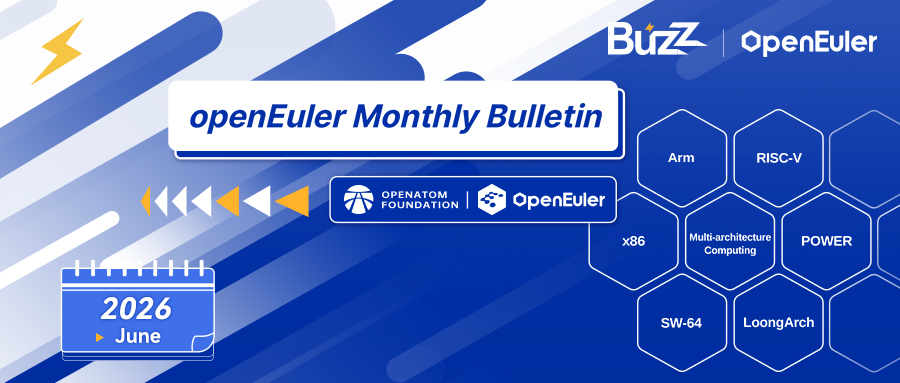
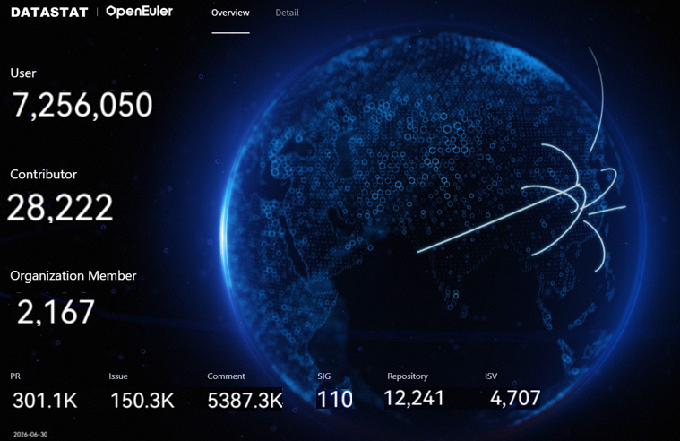
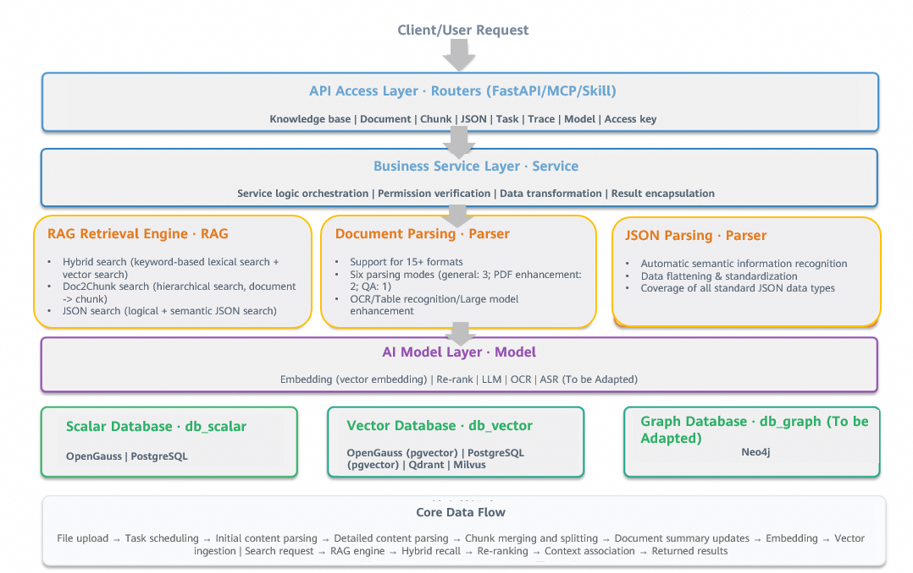
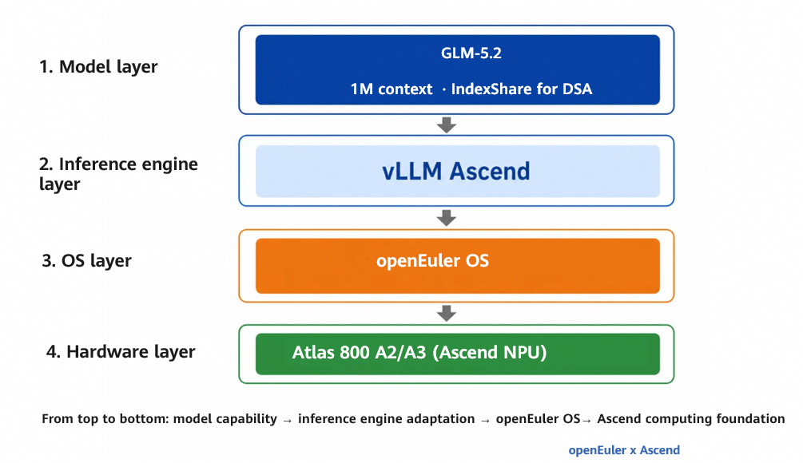
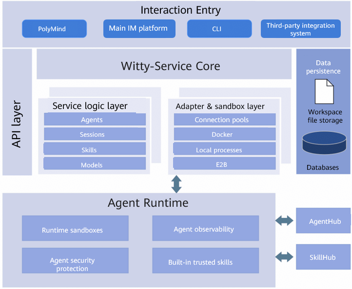

## Overview

In June 2026, the OpenAtom openEuler community (also known as openEuler) continued its steady growth, promoting technological evolution and ecosystem collaboration. The community’s scale and engagement were continuously improved, with the number of users, developers, and organization members steadily increasing, contributing to the community’s ongoing success. In this month, openEuler 24.03 LTS SP4 was officially released, further enhancing AI and all-scenario innovation capabilities. Regarding ecosystem and operations, the community has strengthened industry collaboration and talent development through continuous visits to universities, meetups, and participation in industry exhibitions (such as the China International Financial Exhibition and OpenAtom Open Source Eco-Conference), promoting the development of the open-source ecosystem. Regarding technology, the community has made continuous innovations in the deep integration of AI and operating systems (OSs), made progress in areas such as the O&M knowledge system, automatic CVE fixing, agent security system, and sandbox runtime environment, and promoted the adaptation and application of foundation model ecosystems. Overall, the community has continuously strengthened its open-source foundation and industry service capabilities driven by both scale growth and technological innovation, accelerating the evolution towards intelligent infrastructure.

## Community Scale

As of June 30, 2026, the openEuler community had:

- More than 7.25 million users

- More than 28,000 developers

- 2,167 organization members

- 110 special interest groups (SIGs)

- 301.1k pull requests (PRs)

- 150.3k issues

- 5387.3k comments

openEuler DATASTAT (as of June 30, 2026)

## Community Events

### openEuler 24.03 LTS SP4 Officially Released, Boosting AI and All-Scenario Innovation

openEuler 24.03 LTS SP4 was officially released as an enhanced and extended update to openEuler 24.03 LTS, built on Linux kernel 6.6. Designed for server, cloud, and AI scenarios, this release continues to deliver a wide range of new features and capability enhancements. These include kernel optimizations, improved reliability and usability of UnifiedBus SuperPoDs, NPU resource partitioning, rapid recovery for inference services, sandbox support; intelligent diagnostics, tuning, and operations and maintenance (O&M); compiler advancements, and confidential virtual machines (VMs). Together, these innovations provide a refreshed experience for developers and users, enabling openEuler to support a broader range of applications and serve an expanding user base.

Download: [openEuler 24.03 LTS SP4](https://www.openeuler.openatom.cn/en/download/)

### openEuler at the OpenAtom Open Source Eco-Conference, Further Accelerating the Intelligent Infrastructure Construction

From June 25 to 26, the OpenAtom Open Source Eco-Conference 2026 was successfully held in Beijing. As a key player in the open-source OS field, openEuler participated in the opening ceremony, thematic forums, and ecosystem exchanges. Focusing on the “AI + globalization” strategy, openEuler showcased its latest achievements in version evolution, intelligent infrastructure, industry collaboration, international development, and co-construction with developers.

### openEuler at China International Financial Exhibition, Laying a Solid Foundation for Intelligent Transformation in the Financial Industry

From June 16 to 18, the high-profile China International Financial Exhibition was successfully held at Shanghai World Expo Exhibition & Convention Center. Under the guidance of the People’s Bank of China and with strong support from the Shanghai municipal government, the exhibition brought together top institutions and technical experts in the financial sector to explore new opportunities for digital financial transformation. As a leading open-source OS, openEuler debuted at the event, showcasing its technical achievements and ecosystem practices in the financial industry. It actively participated in the international sub-forums and innovation technology exhibition area, comprehensively demonstrating the technical strength and industrial value of open-source OSs in the financial sector.

### openEuler Technical Committee Meeting Successfully Held

On June 26, the openEuler technical committee meeting 2025–2026 was successfully held in Beijing, hosted by China Unicom Digital Technology Co., Ltd. During the meeting, committee members reviewed the community’s technical planning, project progress, and implementation initiatives in detail, focusing on core technical areas such as the toolchain, kernel security, version management, package management, AI components, embedded development, Rust reconstruction, and lightweight systems. All committee members had in-depth discussions and thorough evaluations on each topic, and reached consensus on the implementation plan for kernel hierarchical maintenance, joint development of AI tools, independent tool repository for embedded systems, and Rust reconstruction. They also clarified the responsibilities of each SIG and the key milestones for each phase.

### openEuler and TongTech Meetup at Xidian University, Building a New Middleware Ecosystem

On June 10, the “Qingzhou & Yunyi: Sailing the Cloud Sea, Soaring to New Heights” meetup, jointly held by openEuler and TongTech communities, was successfully held at Xidian University. This series of events has successively visited multiple universities in cities such as Beijing, Tianjin, Wuhan, and Qingdao, continuously spreading the middleware and open-source concepts to young students, providing industrial practice opportunities for them and injecting fresh energy into the open-source community. This event in Xi’an attracted numerous teachers and students from universities, as well as industry experts. It brought open-source technologies to campuses, advanced the open-source talent development plan, discussed the development of the middleware ecosystem, and collectively promoted the independent innovation and development of foundational software.

### openEuler on RISC-V SIG Showcased the Progress of the RVA23 Server System Ecosystem at the RISC-V Europe Summit

From June 8 to 12, the RISC-V Summit Europe 2026 was held in Bologna, Italy. The openEuler on RISC-V SIG presented a poster titled “openEuler for RVA23: Building a RISC-V Server OS with Ecosystem Partners”, showcasing the progress and future plans of openEuler on RISC-V for the RVA23 server baseline.

The presentation highlighted the progress of openEuler 24.03 LTS SP3 in supporting RVA23, including the development of artifacts such as UEFI ISO, QEMU VM images, and development board images, as well as installation and verification on the SpacemiT K3 platform. In addition, the openEuler on RISC-V SIG showcased the progress of building a common foundation for RISC-V server OSs, including the RISC-V Common Kernel (RVCK) program, toolchain and basic library adaptation, and XiangShan FPGA server load verification.

Later on, the openEuler on RISC-V SIG will continue to advance version adaptation for RVA23 and RISC-V server platform specifications, and work with ecosystem partners to improve the RISC-V server software and hardware ecosystem.

### openYuanrong SIG Deeply Involved in the OpenAtom Open Source Eco-Conference

The openYuanrong SIG, a core SIG of openEuler, deeply involved in the OpenAtom Open Source Eco-Conference held in Beijing from June 25 to 26. The SIG showcased its innovative achievements in fields such as agent, inference, and reinforcement learning. The event attracted a large number of developers who stopped by for exchanges. The project’s popularity continues to rise.

## Key Technical Progress

### openEuler Community Launched Witty RAG Core to Build a Knowledge Base Foundation for O&M Scenarios

In the openEuler ecosystem, a large number of O&M logs, troubleshooting manuals, configuration documents, and version change documents are continuously accumulated. The scattered high-quality O&M knowledge is difficult to be efficiently reused, which is a common pain point for many O&M engineers and enterprise technical teams. To solve industry challenges such as fragmented O&M knowledge, inefficient retrieval, and difficult implementation, the openEuler community officially launches Witty RAG Core, an industrial-grade RAG engine foundation oriented to enterprise-grade O&M scenarios. It features layered decoupling and high scalability, and supports full-link custom development.

### AI Vulnerability Fixing Platform in the openEuler Community: Fixing CVE Kernel Vulnerabilities with PatchFlow Agent

As the openEuler community continues to advance kernel security maintenance and engineering efficiency, PatchFlow Agent, designed for Common Vulnerabilities and Exposures (CVE) fixing scenarios, has been successfully implemented in the openEuler kernel repository. This tool has supported over 250 PRs merged and is gradually being integrated into the real community maintenance process.

PatchFlow Agent focuses on CVE patch processing. It starts with issue analysis and streamlines key steps such as fixing, submission, affected branch analysis, patch application, conflict resolution, and PR creation. This forms an executable, reusable, and scalable closed-loop process tailored to actual maintenance scenarios, providing more efficient support for tasks such as multi-branch maintenance and batch backporting.

### AI Vulnerability Fixing Platform in the openEuler Community: Intelligent CVE Remediation in Peripheral Packages with Agent Workflow

The openEuler community has been continuously improving the intelligent O&M efficiency of massive software packages. For CVE remediation in peripheral packages, the Agent Workflow intelligent patch system, driven by agent orchestration and Harness engineering, has been deployed across 600+ peripheral package repositories, supporting 110+ successful merges. This CVE patch operating system for peripheral packages is called PatchHarness.

### openEuler Agentic Defense-in-Depth Security Solution: Making Users Feel Safe and Secure to Use Agents

AI agents are rapidly penetrating enterprise production environments, but their security mechanisms have not kept pace with their capabilities. The root cause of the issue lies in four aspects: awareness security, behavior security, data security, and supply chain security. The agent full-link security solution released by the openEuler community is designed to address this issue.

The security of AI agents cannot be solved by a single technology. openEuler’s defense-in-depth security solution achieves intent constraint and security through security awareness skills and TEE-based AI trusted intent credentials. It achieves global transparency and controllability of agent behavior through deterministic behavior monitoring (AgentMoss), and makes data such as APIs/keys and user long-term memory available but invisible by using a hardware-level TEE-based data vault. Simultaneously addressing these three critical dimensions forms a comprehensive deep defense-in-depth security system.

### Real-Time Multi-Model Scheduling: A System-Level Approach to Dynamic Model Orchestration

Currently, embodied AI frameworks such as LeRobot generally adopt the “single model per launch” design, that is, one inference model is selected at system startup and remains unchanged throughout the running cycle. This works fine for single-task and fixed-scenario demos. However, problems become significantly more complex in real environments.

Multi-model scheduling is fundamentally about running each model on its optimal device at the right time.

### Quick Start Guide to GLM-5.2 on openEuler and vLLM Ascend

On June 17, Zhipu AI’s next-generation flagship foundation model GLM-5.2 was officially released and open sourced. As a cornerstone base model of the GLM series, GLM-5.2 has made comprehensive breakthroughs in context length, coding capabilities, long-term tasks, and agent tasks, marking a transition from answering well to achieving sustained performance. Compared with GLM-5.1, GLM-5.2 has significantly improved the success rate in core scenarios such as frontend development, backend architecture, and long-term tasks, and demonstrated higher stability in handling complex system engineering and in-depth debugging. In mainstream programming benchmark tests, GLM-5.2 has consistently maintained the state-of-the-art (SOTA) position among open-source models. Its overall capabilities are comparable to those of the top model Claude Opus 4.8 outside China.

This guide will use the container image startup mode of vLLM Ascend to run GLM-5.2 on the Atlas 800 A3 (128G × 8) node.

### openEuler Conch: Enabling a Portable and Recoverable Running Environment for AI Agent Execution

As AI agents demand stateful and recoverable execution, traditional OCI images fall short of sandbox startup and restoration needs. openEuler Conch, a sandbox engine, provides a complete sandbox image system designed for AI agents. It packages rootfs, sandbox startup components, and runtime snapshots into unified, bootable, distributable, and restorable image assets, enabling end-to-end management from image conversion through distribution to recovery.

### Three New Features Provided by UMDK in openEuler 24.03 LTS SP4

Unified remote memory access (URMA) container entity identifier (EID) sharing mode: a mechanism for sharing EIDs between containers. This mode shields the differences between multiple generations of underlying NPUs and implements cross-generation adaptation through a unified command set. One set of commands can be used to operate containers, reducing adaptation complexity and improving the usability of UnifiedBus (UB).

IPoURMA: provides a standardized method for transmitting IP packets based on the UB protocol and hardware. It combines the high-performance characteristics of UB and the broad compatibility of Ethernet. It can replace Ethernet NICs in providing standard socket APIs, thereby improving UB usability.

UMQ: indicates a UB message queue. It abstracts URMA memory semantics into message queue semantics, enabling seamless northbound integration with the unified remote process call (URPC) and third-party xRPC. It delivers core RPC messaging capabilities, including zero-copy transmission and large-scale connections.

### PolyMind: A New Paradigm for AI Agent Interaction Platforms

As AI agent technologies rapidly evolve, the efficient management, orchestration, and operation of multi-agent systems, supported by comprehensive tools and skill ecosystems, have become the critical challenges in AI infrastructure.

PolyMind is a self-hosted AI agent interaction platform that natively integrates the agentd service. It employs a frontend-backend separation architecture. The frontend focuses on enhancing user interaction, while the backend (Witty-Service, serving as the agentd runtime) handles the complete lifecycle management and API services of agents. Incubated by the openEuler community, PolyMind aims to integrate AI dialogs, agent workflow orchestration, and multi-model management, providing a complete out-of-the-box solution.

Currently, the platform has made significant progress in agent runtime lifecycle management, skill ecosystem building, unified model management, and automatic security vulnerability fixing.

## Container Image Updates

**Statistical period**: June 1–30, 2026

**Data source**: [openEuler Docker Images](https://gitcode.com/openeuler/openeuler-docker-images)

As of July 1, 2026, the total number of public container images in the community had reached 1,425. In June 2026, eight upper-layer application images were upgraded and 80 application images were added based on 24.03-LTS-SP3. The details are as follows:

### Upgraded Images (8)

| Category   | Quantity | Image Name                        | Version                         |
|------------|----------|-----------------------------------|---------------------------------|
| Cloud      | 1        | libvirt                           | 12.4.0                          |
| Big data   | 2        | Kibana and Lucene                 | 9.4.2 and 10.5.0                |
| Database   | 1        | orientdb                          | 3.2.53                          |
| Others     | 4        | next, node, pacemaker, and react  | 16.2.7, 26.3.0, 3.0.2, and 19.2.7 |

### Added Images (80)
Container images can be pulled from [Docker Hub](https://hub.docker.com/u/openeuler).

| Category   | Quantity | Image Name                                                                                                                                                                                                                                                             | Version                                                                                                                                                                                                                                                                                                                                                   |
|------------|----------|------------------------------------------------------------------------------------------------------------------------------------------------------------------------------------------------------------------------------------------------------------------------|-----------------------------------------------------------------------------------------------------------------------------------------------------------------------------------------------------------------------------------------------------------------------------------------------------------------------------------------------------------|
| HPC        | 38       | cactus, chaste, chroma, circos, cmag, code-saturn, code_aster, cps_public, cufflinks, dealii, elmer, espresso, fasta, fds, hh-suite, kalign, kb_python, meep, meryl, ncl, ncvview, novoplasty, palabos, parafem, petsc, phono3py, proteinmpnn, prottest3, pwdf, cmpack, rdkit, roms, seisso1, swmm, tophat, velvet, and wannier_tools | 3.2.1, 2026.1, chroma-3-44-0, 0.52, 5.5.2Oct2024, 5.5, 8.0.5, f603c14, 5.2_5, 2.2.1, 9.7.1, 26.2.1, 5.0.0, 2.3.6, 6.11.0, 3.3.0, 3.5.1, 0.30.2, 1.33.0, 1.4.1, 6.6.2, fbf1aec, 4.3.5, 2.3.0, 5.0.3, 3.25.1, 4.1.0, 1.0.1, 3.4.2-release, 1.0.0, 4.2.0, 2026_03_3, 4.2, 202103.Sumatra, 5.2.4, 2.1.2, 1.2.10, and 2.6.2 |
| Others      | 14       | bind9, fthrift, glassfish, libuvy, mongoose, monolith, multiwfn, ndpi, rabbit-library, rust, scann, sonic-cpp, tongsue, and venc                                                                                                                                        | 9.21.23, 2026.06.22.00, 710-20250515-before-cpenv, 1948, 7.22, 135c491, cb37c53, 5.0, 7c2d0d7, 1.95.0, 1.4.2, 1.0.2, 8.4.0, and 1.14.0                                                                                                                                                                                                                  |
| Cloud       | 11       | cloudwego, deathstarbench, e2b, fluid, kata-containers, kubeflow, kuberay, opencloudos, openvelinux, ovirt-engine, and sriov-network-operator                                                                                                                           | 0.16.2, 0.4.1, 2.29.4, 1.0.8, 3.31.0, 1.10.0, 1.6.2, 1.2.11, 1.0, 4.5.7, and 1.6.0                                                                                                                                                                                                                                                                     |
| Big data    | 5        | bolt, celebrom, kylin, oozie, and spark                                                                                                                                                                                                                                | 6b54e46, 0.6.3, 5.0.3, 5.2.1, and 4.1.2                                                                                                                                                                                                                                                                                                                 |
| AI          | 7        | faiss, langgraph, sglang, tensorrt-llm, torchvision, vllm-cpu, and xla                                                                                                                                                                                                 | 20180223, 1.2.5, 0.5.13, 1.2.1, 0.27.1, 0.23.0, and 3b0ff80                                                                                                                                                                                                                                                                                             |
| Storage     | 4        | 3fs, juicefs, mooncake, and reedsolomon                                                                                                                                                                                                                                | 22fca04, 1.3.1, 0.3.11.post1, and 14.1                                                                                                                                                                                                                                                                                                                  |
| Database    | 1        | redis                                                                                                                                                                                                                                                                  | 5.4.1                                                                                                                                                                                                                                                                                                                                                    |

## Software and Hardware Compatibility

As of June 30, 2026, 2,729 products have passed the openEuler software and hardware compatibility evaluation, with 40 new products added in June, including 34 northbound (ISV) products and 6 southbound (IHV) products.

- [Compatibility list](https://www.openeuler.openatom.cn/en/compatibility/)

## Security Bulletin

In June 2026, the community published 275 security notices and fixed 129 vulnerabilities (16 critical, 57 high, and 56 others).

The openEuler community regularly fixes vulnerabilities in maintained versions and releases security patches. Users are advised to pay attention to the security notices on the openEuler official website and install the patches in a timely manner to protect against vulnerabilities.

More information: [openEuler Security Advisories](https://www.openeuler.openatom.cn/en/security/cve/)

## Thank You for Your Support

We extend a warm invitation to all open-source enthusiasts to join the openEuler community. Whether you are passionate about contributing code, sharing your expertise, or simply engaging in insightful discussions, there is a place for you within our community.

Stay connected with us or check our project repositories for regular updates to stay abreast of the latest developments and breakthroughs.

To suggest an addition or share feedback on the monthly bulletin, contact <contact@openeuler.io>.
