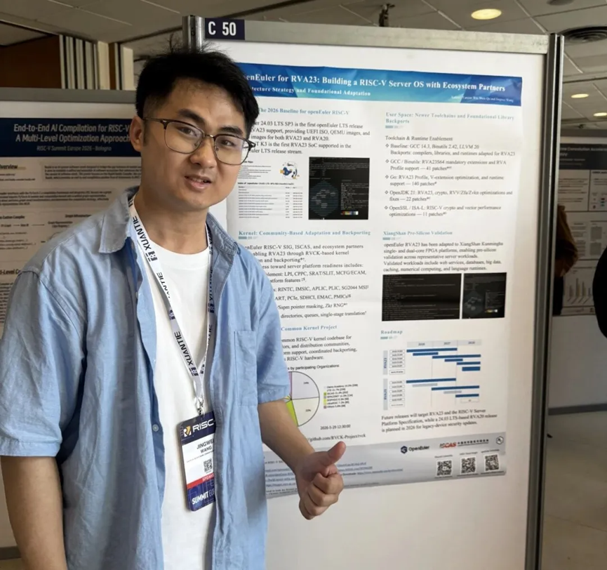
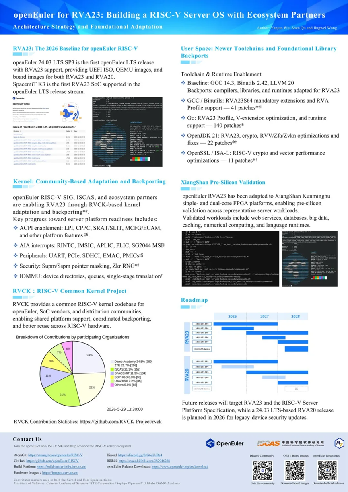
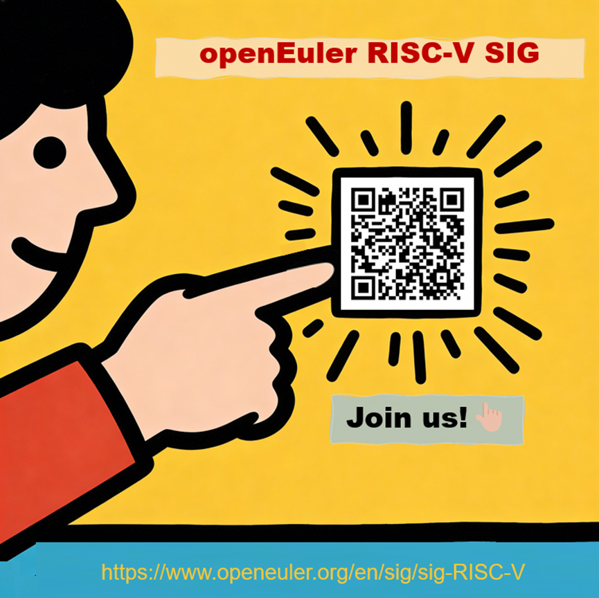

Building a server ecosystem for a new architecture requires collaboration across the entire software stack—from OSs and kernels to toolchains, libraries, and applications.

At RISC-V Summit Europe 2026, we joined the global RISC-V community to share how openEuler and ecosystem contributors are working together to strengthen the software foundation for RVA23-based RISC-V server platforms.

## 𝐏𝐀𝐑𝐓 𝟏: Connecting at RISC-V Summit Europe

From June 8 to 12, developers, researchers, hardware vendors, and open-source communities gathered in Bologna, Italy, for RISC-V Summit Europe 2026 to exchange ideas around RISC-V technologies and ecosystem development.

During the event, the openEuler on RISC-V SIG presented the poster: openEuler for RVA23: Building a RISC-V Server OS with Ecosystem Partners.

For us, the summit was not only a place to share progress, but also an opportunity to connect with the wider RISC-V community, exchange experiences, and learn from developers and ecosystem partners working across different parts of the stack.

We would like to thank the RISC-V Summit Europe organizers and everyone who joined the discussions for creating this valuable opportunity to collaborate and grow the ecosystem together. 

## 𝐏𝐀𝐑𝐓 𝟐: What We Shared

Building a server-ready RISC-V ecosystem requires progress across multiple layers—from system enablement to software validation.

Through our poster, we shared openEuler's work toward a stronger RISC-V server foundation—from RVA23-based system enablement and kernel adaptation to user-space support and workload validation.

These efforts are driven by collaboration across the ecosystem, helping improve software readiness and hardware-software compatibility for future RISC-V server platforms.

Take a closer look at the poster below for the technical details and latest progress. 

## Growing Through Collaboration

The progress shared at RISC-V Summit Europe reflects contributions from a broad ecosystem of research institutes, hardware vendors, and open-source contributors across the RISC-V community.

Building a RISC-V server ecosystem is a long-term effort, and open collaboration remains at the heart of this journey.

Looking ahead, this collaboration will continue through future openEuler releases (download here🔗), including the 24.03 LTS series, 28.03 LTS series, and innovation releases. For platforms with limited RVA23 support, RVA20-based releases from the 24.03 LTS series will continue providing security updates in 2026.

## 𝐆𝐄𝐓 𝐈𝐍𝐕𝐎𝐋𝐕𝐄𝐃

The RISC-V ecosystem continues to grow through contributions from developers and communities around the world.

If you are interested in RISC-V OSs, kernel development, toolchains, or related technologies, we welcome you to join the openEuler RISC-V SIG and contribute with us:

AtomGit: <https://atomgit.com/openeuler/RISC-V>

GitHub:<https://github.com/openeuler-riscv>

Discord: <https://discord.gg/drG6qUsRc4>

Mailing list: riscv@openeuler.org

