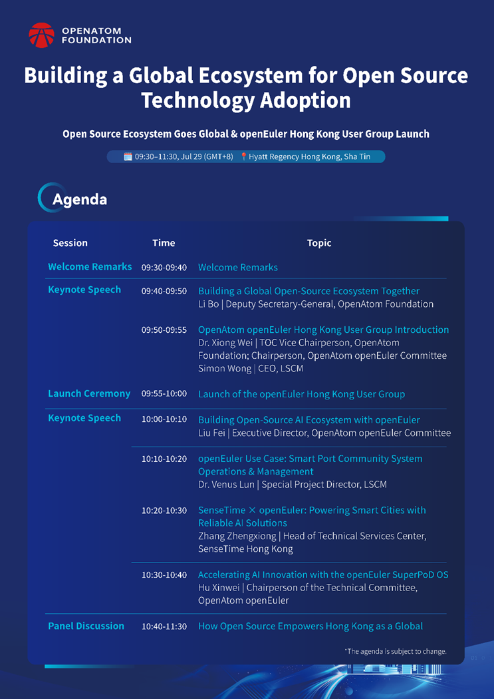
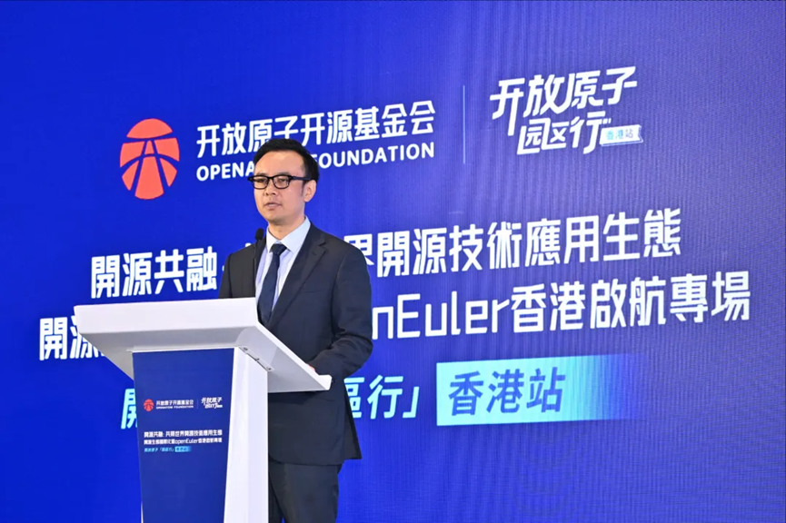
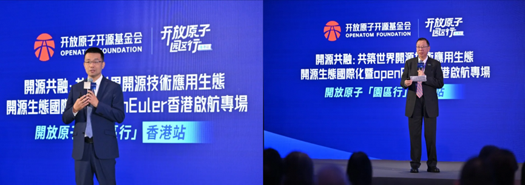
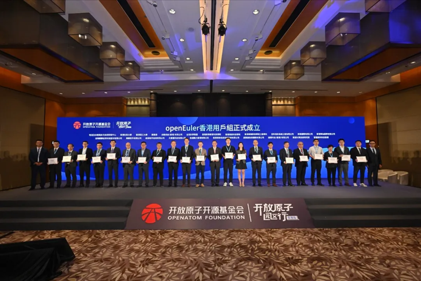
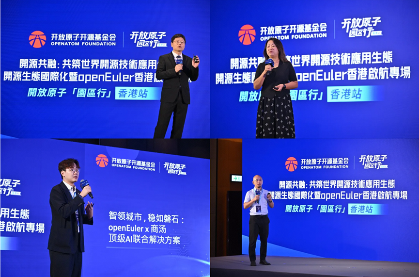

Open source grows when people come together—to share ideas, solve challenges, and build new possibilities.

On July 29, openEuler joined industry partners, universities, and community members in Hong Kong, China for the OpenAtom Industrial Park Tour – Hong Kong Stop: Building a Global Ecosystem for Open-Source Technology Adoption.

Spoiler alert:

A key highlight of the event was the launch of the openEuler Hong Kong User Group, bringing together developers, researchers, and organizations in Hong Kong to connect, share experiences, and explore open-source innovation together. 

Before diving into the highlights, here's a quick look at the agenda.

## Bringing More People Together Through Open Source

Open-source communities grow through connection—bringing together people, ideas, and experiences from different backgrounds. At the event, speakers shared their thoughts on how open source can support collaboration, learning, and innovation across regions.

### ● Building a Global Open-Source Ecosystem Together

Li Bo, Deputy Secretary-General of the OpenAtom Foundation, shared perspectives on building a global open-source ecosystem and supporting broader participation in open source.

He highlighted the importance of community collaboration, talent development, and knowledge sharing in helping open-source projects grow.

### ● OpenAtom openEuler Hong Kong User Group Established

Dr. Xiong Wei, TOC Vice Chairperson of the OpenAtom Foundation and Chairperson of the OpenAtom openEuler Committee, together with Simon Wong, CEO of LSCM, introduced the vision for the openEuler Hong Kong User Group.

Building on openEuler's community experience, the user group will provide a space for local developers, universities, and enterprises to:

Exchange technical knowledge and experiences;
Explore openEuler applications in different scenarios;
Encourage collaboration between industry and academia;
 Support the growth of new open-source contributors.

Representatives from 22 enterprises and universities across Hong Kong (China) and Chinese mainland joined the launch ceremony, opening a chapter for cross-regional open-source collaboration.

## Open-Source Innovation in Action

From AI infrastructure to smart industry applications, openEuler is working with partners to explore how open-source technologies can support real-world scenarios.

The sessions also showed how openEuler is being explored in different areas, with community members and partners sharing practical experiences.

### ● Building Open-Source AI Ecosystem with openEuler

Liu Fei, Executive Director of the OpenAtom openEuler Committee, shared how openEuler is building an open-source AI ecosystem that connects operating systems, hardware, and AI applications.

The session highlighted openEuler's full-stack AI capabilities, hardware compatibility, and efforts to provide developers with a more open and flexible foundation for AI innovation.

### ● openEuler Use Case: Smart Port Community System Operations & Management

Dr. Venus Lun, Special Project Director at LSCM, shared how LSCM applies openEuler in its smart port community system operations and management platform.

By supporting functions such as platform management, data services, and daily operations, the solution demonstrates how open-source technologies can help build reliable digital infrastructure for smart logistics.

### ● SenseTime × openEuler: Powering Smart Cities with Reliable AI Solutions

Zhang Zhengxiong, Head of Technical Services Center at SenseTime Hong Kong, shared how SenseTime combines AI solutions with openEuler to support intelligent applications.

From smart city management to large-scale event services, the collaboration showcases how a reliable open computing foundation can help bring AI solutions into real-world scenarios.

### ● Accelerating AI Innovation with the openEuler SuperPoD OS

Hu Xinwei, Chairperson of the Technical Committee of OpenAtom openEuler, shared how openEuler is preparing for next-generation AI workloads through the openEuler SuperPoD OS.

The session explored how openEuler addresses challenges in AI infrastructure, including efficient deployment, heterogeneous computing, and scalable performance.

## Building the Future Together

The launch of the openEuler Hong Kong User Group is just the beginning.

Thanks to all speakers, partners, and community members for joining us and sharing their insights. Special thanks to Li Bo, 熊伟 , Simon Wong , Liu Fei, Ir Dr Venus Lun Lun, Zhang Zhengxiong, and Xinwei Hu for contributing to the conversations around open source, AI, and industry innovation.

We look forward to welcoming more contributors and partners from Hong Kong and around the world to join the openEuler community. 