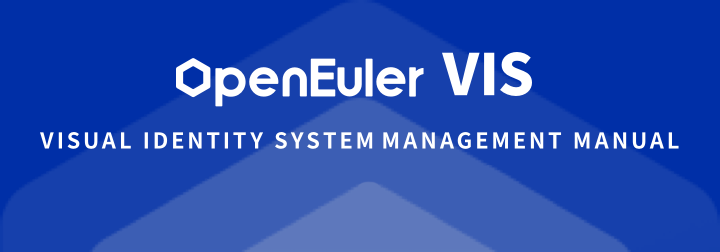
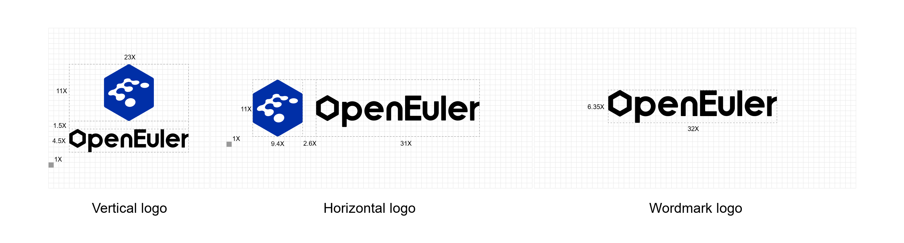
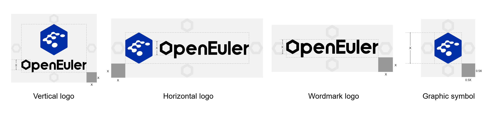
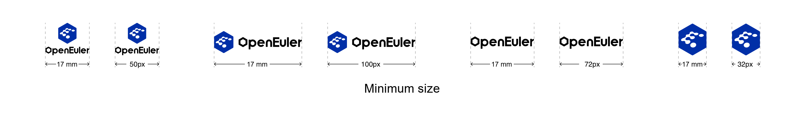
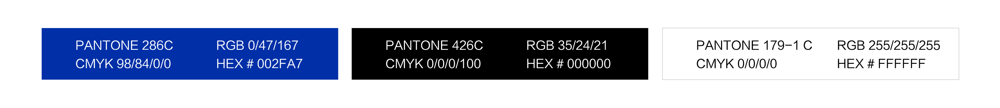
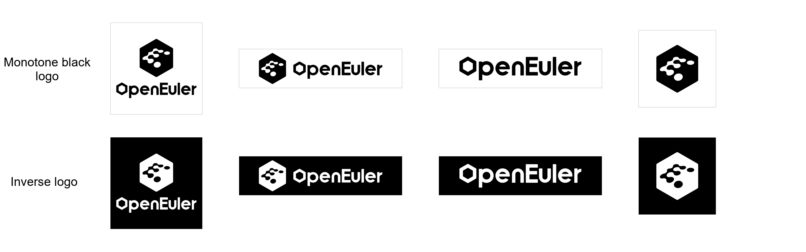
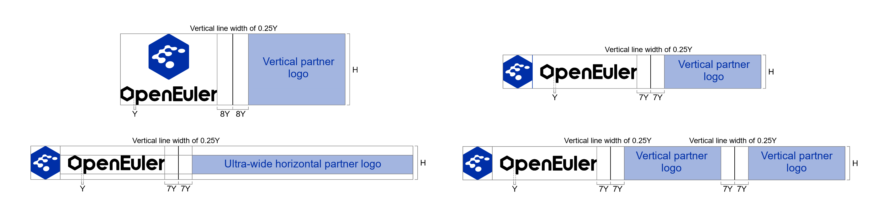
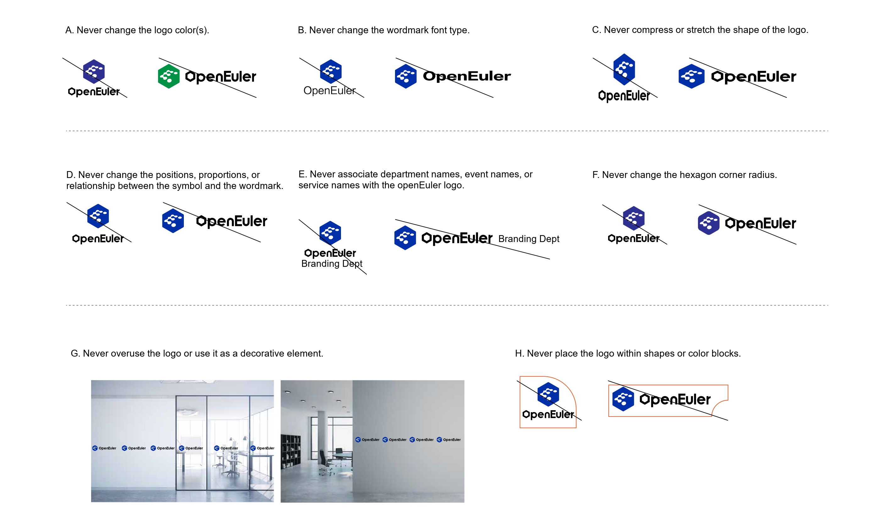

### Logo Rationale

**openEuler positioning**: openEuler is an open source OS for digital infrastructure. The brand logo consists of the symbol and the wordmark.

**Symbol part**: The symbol consists of a blue hexagon with a fluid letter E in the middle.

**Fluid letter E**: "E" stands for Euler. The idea comes from the scientist Leonhard Euler, who made transformative contributions to mathematics and physics, merging them in ways that profoundly influenced and strengthened the technological foundation of the world. Inspired by his legacy of connecting disparate fields to create something new, openEuler is positioned as an open source OS for digital infrastructure. It is dedicated to exploring the boundaries of technological innovation and driving the in-depth integration of the physical and digital worlds.

**Hexagon**: Based on Euler's polyhedral formula, the hexagon is one of the most stable structures in nature. The hexagon symbol of openEuler shows the reliability, stability, and security of the openEuler OS. Besides, the ability of hexagons to extend infinitely in six directions symbolizes that openEuler is fully open source, always seeking tech innovations.

**Wordmark**: "openEuler" is visualized with the letter "o" in a hexagonal shape, ensuring that even when the wordmark is used independently, it continues to symbolize the core principles and goals of openEuler: openness, endless innovation, and a commitment to pushing the boundaries.

**Colors**: The openEuler logo colors combine International Klein Blue (IKB) with black and white. IKB represents a pure blue, symbolizing openness and the continuous drive for openEuler to infuse technological innovation. openEuler is dedicated to technological innovations, hoping to further explore the open source software (OSS) field with all the partners.

### Logo Variations

**Standard logo**: The standard logo of openEuler consists of a graphic symbol and a wordmark. It represents the openEuler OS and open source community and can be used in openEuler brand marketing materials, such as print advertisements, community websites, and online newspapers. In all instances, the official digital artwork must be used without any re-creation, redesign, or other modifications. The wordmark can be used independently in openEuler OS products and as the tail frames for brand videos. The symbol part cannot be used independently.

**Graphic symbol**: This version can be used in materials such as souvenirs.

### Logo Grid Proportions

The proportions of the elements in the logo are carefully crafted for perfection; altering any shape, color, or proportional relationship is not allowed.  
Corner radius of the hexagon = 0.04 × Width of the hexagon

**Vertical lock-up**: The height of the logo is defined as 17X and the width of the logo is 23X. The letter "o" is designed to be a hexagon and the letter "E" is capitalized. The distance between the symbol and the wordmark is 1.5X.

**Horizontal lock-up**: The height of the logo is defined as 11X and the width of the logo is 43X. The letter "o" is designed to be a hexagon and the letter "E" is capitalized. The distance between the symbol and the wordmark is 2.6X.

### Minimum Logo Size and Clear Space

The logo must be protected by a minimum clear space free of any other graphic elements. Additionally, a minimum size is determined to ensure the logo is always legible and recognizable in all applications.

**Minimum clear space**: The height of the letter "o" is defined as X. The size of the minimum clear space is X for both horizontal and vertical lock-ups.

**Minimum size**:

- The minimum size of the vertical lock-up is 17 mm (for printed materials) or 50px (for digital formats) in width.
- The minimum size of the horizontal lock-up is 35 mm (for printed materials) or 100px (for digital formats) in width.
- The minimum size of the wordmark logo is 25 mm (for printed materials) or 72px (for digital formats) in width.
- The minimum size of the graphic symbol is 11 mm (for printed materials) or 32px (for digital formats) in width.

In all instances, the official digital artwork must be used without any re-creation, redesign, or other modifications.

### Logo Color Specifications

This section demonstrates the color set-up for the IKB logo. Color modes include CMYK, Pantone, RGB, and web colors.

The IKB logo is always the preferred version. Monotone black and inverse logos are provided for special cases.

### Monotone Black/Inverse Logos

The IKB logo is always the preferred version. The monotone black and inverse logos are supplementary options intended for specific situations and uses.

**Applicable scenarios**:

1. In cases where materials, production techniques, costs, and so on do not allow the use of the IKB logo (such as packaged products, guide bar, etc.)

2. In cases when the IKB logo cannot achieve sufficient contrast against the background color and will result in poor legibility or recognition

3. Other scenarios

### Co-branding Logo Guidelines

Co-branding refers to the situations where two or more brands from different companies join for a short-term or long-term association or partnership. This is often expressed visually through a combination of brand names or logos. However, internal product names, department names, activity names, and similar designations within openEuler are not considered co-branding partners. Therefore, the guidelines outlined in this section should not be applied to such situations.

**Co-branding logo guidelines**:

1. When the partner logo is a vertical lock-up, use the vertical lock-up of the openEuler logo. When the partner logo is a horizontal lock-up, use the horizontal lock-up of the openEuler logo.

2. When openEuler is organizing an event or related activities, place the openEuler logo to the left of the partner's logo. If the event is organized by openEuler's partners or industry associations, follow the specific logo placement guidelines agreed upon by both parties.  In the absence of explicit guidelines from the partner, place the partner's logo to the left of the openEuler logo.

3. The partner's logo should match the height of the openEuler logo to ensure uniformity.

4. In co-branding situations, and if allowed by the partner and actual conditions, the preferred location for the co-branding logo is the lower right corner of the layout. This is consistent with the preferred placement of the openEuler logo, as stated in these guidelines.

5. The partner's logo and the openEuler logo must be separated by a vertical line, which should be as tall as the logos. The proportional relationship between the elements is shown in the examples below.

### Incorrect Usage of Logo

The proportions of the elements in the openEuler logo, colors and symbols are carefully crafted, and no changes are allowed under any circumstances. In all instances, the official digital artwork must be used without any re-creation, redesign, or other modifications.

A. Never change the logo color(s).

B. Never change the "openEuler" font type.

C. Never compress or stretch the shape of the logo.

D. Never change the positions, proportions, or relationship between the symbol and the wordmark.

E. Never associate department names, event names, or service names with the openEuler logo. (An association is considered to exist if the distance between the name and the logo is less than the height of the logo.)

F. Never change the hexagon corner radius.

G. Never overuse the logo or use it as a decorative element.

H. Never place the logo within shapes or color blocks.

