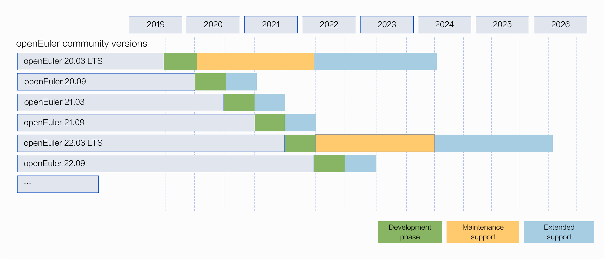
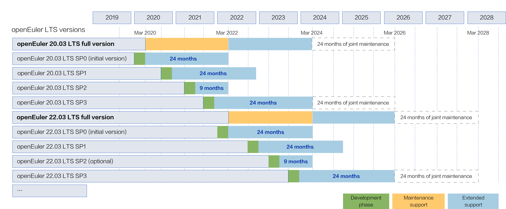

## 1. openEuler Community Version Lifecycle Management (Overall)

Community versions are named based on the release year and month. For example, openEuler 20.09 was released in September 2020.

Community versions are classified into Long Term Support (LTS) versions and innovation versions.

- **LTS version**: released every two years and provides community support for four years. openEuler 20.03 LTS, the first LTS version, was released in March 2020. openEuler 22.03 LTS based on kernel 5.10 was released in March 2022.

- **Innovation version**: released every six months and provides community support for six months. The next innovation version will be released in September 2023.

 
 

## 2. openEuler Community Version Lifecycle Management (LTS+SP)

_\* The solution has been reported to the Technical Committee and the Release SIG and publicly announced in the community mailing list from March 15, 2022, to March 31, 2022._

- The lifecycle of a **full LTS version** is four years (two years of maintenance support and two years of extended support). **A joint maintenance team will be set up by related teams** half a year to one year before the lifecycle ends to apply for another two years of joint maintenance.

- In principle, the lifecycle of a service pack (SP) of an LTS version is 9 months (for an optional minor SP released in June) or 24 months (for a major SP released in December). Major SPs are recommended for **large-scale use**.

- By default, the lifecycle of an initial LTS version (SP0) is **the same as that of a major SP**, but could end half a year to one year earlier based on a review of its usage in the community and community rules. SP3, as the last SP of an LTS version, ends with the lifecycle of the full LTS version.

- Maintenance support includes fixes for CVEs and bugs, support for new hardware, and some new features with backward compatibility within an LTS version.

- Extended support includes fixes for CVEs with major or higher severities and bugs.

- The end of the lifecycle of any version will be announced by email and public announcement three months in advance.

- An SP can be upgraded to a later SP within the same LTS version.

 

