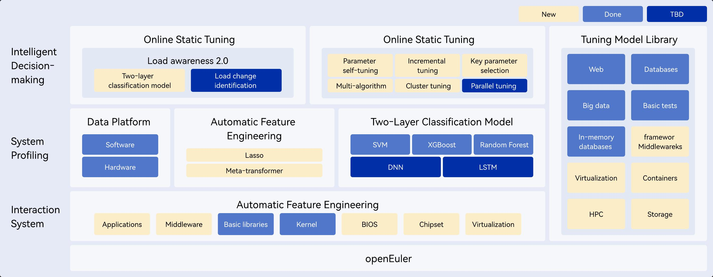

<MarkdownLayout>

# A-Tune

## AI-based Tuning Engine

[Try Now](https://atomgit.com/openeuler/A-Tune)

[Web UI](https://atomgit.com/openeuler/A-Tune-UI)

</MarkdownLayout>

<MarkdownLayout>

# Overview

## 

A-Tune is an automatic and intelligent performance tuning engine developed based on openEuler. It adopts AI technologies to ensure the optimal service running. A-Tune builds precise models for services running on the operating system, understands service features dynamically to infer specific applications. And it adjusts the parameters based on service loads to provide the optimal parameter configurations.

</MarkdownLayout>

<MarkdownLayout>

# Architecture

## 

A-Tune provides two core capabilities: online static tuning and offline dynamic tuning. The overall architecture consists of three layers: intelligent decision-making, system profiling, and interaction system.

The intelligent decision-making layer consists of the sensing and decision-making subsystems, which implement intelligent sensing of applications and decision-making of system tuning, respectively.

The system profiling layer includes the automatic feature engineering and the two-layer classification model. The automatic feature engineering is used for automatic selection of service features, and the two-layer classification model helps learn and classify service models.

The interaction system layer monitors and configures various system resources. The tuning policies are executed at this layer.

The tuning model library contains the tuning configurations for 20+ application scenarios of 10 categories.

</MarkdownLayout>

<MarkdownLayout>

# Documentation

## About A-Tune

&nbsp;

[Read more](https://atomgit.com/openeuler/A-Tune/blob/master/docs/en/24.03_LTS_SP2/getting_to_know_a_tune.md)

## Installation and Deployment

&nbsp;

[Read more](https://atomgit.com/openeuler/A-Tune/blob/master/docs/en/24.03_LTS_SP2/installation_and_deployment.md)

## How to Use

&nbsp;

[Read more](https://atomgit.com/openeuler/A-Tune/blob/master/docs/en/24.03_LTS_SP2/usage_instructions.md)

## FAQs

&nbsp;

[Read more](https://atomgit.com/openeuler/docs/blob/stable-common/docs/en/faq/server/atune_faqs.md)

#

[Feedback](mail-to:a-tune@openeuler.org)

</MarkdownLayout>
