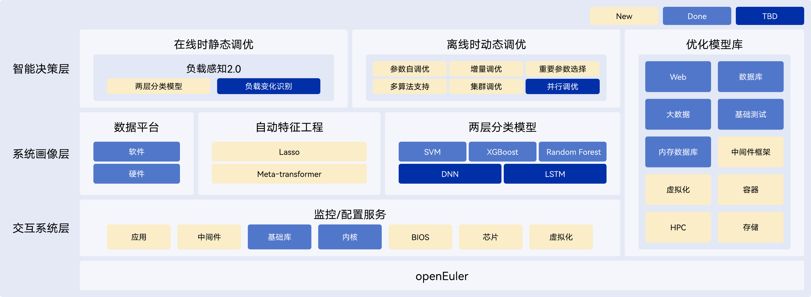

<MarkdownLayout>

# iSula

## Packs a huge punch in a small size

[Try Now](https://atomgit.com/openeuler/community/tree/master/sig/iSulad)

</MarkdownLayout>

<MarkdownLayout>

# Overview

##

iSula derives its name from a species of ant, one of the most powerful insects in the world despite its small size. This combination of ultimate power and minimal size is the perfect description of the iSula container technology solution.

</MarkdownLayout>

<MarkdownLayout>

# Architecture

## iSulad

###

iSulad provides a unified architecture for different CT and IT requirements. It features a lightweight, fast, and flexible design, unlocking great power like the small isula ant.

iSulad boasts the following features:

Multiple languages: supports C/C++and will support Rust in the future.

Northbound interface: provides the CRI that connects to Kubernets, as well as easy-to-use command lines.

Southbound interface: supports OCI runtime and image specifications for smooth replacement.

Container forms: supports multiple container forms, such as system and VM.

Scalability: provides a plug-in architecture that allows you to develop custom plug-ins.

iSulad is not restricted by hardware specifications and architectures. It features minimal background noise, making it a perfect option for many fields.

## isula-build

###

isula-build usually runs in the build environment and provides template container images for the runtime system.

During the build operation, isula-build reads Dockerfile as the input to quickly build container images that comply with the Docker and OCI image specifications. Then, isula-build distributes the images to the iSulad/Docker on the same node, local TAR packages, or remote container image repositories.

## isula-transform

###

isula-transform was released together with iSulad 2.0 to convert containers managed by the Docker container engine and migrate them to the iSulad engine. After the migration, iSulad allows you to effortlessly manage the lifecycle of containers.

</MarkdownLayout>

<MarkdownLayout>

# Documentation

## iSulad

### README

&nbsp;

[Read more](https://atomgit.com/openeuler/iSulad/blob/master/README.md)

### Architecture

&nbsp;

[Read more](https://atomgit.com/openeuler/iSulad/blob/master/docs/design/architecture.md)

### Build Guide for RISC-V Integration

&nbsp;

[Read more](https://atomgit.com/openeuler/iSulad/blob/master/docs/build_docs/guide/build_guide.md)

## isula-build

### README

&nbsp;

[Read more](https://atomgit.com/openeuler/isula-build/blob/master/README.zh.md)

### Manual

&nbsp;

[Read more](https://atomgit.com/openeuler/isula-build/blob/master/doc/manual_zh.md)

## isula-transform

### README

&nbsp;

[Read more](https://atomgit.com/openeuler/isula-transform/blob/master/README.md)

</MarkdownLayout>
