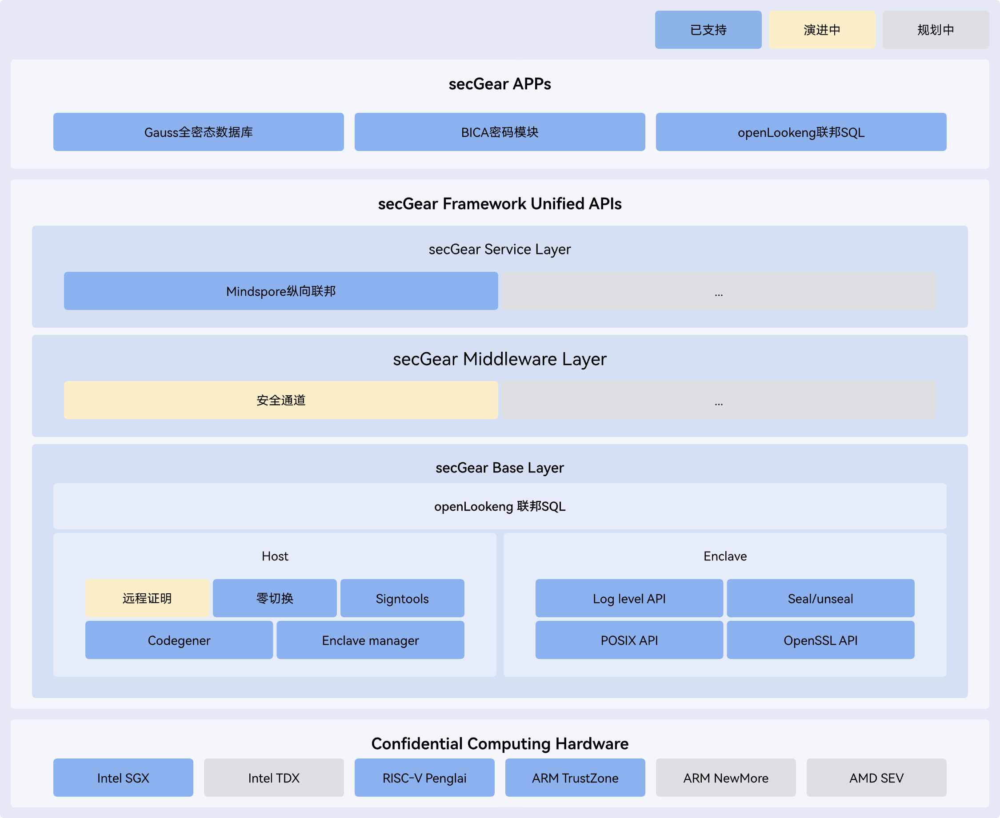

<MarkdownLayout>

# StratoVirt

## Virtualization platform for cloud data centers

[Try Now](https://atomgit.com/openeuler/stratovirt)

[Feedback](https://atomgit.com/openeuler/stratovirt/issues)

</MarkdownLayout>

<MarkdownLayout>

# Overview

## 

StratoVirt is an enterprise-grade virtualization cloud platform that uses a single architecture to support VM, containers, and serverless data center scenarios. StratoVirt has competitive advantages in key technologies such as lightweight and low noise, software and hardware collaboration, as well as premium security using Rust language.

StratoVirt reserves component-based assembling capabilities and interfaces in the architecture design, that is, premium features can be flexibly assembled and evolve to support standard virtualization. In this way, StratoVirt strikes a perfect balance between feature requirements, application scenarios, and flexibility.

</MarkdownLayout>

<MarkdownLayout>

# Feature

## Enhanced Security

StratoVirt uses the Rust language and supports seccomp to implement security isolation between multiple tenants.

## Lightweight and Low Noise

The simplified device model offers a startup time of under 50 ms, and a memory noise floor less than 4 MB. Serverless load is supported.

## Fast Scaling

StratoVirt supports device scaling within milliseconds, providing flexible resource scaling capabilities for lightweight loads.

## Software and Hardware Collaboration

StratoVirt supports x86 VT and Kunpeng-V to implement multi-system hardware acceleration.

## High Scalability

The device model can be extended to support complex device specifications such as PCI and implement standard VMs.

## Enhanced Heterogeneity

In addition to the common hardware SR-IOV passthrough solution, the Ascend software definition capability is used to implement more flexible allocation of heterogeneous computing power.

</MarkdownLayout>

<MarkdownLayout>

# Architecture

## 

The StratoVirt core architecture comprises three layers from top to bottom:

OCI compatibility interface: StratoVirt is compatible with the QEMU Machine Protocol (QMP) and inherits OCI capabilities.

BootLoader: StratoVirt abandons the conventional BIOS + GRUB boot mode and implements a lighter and faster boot operation.

MicroVM: This is the virtualization layer that leverages software and hardware collaboration to simplify the device management and support low-latency resource scaling.

</MarkdownLayout>

<MarkdownLayout>

# Documentation

## Introduction to StratoVirt

&nbsp;

[Read more](https://gitee.com/openeuler/Virt-docs/blob/master/docs/en/virtualization_platform/stratovirt/stratovirt_introduction.md)

## Installing StratoVirt

&nbsp;

[Read more](https://gitee.com/openeuler/Virt-docs/blob/master/docs/en/virtualization_platform/stratovirt/install_stratovirt.md)

## Preparing the Environment

&nbsp;

[Read more](https://gitee.com/openeuler/Virt-docs/blob/master/docs/en/virtualization_platform/stratovirt/prepare_env.md)

## Configuring VMs

&nbsp;

[Read more](https://gitee.com/openeuler/Virt-docs/blob/master/docs/en/virtualization_platform/stratovirt/vm_configuration.md)

## Managing VM Lifecycle

&nbsp;

[Read more](https://gitee.com/openeuler/Virt-docs/blob/master/docs/en/virtualization_platform/stratovirt/vm_management.md)

## Connecting to iSula Security Containers

&nbsp;

[Read more](https://gitee.com/openeuler/Virt-docs/blob/master/docs/en/virtualization_platform/stratovirt/interconnect_isula.md)

</MarkdownLayout>
