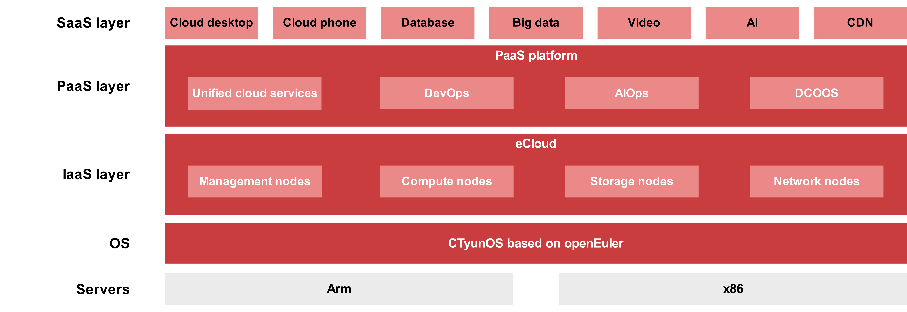

## Application Scenario

China Telecom released the self-developed CTyunOS based on openEuler in 2021. By August 2022, CTyunOS has been fully adapted to the services of China Telecom eCloud (e-Cloud). The comprehensive migration tool system and engineering capabilities of openEuler enabled China Telecom to seamlessly replace the original OS in all scenarios with CTyunOS. A total of 30,000 CTyunOS instances were deployed to effectively support China Telecom's cloudification & digital transformation strategy.

Currently, CTyunOS has been adapted to various scenarios within eCloud, encompassing infrastructure, platform, and application layers. It empowers compute, storage, network, and management nodes for the Infrastructure-as-a-Service (IaaS) layer, a unified cloud service platform and DevOps platform for the Platform-as-a-Service (PaaS) layer, Edge Cloud X, databases, and various other services. With CTyunOS, the overall platform performance increases by over 10%.

## Solution

CTyunOS adopts openEuler's six-step migration solution, covering creating a migration support team, conducting migration analysis, designing a migration plan, adapting software before migration, implementing migration, and performing testing and rollout. openEuler offers the x2openEuler tool for migration assessment and in-place upgrades.

- To ensure a seamless transition of services, x2openEuler performs thorough analysis of hardware, software, and configurations, including changes in upper-layer software interfaces, dependency versions, and post-migration OS configurations.

- x2openEuler in-place upgrade migrates the existing CentOS to openEuler within two hours, without requiring services to be redeployed or parameters reconfigured, significantly cutting down on time and effort. This cost-effective option enables the direct use of original server resources to remove the need for backup servers.

## Benefits

30,000 CTyunOS instances have been deployed to support eCloud's cloud regions, one pool for one city strategy, and IT cloud migration. These instances provide services for eCloud customers in various industries.

In the future, China Telecom will continue to cooperate with openEuler to enhance the reliability, availability, and completeness of CTyunOS through ongoing updates. China Telecom and openEuler will work together to bring technological innovations and breakthroughs to the digital foundation of eCloud, fostering the digital transformation of industry customers and the high-quality development of China's digital economy.
