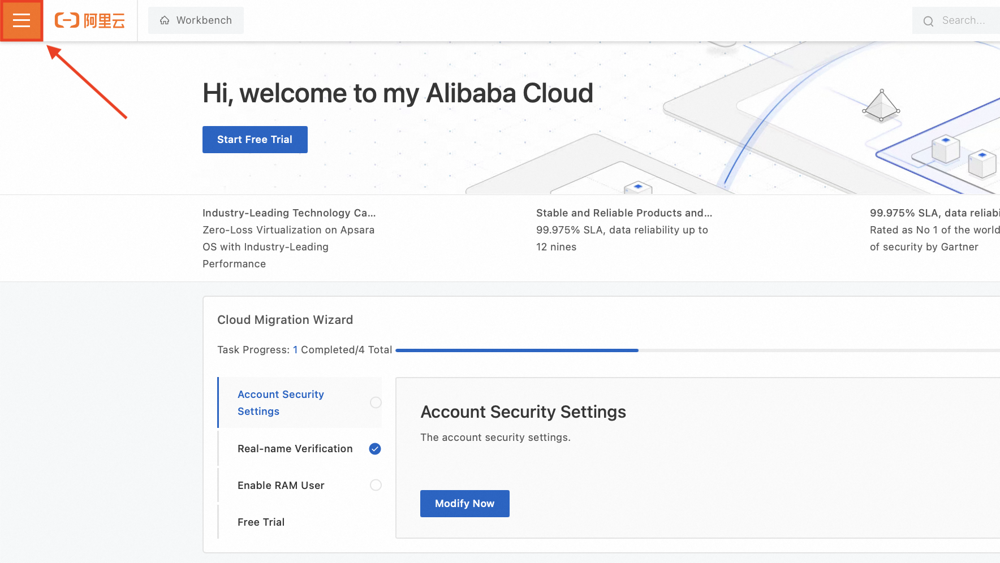
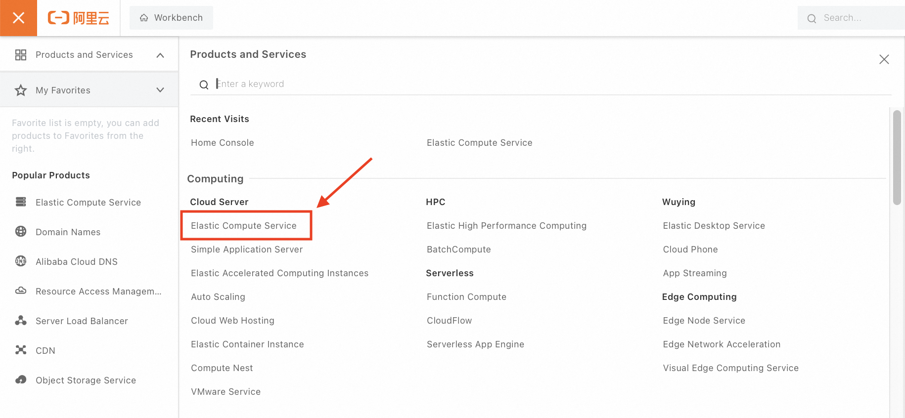
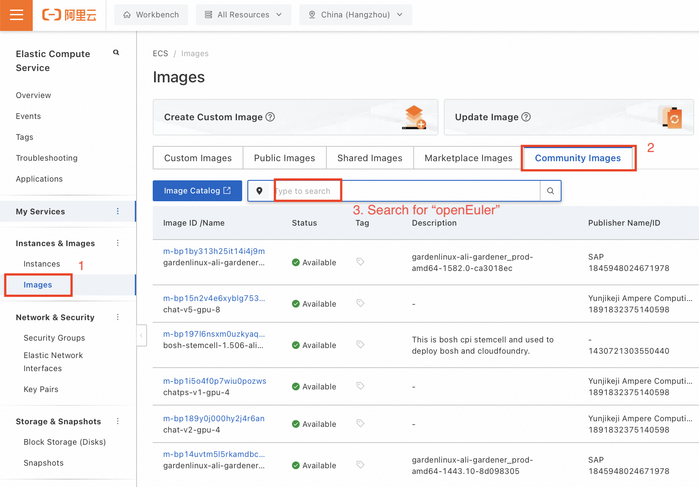

## Obtaining the openEuler Image on Alibaba Cloud

#### Step 1

Log in to the [Alibaba Cloud Console](https://cn.aliyun.com).

#### Step 2

Expand the **Home** tab and choose **Elastic Compute Service**.

   

   

#### Step 3

In the **Images** list, choose **Community Images**, and search for "openEuler."

   

#### Step 4

Select an openEuler version to create a VM.
