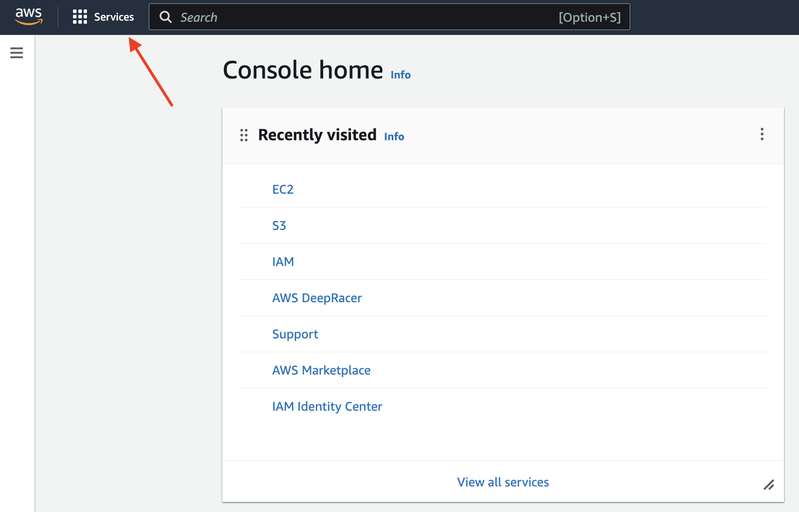
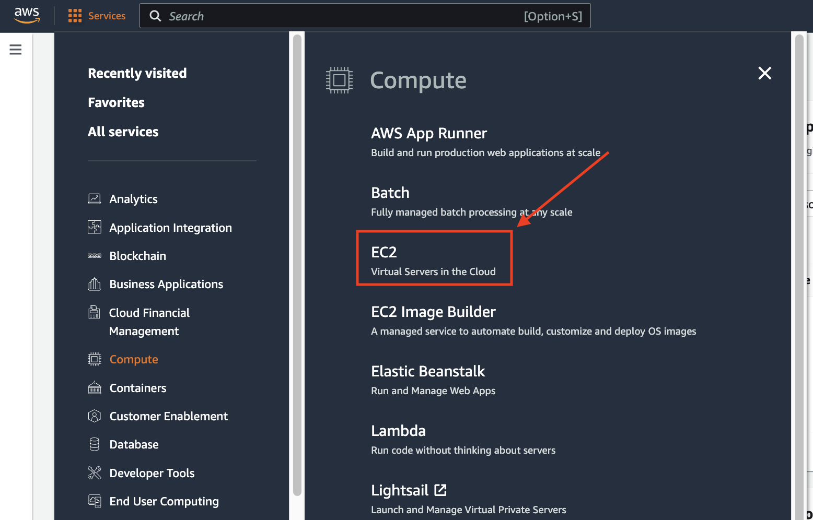

## Obtaining the openEuler Image on AWS

#### Step 1

Log in to the [AWS Console](https://console.aws.amazon.com).

#### Step 2

Expand the **Services** tab, select **Compute** and then **EC2**.

#### Step 3

In the **Images** list, choose **AMI Catalog**.

#### Step 4

Choose **Community AMIs** and search for "openEuler."

#### Step 5

Select an openEuler version to create a VM.
