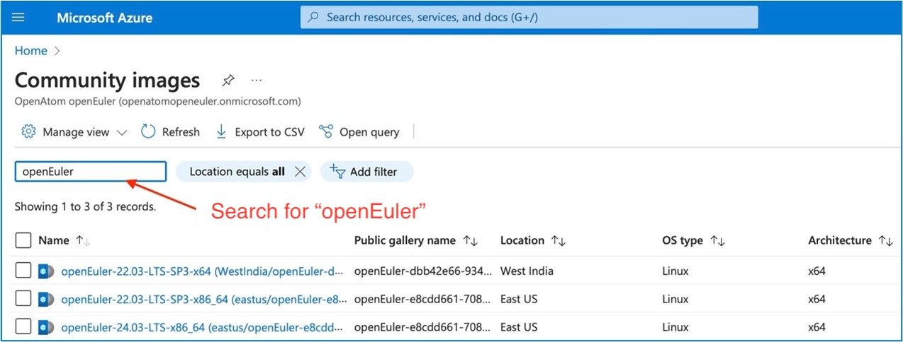
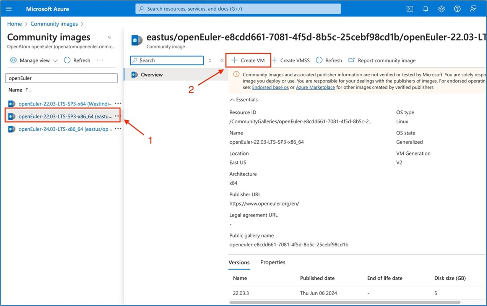

## Obtaining the openEuler Shared Image on Azure

1. Log in to the [Azure Portal](https://portal.azure.com/).

2. Go to the account home page and search for "Community images."

   

3. On the **Community images** page, search for the "openEuler" to view available openEuler images.

   

4. Click the target image and create a VM.

   