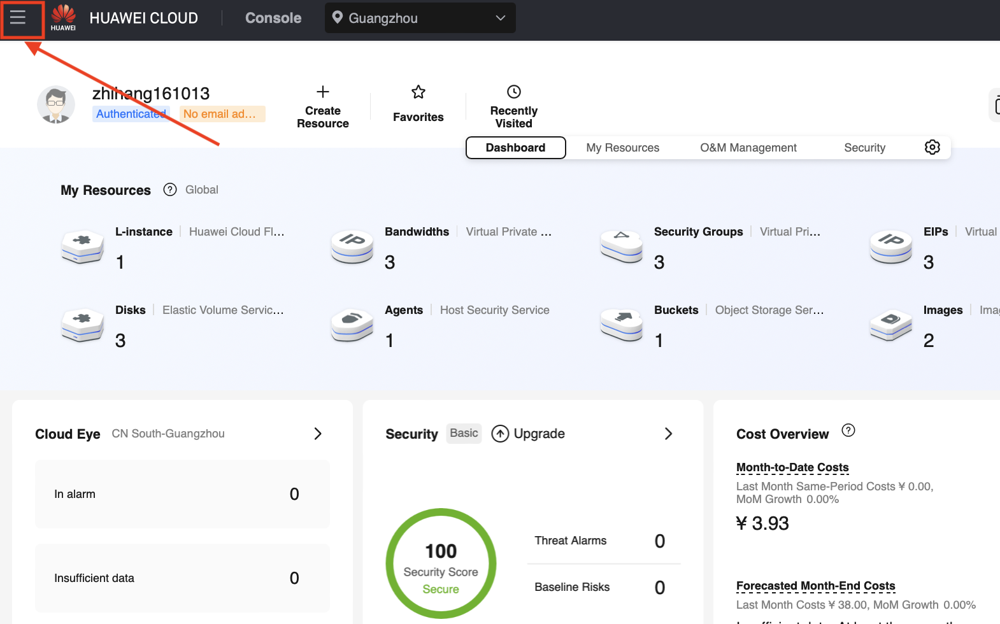
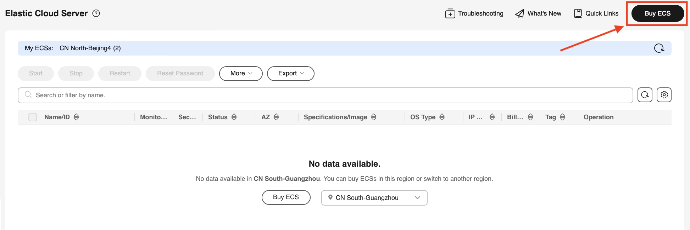
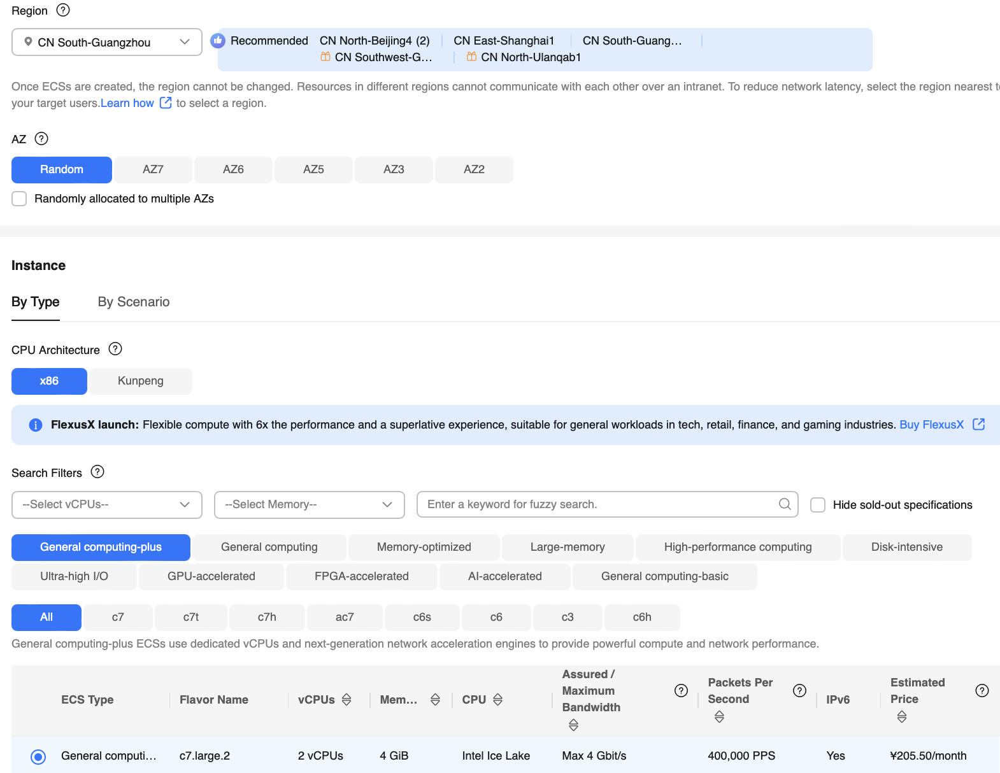

## openEuler Cloud Instance Creation

This section takes cloud host (instance) creation on Huawei Cloud as an example to illustrate how to use openEuler on a public cloud.

1. Log in to the HUAWEI CLOUD website and click **Console**.

   

2. Select **Elastic Cloud Server**.

   
   

3. Buy and configure an ECS.

   

   1. Configure computing resources.
      
   2. Select an openEuler image.
      
      
      
   3. Configure the network.
      
      
   4. Configure the login mode.
      
      Huawei Cloud KooGallery requires released images to prohibit **root** user login. Therefore, the **root** user can only log in through the console. If you need to use the **root** user, log in through the console and modify the **/etc/ssh/sshd_config** file.
   5. Completing the purchase.
      
   6. Log in and use the ECS.

      After the status of the created ECS changes to **Running**, you can remotely log in to the ECS.
      

      Due to the image release requirements of Huawei Cloud KooGallery, ECSs running openEuler images cannot be accessed via root login or password authentication. The default user is **openeuler**. Therefore, before using the ECS, you need to log in to the console as the **root** user set in step 4 and modify the configuration items in the **/etc/ssh/sshd_config** file as follows:

      ```shell
      # /etc/ssh/sshd_config

      # Allows root user login.
      PermitRootLogin yes
      # Allows password authentication.
      PasswordAuthentication yes
      ```

      After the modification, you can log in as the **root** user from any terminal through SSH.

      ```shell
      $ ssh root@1.92.159.107

      Authorized users only. All activities may be monitored and reported.
      root@1.92.159.107's password:

      Authorized users only. All activities may be monitored and reported.
      Last login: Mon Apr 29 11:03:05 2024


      Welcome to 5.10.0-182.0.0.95.oe2203sp3.x86_64

      System information as of time:  Mon Apr 29 11:19:11 AM UTC 2024

      System load: 	0.00
      Processes: 	80
      Memory used: 	3.7%
      Swap used: 	0.0%
      Usage On: 	4%
      IP address: 	192.168.0.231
      Users online: 	2

      [root@openeuler-host ~]#
      ```

**The method of using openEuler images on other clouds is similar to that on Huawei Cloud. For details, see the user guide of the respective cloud product.**