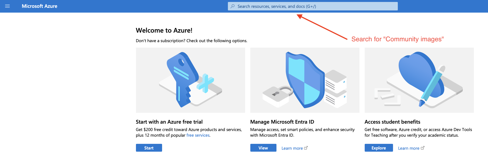

# Public Cloud Image User Guide

Multiple public cloud vendors are providing openEuler cloud images. This document takes Huawei Cloud as an example to introduce how to use openEuler images. The usage of openEuler on [other clouds](https://www.openeuler.org/en/download/get-os/) is similar to that on Huawei Cloud, and the detailed usage methods can be found in the user guides of the respective cloud products.

## Available Versions

The following openEuler image versions have been released on mainstream public clouds:

- **AWS Marketplace**

| Version         | AMI ID                | Architecture   |
| :-------------- | :-------------------- | :------ |
| 22.03-LTS-SP1 2 | ami-0baeb9308b134d488 | x86_64  |
| 22.03-LTS-SP1   | ami-03231b47c646ab173 | AArch64 |
| 22.03-LTS-SP2   | ami-0eceb9e642c0299f8 | x86_64  |
| 22.03-LTS-SP2   | ami-067e1b0f491b95db2 | AArch64 |
| 22.03-LTS-SP3   | ami-0145435b3931b0fe7 | x86_64  |
| 22.03-LTS-SP3   | ami-01677a5af1dee0f72 | AArch64 |
| 23.09           | ami-08556c9d0dd2f0a01 | x86_64  |
| 23.09           | ami-051484777fe029d4e | AArch64 |

- **Huawei Cloud KooGallery**

| Version         | Architecture   |
| :-------------- | :------ |
| 22.03-LTS-SP2 1 | x86_64  |
| 22.03-LTS-SP2   | AArch64 |
| 22.03-LTS-SP3   | x86_64  |
| 22.03-LTS-SP3   | AArch64 |
| 23.09           | x86_64  |
| 23.09           | AArch64 |

**Note:** Tencent Cloud has not yet widely adopted Arm computing power, and many regions in China are not available during release. Therefore, the openEuler image for AArch64 has not been released on Tencent Cloud.

## openEuler Cloud Instance Creation

This section takes cloud host (instance) creation on Huawei Cloud as an example to illustrate how to use openEuler on a public cloud.

1. Log in to the HUAWEI CLOUD website and click **Console**.

   

2. Select **Elastic Cloud Server**.

   
   

3. Buy and configure an ECS.

   

   1. Configure computing resources.
      
   2. Select an openEuler image.
      
      
      
   3. Configure the network.
      
      
   4. Configure the login mode.
      
      Huawei Cloud KooGallery requires released images to prohibit **root** user login. Therefore, the **root** user can only log in through the console. If you need to use the **root** user, log in through the console and modify the **/etc/ssh/sshd_config** file.
   5. Completing the purchase.
      
   6. Log in and use the ECS.

      After the status of the created ECS changes to **Running**, you can remotely log in to the ECS.
      

      Due to the image release requirements of Huawei Cloud KooGallery, ECSs running openEuler images cannot be accessed via root login or password authentication. The default user is **openeuler**. Therefore, before using the ECS, you need to log in to the console as the **root** user set in step 4 and modify the configuration items in the **/etc/ssh/sshd_config** file as follows:

      ```shell
      # /etc/ssh/sshd_config

      # Allows root user login.
      PermitRootLogin yes
      # Allows password authentication.
      PasswordAuthentication yes
      ```

      After the modification, you can log in as the **root** user from any terminal through SSH.

      ```shell
      $ ssh root@1.92.159.107

      Authorized users only. All activities may be monitored and reported.
      root@1.92.159.107's password:

      Authorized users only. All activities may be monitored and reported.
      Last login: Mon Apr 29 11:03:05 2024


      Welcome to 5.10.0-182.0.0.95.oe2203sp3.x86_64

      System information as of time:  Mon Apr 29 11:19:11 AM UTC 2024

      System load: 	0.00
      Processes: 	80
      Memory used: 	3.7%
      Swap used: 	0.0%
      Usage On: 	4%
      IP address: 	192.168.0.231
      Users online: 	2

      [root@openeuler-host ~]#
      ```

**The method of using openEuler images on other clouds is similar to that on Huawei Cloud. For details, see the user guide of the respective cloud product.**

## Obtaining the openEuler Shared Image on Azure

1. Log in to the [Azure Portal](https://portal.azure.com/).

2. Go to the account home page and search for "Community images."

   

3. On the **Community images** page, search for the "openEuler" to view available openEuler images.

   

4. Click the target image and create a VM.

   

## Obtaining the openEuler Image on Alibaba Cloud

1. Log in to the [Alibaba Cloud Console](https://cn.aliyun.com).

2. Expand the Home tab and choose **Elastic Compute Service**.

   

   

3. In the **Images** list, choose **Community Images**, and search for "openEuler."

   

4. Select an openEuler version to create a VM.
