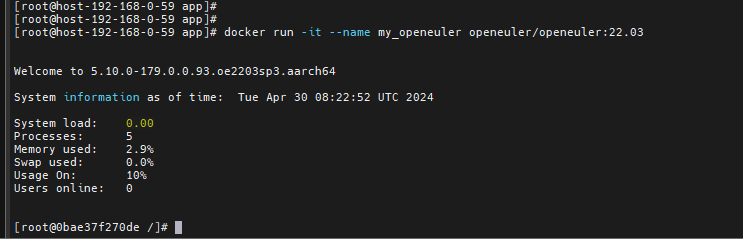

# openEuler Container Image Deployment Guide

Beyond base images, the openEuler community has released over 20 images of commonly used open source applications. This document focuses on the installation and basic usage of openEuler base images. If you are interested in other openEuler community images, we encourage you to explore and experiment with them.

## Base Image Overview

1. Container image repository

   openEuler official container image repository, containing openEuler base images and application images. You can find the usage and introduction of the images [here](https://gitee.com/openeuler/openeuler-docker-images).  

2. Base image address

   openEuler base image official website: [repo.openeuler.org](https://repo.openeuler.org/)

3. Base image versions

   - [20.03-lts](https://repo.openeuler.org/openEuler-20.03-LTS/docker_img/)
   - [20.03-lts-sp1](https://repo.openeuler.org/openEuler-20.03-LTS-SP1/docker_img/)
   - [20.03-lts-sp2](https://repo.openeuler.org/openEuler-20.03-LTS-SP2/docker_img/)
   - [20.03-lts-sp3](https://repo.openeuler.org/openEuler-20.03-LTS-SP3/docker_img/)
   - [20.03-lts-sp4, 20.03](https://repo.openeuler.org/openEuler-20.03-LTS-SP4/docker_img/)
   - [20.09](https://archives.openeuler.openatom.cn/openEuler-20.09/docker_img/)
   - [21.03](https://archives.openeuler.openatom.cn/openEuler-21.03/docker_img/)
   - [21.09](https://archives.openeuler.openatom.cn/openEuler-21.09/docker_img/)
   - [22.03-lts](https://repo.openeuler.org/openEuler-22.03-LTS/docker_img/)
   - [22.09](https://archives.openeuler.openatom.cn/openEuler-22.09/docker_img/)
   - [22.03-lts-sp1](https://repo.openeuler.org/openEuler-22.03-LTS-SP1/docker_img/)
   - [22.03-lts-sp2](https://repo.openeuler.org/openEuler-22.03-LTS-SP2/docker_img/)
   - [22.03-lts-sp3, 22.03, latest](https://repo.openeuler.org/openEuler-22.03-LTS-SP3/docker_img/)
   - [23.03](https://repo.openeuler.org/openEuler-23.03/docker_img/)
   - [23.09](https://repo.openeuler.org/openEuler-23.09/docker_img/)

## Image Repositories

Supported base images and application images are released to the following image repositories for download and use:

- [hub.docker.com](https://hub.docker.com/)
- [quay.io](https://quay.io/)
- [hub.oepkgs.net](https://hub.oepkgs.net/)
- [repo.openeuler.org](https://repo.openeuler.org/)

## Image Deployment Process

### 1. Environment Setup

- For Windows, prepare a VM.
- For macOS, use the built-in terminal.

### 2. Docker Deployment

```bash
#1. Run the Docker installation command. If Docker has been installed or the Docker client has been downloaded, skip this step.
dnf -y install docker  # Example command for installing Docker in a VM. For macOS, follow the respective procedures.

# 2. After Docker is installed, run the following command to view the installed version.
docker version
```


### 3. Image Pulling

> Generally, the latest image version is used. To use other versions, replace **latest** with the required version. You are advised to pull images from a geographically closer mirror repository for fast and stable pulling.

```bash
# Pull an image from the default repository.
docker pull openeuler/openeuler:latest
# Pull an image from the OEPKGS repository.
docker pull hub.oepkgs.net/openeuler/openeuler:latest
```

```bash
#After the image is pulled, run the following command to view images:
docker images
```


### 4. Container Startup

> Generally, the latest image version is used. To use other versions, replace **latest** with the required version.

```bash
# Start an image from the default repository.
docker run -it  openeuler/openeuler:latest
# Start an image from the OEPKGS repository.
docker run -it  hub.oepkgs.net/openeuler/openeuler:latest
```



### 5. Container Running Test

Write a test script. By default, openEuler is installed with Python 3. You can write a simple "HelloWorld" script for testing.

The example is as follows:

```bash
# Open the text editor.
vi HelloWorld.py
```

```bash
# Press "Insert" or "i" to start editing.
```

```bash
# Write the test program.
print("Hello, world!")
```

```bash
# Press Esc to stop editing. Enter ":" (Shift+;) and "wq!" to save the file and exit.
```

```bash
# Run the Python script for testing.
python3 HelloWorld.py
```

File editing example


Application running example


## Obtaining openEuler in OrbStack

[OrbStack](https://orbstack.dev/) is a lightweight VM platform on macOS that supports openEuler.
After downloading OrbStack from <https://orbstack.dev/download>, click **+** and select openEuler to create an openEuler VM.


