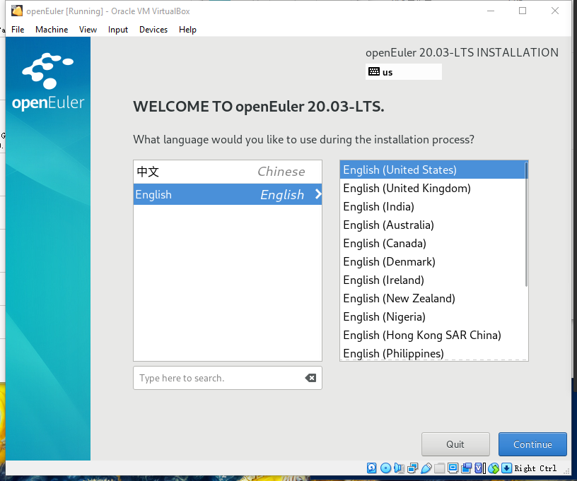

# Installing openEuler in VirtualBox on Windows

VirtualBox, originally developed by Innotek GmbH and now maintained by Oracle Corporation, is a VM software component of the Oracle xVM virtualization platform. Users can install openEuler VMs through VirtualBox using images downloaded from the official openEuler repository.

openEuler download link: <https://www.openeuler.org/en/download>

## Environment Preparation

- Windows 10 (64-bit)
- Oracle VM VirtualBox 6.1.4
- openEuler image for x86: [openEuler-20.03-LTS-x86_64-dvd.iso](https://repo.openeuler.org/openEuler-20.03-LTS/ISO/x86_64/openEuler-20.03-LTS-x86_64-dvd.iso)

## Installation Procedure

### 1. VirtualBox Installation

Download the VirtualBox installer from the [VirtualBox official website](https://www.virtualbox.org/wiki/Downloads).

Use a custom installation path, for example, **D:\software\Oracle\VirtualBox**, and use default settings for subsequent steps.

After the installation is complete, press **Ctrl**+**G** to open global settings and change the default VM location, for example, **D:\myVM**.

### 2. VM Creation

Choose **Machine** > **New** and enter the VM configuration information, as shown in the following figure.

Set **Name** to openEuler, **Type** to Linux, and **Version** to **Other Linux (64-bit)**. Then, click **Next**.

Allocate system memory to the VM as its memory. Set the value to 4 GB (4,096 MB).

Choose **Create a virtual hard disk now**.

Select **VDI (VirtualBox Disk Image)** for the hard disk file type and click **Next**.

Select **Dynamically allocated** and click **Next**.

It is more efficient to allocate a large amount of memory to a VM and let it dynamically use drive space as needed, shrinking automatically when idle.

Set the VM hard disk size to 64 GB.

Now, the VM has been created, and hardware resources required by openEuler have been prepared.

### 3. openEuler Installation

Start the VM created in the previous step.

Click the folder icon on the right.

Click **Add** and select **openEuler-20.03-LTS-x86_64-dvd.iso** downloaded during preparation.

Click **Start** to enter the installation page.

Select **Install openEuler 20.03-LTS** and press **Enter**.

Click **Continue**.

Select **Installation Destination**.

Select the target drive and click **Done**.

Select **Begin Installation**.

The following figure shows installation in progress:

Set the password of the **root** user. The password will be used for subsequent login.  

After the installation is complete, click **Reboot** to restart the VM.

The installation page is displayed again.

Stop the VM. In **Storage** of VM settings, right-click **openEuler-20.03-LTS-x86_64-dvd.iso**, choose **Remove Attachment**, save the settings, and exit.

Restart the VM. When the following screen is displayed, press **Enter**.

Enter the user (**root**) and password set during the installation to log in to the VM.

Now, the openEuler VM is ready for use.
