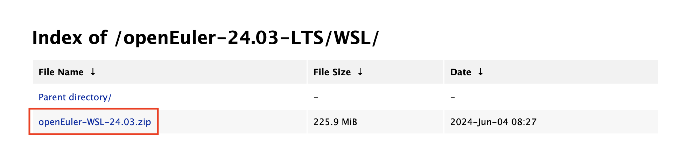
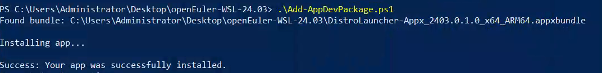
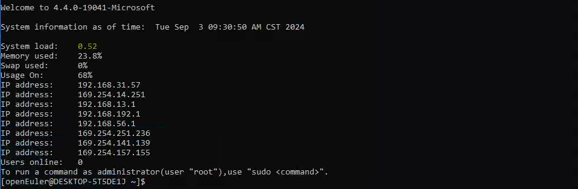

# openEuler WSL Installation

[Windows Subsystem For Linux (WSL)](https://learn.microsoft.com/en-us/windows/wsl/about) developed by Microsoft allows users to run Linux environments directly on Windows.

With the openEuler WSL application, you can now experience a genuine openEuler development environment seamlessly integrated within Windows.

openEuler now offers several versions on [Microsoft Store](https://apps.microsoft.com/search?query=openeuler&hl=en-us&gl=US), including 24.09, 24.03 LTS, 23.09, 23.03, 22.09, and more versions. Download and experience openEuler today!

Alternatively, if you do not wish to use Microsoft Store, you can install openEuler WSL through sideload following the instructions below.

1. Install openEuler WSL.
    - The whole procedure is performed using openEuler 24.03 LTS. If you cannot or do not wish to use Microsoft Store, download the [WSL sideload package of openEuler 24.03 LTS](https://repo.openeuler.org/openEuler-24.03-LTS/WSL/openEuler-WSL-24.03.zip). If you install the WSL application from Microsoft Store, you can skip the next two steps.

    - Double-click **DistroLauncher-Appx_2403.0.1.0_x64_ARM64.cer** in the package and choose **Install Certificate** > **Local Machine** > **Place all certificates in the following store** > **Trusted People**.

    
    - Install the sideload application: Start a PowerShell terminal as an administrator and run the **Add-AppDevPackage.ps1** script in the package.

    
    - Initialize the WSL environment: After the installation is complete, click the icon of the openEuler 24.03 application in the Start menu. After the application is started, initialize the user and password as prompted to start the WSL environment.

    
