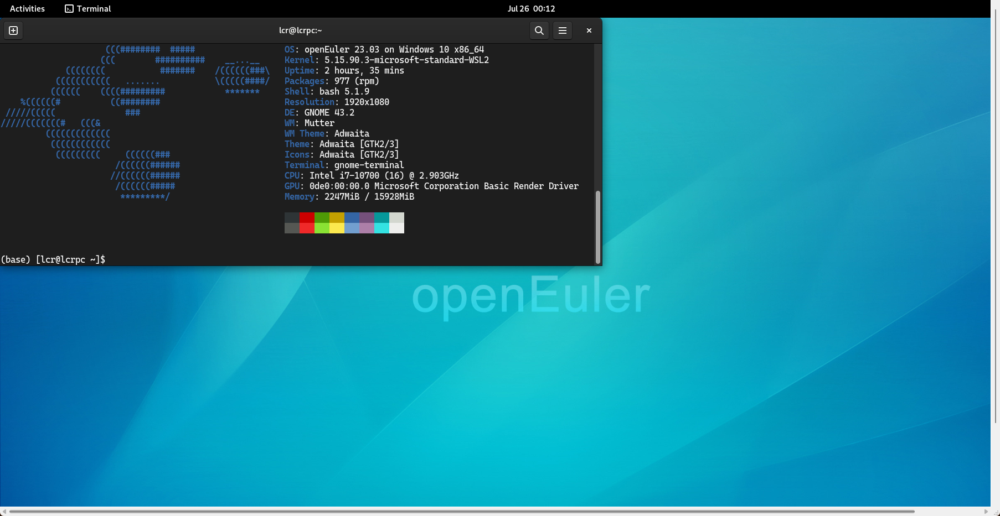
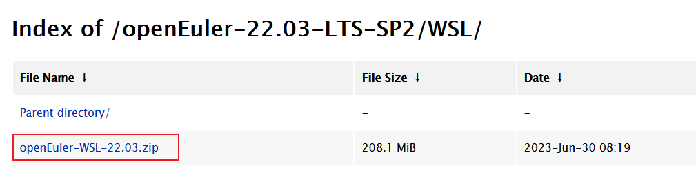
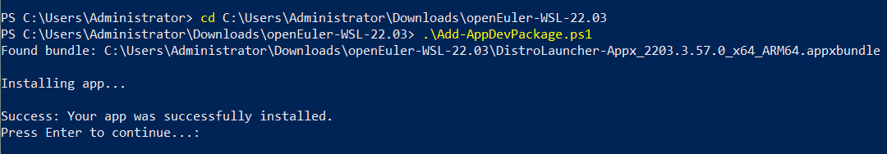
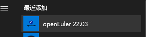
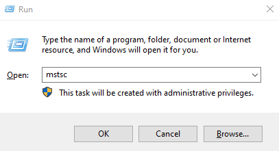
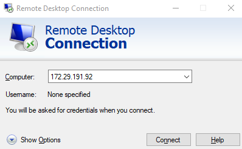

# Complete openEuler Desktop Experience with WSL

[Windows Subsystem For Linux (WSL)](https://learn.microsoft.com/en-us/windows/wsl/about) developed by Microsoft allows users to run Linux environments directly on Windows.

With the openEuler WSL application, you can now experience a genuine openEuler development environment seamlessly integrated within Windows.

openEuler now offers several versions on [Microsoft Store](https://apps.microsoft.com/search?query=openeuler&hl=en-us&gl=US), including 24.03 LTS, 23.09, 22.09, and more versions. Download and experience openEuler today!

Alternatively, if you do not wish to the Microsoft Store, you can install openEuler WSL through sideload following the instructions below.

## openEuler User Repo

To enrich the software package ecosystem of openEuler, the community launched the [openEuler User Repository (EUR)](https://eur.openeuler.openatom.cn/).

EUR is a solution if you find that some software packages are missing or existing packages do not meet your requirements when using openEuler.

## WSL + EUR

Currently, the mainstream desktop solution in the WSL community is [Win-KeX](https://www.kali.org/docs/wsl/win-kex/), which is exclusive to Kali Linux. The seamless mode of Kex is implemented by xrdp, which is not introduced in the openEuler community for the time being.

However, with EUR and WSL, we can add xrdp to openEuler and run xrdp desktop environment on WSL.

The following figure shows an openEuler desktop environment on Windows.



Below is the procedure to run the GNOME desktop environment on the WSL of openEuler 22.03:

1. Install the WSL on Windows.
    - The whole procedure is performed using openEuler 22.03. If you cannot access Microsoft Store, download the [WSL sideload package of openEuler 22.03-LTS-SP2](https://repo.openeuler.org/openEuler-22.03-LTS-SP2/WSL/openEuler-WSL-22.03.zip). If you install openEuler 22.03 from Microsoft Store, you can skip the next two steps.

    - Double-click **DistroLauncher-Appx_2203.1.164.0_x64_ARM64.cer** in the package and choose **Install Certificate** > **Local Machine** > **Place all certificates in the following store** > **Trusted People**.

    
    - Install the sideload application: Start a PowerShell terminal as an administrator and run the **Add-AppDevPackage.ps1** script in the package.

    
    - Initialize the WSL environment: After the installation is complete, click the icon of the openEuler 22.03 application in the Start menu. After the application is started, initialize the user and password as prompted to start the WSL environment.

    

2. Set up the desktop environment. This procedure uses xrdp in [EUR](https://eur.openeuler.openatom.cn/coprs/mywaaagh_admin/xrdp/) to implement the desktop environment. 
    - Obtain the configuration of the EUR repository of openEuler 23.03. For other versions, obtain the configuration from [here](https://eur.openeuler.openatom.cn/coprs/mywaaagh_admin/xrdp/).

    ```shell
    $ sudo curl -o /etc/yum.repos.d/xrdp.repo -L https://eur.openeuler.openatom.cn/coprs/mywaaagh_admin/xrdp/repo/openeuler-23.03/mywaaagh_admin-xrdp-openeuler-23.03.repo
    
    We trust you have received the usual lecture from the local System
    Administrator. It usually boils down to these three things:
    
        #1) Respect the privacy of others.
        #2) Think before you type.
        #3) With great power comes great responsibility.
    
    [sudo] password for lcr:
    % Total    % Received % Xferd  Average Speed   Time    Time     Time  Current
                                    Dload  Upload   Total   Spent    Left  Speed
    100   379  100   379    0     0   1237      0 --:--:-- --:--:-- --:--:--  1238
    ```

    - Install the software packages related to xrdp and GNOME.

    ```shell
    $ sudo dnf in xrdp gnome-terminal gdm neofetch
    ...
    Total                                                                                   1.2 MB/s | 358 MB     05:05
    Copr repo for xrdp owned by mywaaagh_admin                                              7.0 kB/s | 1.0 kB     00:00
    Importing GPG key 0xA893D75B:
    Userid     : "mywaaagh_admin_xrdp (None) <mywaaagh_admin#xrdp@copr.osinfra.cn>"
    Fingerprint: 945E 21A6 D982 49A7 A61A E62A 026A 219C A893 D75B
    From       : https://eur.openeuler.openatom.cn/results/mywaaagh_admin/xrdp/pubkey.gpg
    Is this ok [y/N]: y
    ...
    
    Complete!
    ```

    - Start the xrdp and gdm services.

    ```bash
    sudo systemctl start xrdp
    sudo systemctl restart gdm
    ```

3. Run the `mstsc.exe` command on Windows to access the xrdp service that is just started. You can run the `ip a` command in the WSL to obtain its IP address.

    ```shell
    $ ip a
    1: lo: <LOOPBACK,UP,LOWER_UP> mtu 65536 qdisc noqueue state UNKNOWN group default qlen 1000
        link/loopback 00:00:00:00:00:00 brd 00:00:00:00:00:00
        inet 127.0.0.1/8 scope host lo
        valid_lft forever preferred_lft forever
        inet6 ::1/128 scope host
        valid_lft forever preferred_lft forever
    2: eth0: <BROADCAST,MULTICAST,UP,LOWER_UP> mtu 1500 qdisc mq state UP group default qlen 1000
        link/ether 00:15:5d:1a:3f:30 brd ff:ff:ff:ff:ff:ff
        inet 172.29.191.92/20 brd 172.29.191.255 scope global eth0
        valid_lft forever preferred_lft forever
        inet6 fe80::215:5dff:fe1a:3f30/64 scope link
        valid_lft forever preferred_lft forever
    (base) [lcr@lcrpc cascadia-code-nerd-fonts-mono]$
    ```

    

    
    
4. After the remote desktop is connected, select **Xvnc** and enter the user name and password created when the WSL is started for the first time to access the GNOME desktop of the openEuler.

    

    

## Precautions

- Multiple WSL instances share the same network. Therefore, after the xrdp service is enabled for an instance, the service will fail to be started in another WSL instance due to port conflicts. In this case, you can modify the listening ports in **/etc/xrdp/xrdp.ini** and **/etc/xrdp/sesman.ini**.
- After the remote desktop is successfully connected, the window may exit unexpectedly due to residual X-sessions in the system. In this case, you can try to restart the gdm service.

    ```shell
    sudo systemctl restart gdm
    ```

- The font used in the GNOME terminal screenshot is cascadia-code-nerd-fonts-mono, which is also hosted in the xrdp repository of EUR.
- Theoretically, xrdp can start any desktop environment using `/etc/xrdp/startwm.sh`. Any desktop session process can be added to **$HOME/.xsession**. For example, to start i3, run `echo i3 > $HOME/.xsession && chmod +x ~/.xsession`. When xrdp is connected, an i3 session is started.
