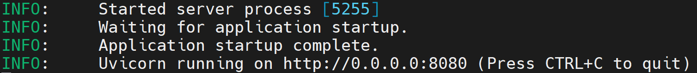
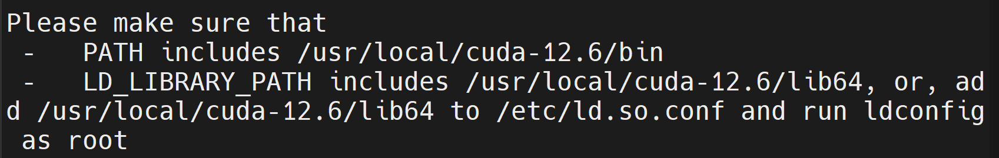

# 引言

上期介绍了在openEuler上使用Ollama推理框架快速部署DeepSeek的流程，适合于个人开发者与AI爱好者能快速上手体验DeepSeek。但是Ollama不适合大规模AI部署、大并行计算任务等场景，vLLM框架在这个场景则具有独到的优势。vLLM是一款专注于高性能LLM推理的工具，能够有效利用多核CPU和GPU资源，更加适合团队及企业用户。

# 系统环境硬件要求

CPU推理规格：

| 模型                        | CPU                     | 内存       | 存储       |
|----------------------|-------------------|----------|------------|
| DeepSeek-R1-Distill-Qwen-1.5B   | 至少8核  | 16GB以上   | 60GB以上 |
| DeepSeek-R1-Distill-Qwen-7B      | 至少128核   | 32GB以上   | 60GB以上 |
| DeepSeek-R1-Distill-Llama-8B      | 至少128核  | 32GB以上   | 60GB以上 |

GPU推理规格

| 模型                        | CPU               |    GPU      |    内存       | 存储       |
|----------------------|---------------|------------|----------|------------|
| DeepSeek-R1-Distill-Qwen-1.5B   | 至少8核     |  至少6GB显存   | 16GB以上   | 60GB以上 |
| DeepSeek-R1-Distill-Qwen-7B      | 至少32核 |  至少32GB显存   | 32GB以上   | 60GB以上 |
| DeepSeek-R1-Distill-Llama-8B      | 至少32核 |   至少32GB显存  | 32GB以上   | 60GB以上 |

# 使用vLLM推理框架的DeepSeek部署过程

以下部署流程以鲲鹏920服务器，openEuler 24.03 LTS操作系统为例说明如何使用vLLM推理框架部署DeepSeek-R1-Distill-Llama-8B。

* vLLM框架对safetensors模型支持较好，可以从hf-mirror.com下载模型来获得更快的下载速度：

```
pip install huggingface-hub
export HF_ENDPOINT="https://hf-mirror.com"
huggingface-cli download deepseek-ai/DeepSeek-R1-Distill-Llama-8B --local-dir DeepSeek-R1-Distill-Llama-8B
```

## 方式一：在鲲鹏CPU上的部署流程

首先需要安装必要的基础软件。

```
yum install -y gcc g++ cmake python-pip python3-devel ninja-build.aarch64 numactl-devel.aarch64 git
pip install numpy
```

设置环境变量。

```
# 环境变量OMP_NUM_THREADS指定了OpenMP并行使用的线程数，需要根据自己计算机的CPU核数来确定。
export KUNPENG_CPU_INFERENCE=enable
export OMP_NUM_THREADS=96
```

在鲲鹏服务器上（arm架构）采用源码编译安装的方式来构建vLLM，流程如下：

```
git clone https://github.com/vllm-project/vllm.git
cd vllm
VLLM_TARGET_DEVICE=cpu pip install -e . -i https://mirrors.huaweicloud.com/repository/pypi/simple
```

通过如下命令启动模型：

```
python -m vllm.entrypoints.openai.api_server \
    --served-model-name deepseek-r1:8b \
    --model /home/deepseek/DeepSeek-R1-Distill-Llama-8B \
    --trust-remote-code \
    --host 0.0.0.0 \
    --port 8080 \
    --max-model-len 4096 \
    --enforce-eager \
    --dtype float16 &
```

下面为部分指令的解读：

* `--served-model-name`指定部署的模型名称，这里指定为`deepseek-r1:8b`
* `--model`指定要加载的模型路径，这里需要注意修改模型路径为自己刚刚下载的模型路径文件
* `--host`指定服务器监听的IP地址，`0.0.0.0`表示监听所有的网络接口，允许外部访问
* `--port`指定服务器监听的端口号，这里指定为`8080`，读者可以自行修改
* `--max-model-len`指定模型的最大上下文长度，这里指定为`4096`，超过该长度的输入会被截断
* `--dtype float16`指定模型计算的数据类型为`float16`（半精度浮点数）


当显示下述输出时，模型部署成功：


通过如下命令进行功能验证：

```
curl -X POST "http://localhost:8080/v1/chat/completions" \
-H "Content-Type: application/json" \
-d '{
"model": "deepseek-r1",
"messages": [{"role": "user", "content": "请介绍一下开源操作系统openEuler"}]
}'
```

问答效果展示：

```
{
	"id": "chatcmpl-e8643c42d3e04fe3b509d284b761422d",
	"object": "chat.completion",
	"created": 1739419475,
	"model": "deepseek-r1:8b",
	"choices": [{
		"index": 0,
		"message": {
			"role": "assistant",
			"reasoning\_content": null,
			"content": "好的,我现在遇到了关于openEuler的问题,我需要仔细思考一下该怎么介绍它。首先，openEuler是一个操作系统，类似于Linux和Windows,主要面向企业用户,提供了诸多高级功能。它在几年前发布，开源社区支持很好,这点很重要,说服用户使用的关键点。在资源管理方面,openEuler有高效的内核,支持Containerd和CRI,让云原生应用方便运行。安全性也是一大卖点,多级权限和容器安全机制都是亮点,满足企业对安全的需求。当然,openEuler也有不足之处。虽然功能全面,但相较于传统大 flea Like Linux,生态系统还不够成熟。企业如果有特殊需求,可能还是得依赖花旗帮派,这也是需要考虑的。其他挑战包括引起的许可问题和技术债务,需要持续改进。所以,总体来看,openEuler适合需要高性能和可靠性企业用户,特别是开源技术和云原生应用方面的团队。它能提供一整套工具,解决很多复杂问题,但仍在不断发展中,未来有很多潜力。</think>openEuler 是一个开源操作系统,旨在为企业用户提供高性能和可靠的运维体验。它结合了 Linux 的成熟稳定性和 Windows 的现代化 User Experience。开源背景使得 openEuler 适合开发者和企业,可以根据特定需求进行定制和优化。由于其高效的资源管理和强大的安全机制,openEuler 在云原生应用和容器化环境中表现优异。然而,尽管功能丰富,这些要是到传统操作系统路线上的uggy以外,openEuler 的生态系统尚未成熟,可能难以满足所有复杂需求。总体而言,openEuler 是一个有潜力的操作系统,值得企业关注。",
			"tool_calls": []
		},
		"Logprobs": null,
		"finish_reason": "stop",
		"stop_reason": null
	}],
	"usage": {
		"prompt_tokens": 15,
		"total_tokens": 466,
		"completion_tokens": 451,
		"prompt_tokens details": null
	},
	"prompt_logprobs": null
}
```

## 方式二：在鲲鹏CPU+NVIDIA GPU上的部署流程

该部署流程是以在鲲鹏920服务器，使用cuda 12.6版本进行部署举例。不同的cuda版本在部署安装时需要选择适配的torch版本，流程相同。安装时请开发者自行处理，本文不再赘述。

首先需要安装必要的基础软件。

```
yum install -y gcc g++ cmake python-pip python3-devel ninja-build.aarch64 numactl-devel.aarch64 wget git
pip install numpy
```

在安装cuda之前，请开发者先确认开发环境中是否已经安装nvidia驱动和cuda，以及他们的版本：

```
# 查看驱动版本。如果该命令执行失败说明开发环境中没有安装nvidia驱动
nvidia-smi
# 查看cuda版本。如果该命令执行失败说明开发环境中没有安装cuda
nvcc -V
```

**注意：nvidia驱动版本必须高于cuda版本！**
没有安装nvidia驱动的开发环境请首先下载驱动进行安装：

https://www.nvidia.cn/drivers/

采用如下命令安装cuda。注意，当前命令安装的是cuda 12.6版本，请选择低于开发环境中nvidia驱动版本的cuda进行安装：

```
wget https://developer.download.nvidia.com/compute/cuda/12.6.0/local_installers/cuda_12.6.0_560.28.03_linux_sbsa.run
sh cuda_12.6.0_560.28.03_linux_sbsa.run
```

安装完成后需要配置cuda环境变量。安装完成会弹出cuda的安装位置：


采用如下命令配置环境变量：

```
export PATH=$PATH:/usr/local/cuda-12.6/bin
export LD_LIBRARY_PATH=$LD_LIBRARY_PATH:/usr/local/cuda-12.6/lib64
```

采用如下命令安装torch。需要注意的是，读者需要根据自己的环境下的python版本和cuda版本选择torch的安装版本，安装错误可能会导致后续流程构建失败。笔者当前环境下为python3.9 + cuda 12.6版本，因此采用如下命令进行安装：

```shell
wget https://download.pytorch.org/whl/nightly/cu126/torch-2.6.0.dev20250104%2Bcu126-cp39-cp39-linux_aarch64.whl
pip install torch-2.6.0.dev20250104+cu126-cp39-cp39-linux_aarch64.whl -i https://mirrors.huaweicloud.com/repository/pypi/simple
```

对于其他的组合，可以在该网站中进行查找：

```
https://download.pytorch.org/whl/torch/
```

安装完成torch后，采用如下命令

```
git clone https://github.com/vllm-project/vllm.git
cd vllm

python use_existing_torch.py
pip install -r requirements-build.txt -i https://mirrors.huaweicloud.com/repository/pypi/simple
pip install -e . --no-build-isolation -i https://mirrors.huaweicloud.com/repository/pypi/simple
```

通过如下命令启动模型：

```
python -m vllm.entrypoints.openai.api_server \
    --served-model-name deepseek-r1:8b \
    --model /home/deepseek/DeepSeek-R1-Distill-Llama-8B \
    --trust-remote-code \
    --host 0.0.0.0 \
    --port 8080 \
    --max-model-len 4096 \
    --tensor-parallel-size 8 \
    --gpu_memory_utilization 0.8 \
    --enforce-eager \
    --dtype float16
```

下面为部分指令的解读：

* `--tensor-parallel-size`指定张量并行的数量，设置为`8`表示模型将会在`8`个GPU上进行并行计算，读者需要根据自己机器的实际GPU数量填写

通过如下命令进行功能验证：

```
curl -X POST "http://localhost:8080/v1/chat/completions" \
-H "Content-Type: application/json" \
-d '{
"model": "deepseek-r1",
"messages": [{"role": "user", "content": "请介绍一下开源操作系统openEuler"}]
}'
```

问答效果展示：

```
{
	"id": "chatcmpl-e8643c42d3e04fe3b509d284b761422d",
	"object": "chat.completion",
	"created": 1739419475,
	"model": "deepseek-r1:8b",
	"choices": [{
		"index": 0,
		"message": {
			"role": "assistant",
			"reasoning\_content": null,
			"content": "嗯,我现在需要介绍一下开源操作系统openEuler。听起来这个名字和欧拉有关,所以我猜它可能和科学计算相关。根据我的了解,开源操作系统通常指的是可以使用的免费软件,比如Linux或者Windows Subsystem for Linux. openEuler可能是一个类似于Linux的操作系统,但基于欧拉引擎,这可能是为了高性能计算设计的。首先,我应该考虑what openEuler 是。从名字来看,应该是一个针对高性能计算的操作系统,所以它可能支持并行处理、多核处理等功能。此外,作为开源项目,openEuler可能被许多研究机构和开发者用于科学模拟、工程仿真等场景。接下来,我需要了解它的架构。欧拉引擎是Seoul ational University的项目,所以openEuler很可能基于它,这样它可以在处理大规模数据和并行任务时表现更好。这可能使其在大型计算任务中比普通的操作系统更高效。",
			"tool_calls": []
		},
		"Logprobs": null,
		"finish_reason": "stop",
		"stop_reason": null
	}],
	"usage": {
		"prompt_tokens": 15,
		"total_tokens": 466,
		"completion_tokens": 451,
		"prompt_tokens details": null
	},
	"prompt_logprobs": null
}
```


