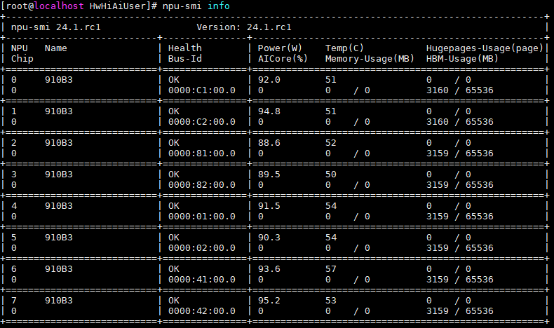
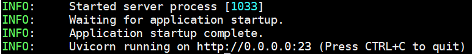

# 引言

上期介绍了在鲲鹏 CPU+NVIDIA GPU上部署DeepSeek的流程，本期将会继续介绍在鲲鹏 CPU+昇腾 NPU上通过vLLM框架来部署DeepSeek。

# 系统环境硬件要求

NPU推理规格

| 模型                          | CPU      | NPU          | 内存     | 存储     |
| ------------------------------- | ---------- | -------------- | ---------- | ---------- |
| DeepSeek-R1-Distill-Qwen-1.5B | 至少8核  | 至少6GB显存  | 16GB以上 | 60GB以上 |
| DeepSeek-R1-Distill-Qwen-7B   | 至少32核 | 至少32GB显存 | 32GB以上 | 60GB以上 |
| DeepSeek-R1-Distill-Llama-8B  | 至少32核 | 至少32GB显存 | 32GB以上 | 60GB以上 |

# 使用vLLM推理框架在昇腾NPU上的DeepSeek部署过程

以下部署流程以Atlas 800I A2服务器，openEuler 24.03 LTS操作系统为例说明如何使用vLLM框架部署DeepSeek-R1-Distill-Llama-8B。需要注意的是，该部署流程当前适合Altas 800I A2和Altas 800T A2服务器，对于其他的服务器型号暂时缺乏验证。

部署流程分为以下3个部分：

* 开发环境配置
* vLLM构建
* 大模型部署

## 开发环境配置

首先执行`npu-smi info`查看驱动加载是否成功。如果出现类似下图的回显信息说明加载成功，可跳过驱动固件安装步骤，开始安装昇腾容器引擎插件。否则需要首先安装驱动及固件。



对于Atlas 800I A2服务器，按照官方提供的流程[安装NPU驱动及固件](https://www.hiascend.com/document/detail/zh/quick-installation/24.0.RC1/quickinstg/800I_A2/quickinstg_800I_A2_0007.html)和[昇腾容器引擎插件]。(https://www.hiascend.com/document/detail/zh/quick-installation/24.0.RC1/quickinstg/800I_A2/quickinstg_800I_A2_0030.html)

## vLLM构建

首先需要拉取镜像：

```bash
docker pull hub.oepkgs.net/neocopilot/deepseek_vllm:cann.8.0.rc3.beta1-910b-openeuler22.03-py3.10
```

倘若出现了`x509: certificate signed by unknown authority`错误，可以临时绕过证书验证，执行如下命令后重新拉取镜像：

```bash
echo '{"insecure-registries": ["quay.io"]}' | sudo tee /etc/docker/daemon.json
sudo systemctl restart docker
```

采用如下命令拉起容器：

```bash
docker run -it \
    -p 2023:23 \
    --name deepseek_npu_8b \
    --device /dev/davinci0 \
    --device /dev/davinci1 \
    --device /dev/davinci2 \
    --device /dev/davinci3 \
    --device /dev/davinci4 \
    --device /dev/davinci5 \
    --device /dev/davinci6 \
    --device /dev/davinci7 \
    --device /dev/davinci_manager \
    --device /dev/devmm_svm \
    --device /dev/hisi_hdc \
    -v /usr/local/dcmi:/usr/local/dcmi \
    -v /usr/local/bin/npu-smi:/usr/local/bin/npu-smi \
    -v /usr/local/Ascend/driver/lib64/:/usr/local/Ascend/driver/lib64/ \
    -v /usr/local/Ascend/driver/version.info:/usr/local/Ascend/driver/version.info \
    quay.io/ascend/cann:8.0.rc3.beta1-910b-openeuler22.03-py3.10 bash
```

注意：

* `-p 2023:23`是将容器内的2023端口映射到宿主机上的23端口。这两个端口可以根据开发者机器的情况来自行调整。需要注意的是，一旦这里的端口映射修改了，后续流程中的端口也要做响应调整。
* `--device /dev/davinciX` 为使用的NPU卡的数量，可以根据实际情况进行调整，本教程使用的是8张NPU卡，即`/dev/davinci0`到`/dev/davinci7`，其他启动参数不变。

在进入容器后，采用如下命令构建vLLM：

```bash
yum install -y python python-pip gcc cmake git
pip install ml-dtypes tornado -i https://mirrors.huaweicloud.com/repository/pypi/simple
git clone https://github.com/wangshuai09/vllm
cd vllm
git chekcout npu_support

VLLM_TARGET_DEVICE=npu pip install -e . -i https://mirrors.huaweicloud.com/repository/pypi/simple
```

## 大模型部署

采用如下命令启动模型服务：

```python
python -m vllm.entrypoints.openai.api_server \
    --served-model-name deepseek-r1:8b \
    --model /home/deepseek/DeepSeek-R1-Distill-Llama-8B \
    --trust-remote-code \
    --host 0.0.0.0 \
    --port 23 \
    --max-model-len 4096 \
    --tensor-parallel-size 8 \
    --gpu_memory_utilization 0.8 \
    --enforce-eager \
    --dtype float16 &
```

以下是部分参数的解读：

* `--served-model-name`指定部署的模型名称，这里指定为`deepseek-r1:8b`
* `--model`指定要加载的模型路径，这里需要注意修改模型路径为自己刚刚下载的模型路径文件
* `--host`指定服务器监听的IP地址，`0.0.0.0`表示监听所有的网络接口，允许外部访问
* `--port`指定服务器监听的端口号，这里与上文对应，指定为`23`，读者可以自行修改
* `--max-model-len`指定模型的最大上下文长度，这里指定为`4096`，超过该长度的输入会被截断
* `--tensor-parallel-size`指定张量并行的数量，设置为`8`表示模型将会在`8`个NPU上进行并行计算，读者需要根据在容器启动时制定的NPU数量来填写。
* `--dtype float16`指定模型计算的数据类型为`float16`（半精度浮点数）

当显示如下回显是，说明模型部署成功。


通过`CTRL+D`回到宿主机后，通过如下命令进行功能验证：

```bash
curl -X POST "http://localhost:2023/v1/chat/completions" \
-H "Content-Type: application/json" \
-d '{
"model": "deepseek-r1:8b",
"messages": [{"role": "user", "content": "请介绍一下开源操作系统openEuler"}]
}'
```

问答效果展示：

```
{
	"id": "chatcmpl-e8643c42d3e04fe3b509d284b761422d",
	"object": "chat.completion",
	"created": 1739419475,
	"model": "deepseek-r1:8b",
	"choices": [{
		"index": 0,
		"message": {
			"role": "assistant",
			"reasoning\_content": null,
			"content": "好的，我现在遇到了关于openEuler的问题,我需要仔细思考一下该怎么介绍它。首先，openEuler是一个操作系统，类似于Linux和Windows,主要面向企业用户,提供了诸多高级功能。它在几年前发布，开源社区支持很好,这点很重要,说服用户使用的关键点。在资源管理方面,openEuler有高效的内核,支持Containerd和CRI,让云原生应用方便运行。安全性也是一大卖点,多级权限和容器安全机制都是亮点,满足企业对安全的需求。当然,openEuler也有不足之处。虽然功能全面,但相较于传统大 flea Like Linux,生态系统还不够成熟。企业如果有特殊需求,可能还是得依赖花旗帮派,这也是需要考虑的。其他挑战包括引起的许可问题和技术债务,需要持续改进。所以,总体来看,openEuler适合需要高性能和可靠性企业用户,特别是开源技术和云原生应用方面的团队。它能提供一整套工具,解决很多复杂问题,但仍在不断发展中,未来有很多潜力。</think>openEuler 是一个开源操作系统,旨在为企业用户提供高性能和可靠的运维体验。它结合了 Linux 的成熟稳定性和 Windows 的现代化 User Experience。开源背景使得 openEuler 适合开发者和企业,可以根据特定需求进行定制和优化。由于其高效的资源管理和强大的安全机制,openEuler 在云原生应用和容器化环境中表现优异。然而,尽管功能丰富,这些要是到传统操作系统路线上的uggy以外,openEuler 的生态系统尚未成熟,可能难以满足所有复杂需求。总体而言,openEuler 是一个有潜力的操作系统,值得企业关注。",
			"tool\_calls": []
		},
		"Logprobs": null,
		"finish\_reason": "stop",
		"stop\_reason": null
	}],
	"usage": {
		"prompt\_tokens": 15,
		"total\_tokens": 466,
		"completion\_tokens": 451,
		"prompt\_tokens details": null
	},
	"prompt\_logprobs": null
}
```


