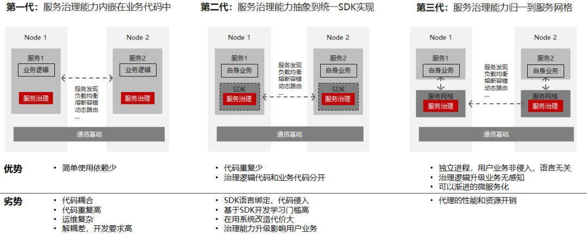
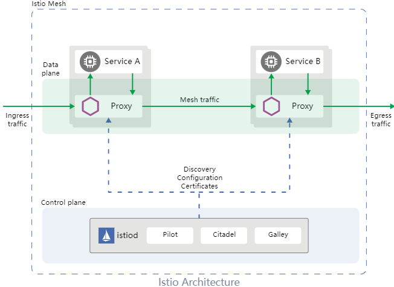
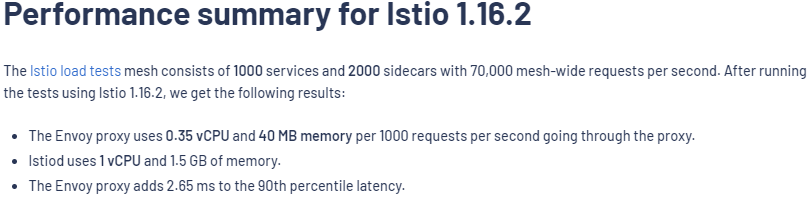
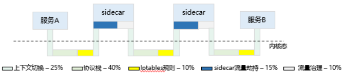
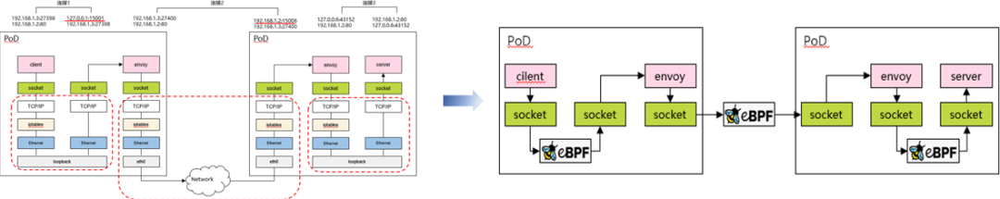
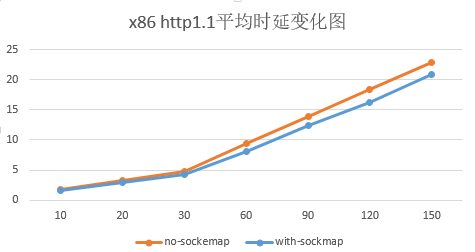
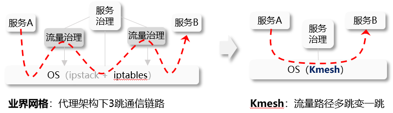
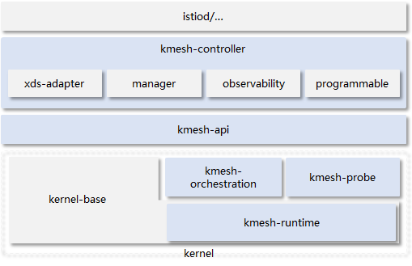
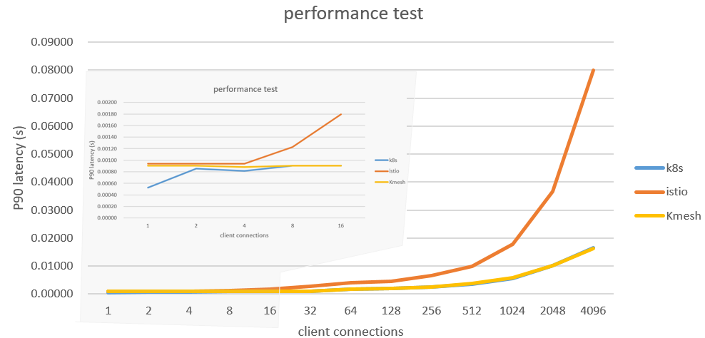

3 月，openEuler 社区推出了一个创新项目，高性能服务治理框架
Kmesh，通过架构创新为服务网格带来全新的数据面体验。本文从服务网格讲起，带您一起了解
Kmesh 的前世今生。

当前 Kmesh 项目已经在 openEuler 23.03
版本中发布，欢迎感兴趣的小伙伴下载使用。

**「仓库地址」** <https://gitee.com/openeuler/Kmesh>

## 什么是服务网格

服务网格是 2016 年由开发 Linkerd 软件的 buoyant 公司提出。Willian
Morgan（Linkerd 的 CEO）给出了Service Mesh的最初定义：

A service mesh is a dedicated infrastructure layer for handling
service-to-service communication. It's responsible for the reliable
delivery of requests through the complex topology of services that
comprise a modern, cloud native application. In practice, the service
mesh is typically implemented as an array of lightweight network proxies
that are deployed alongside application code, without the application
needing to be aware.

大致意思为：服务网格（service
mesh）是处理服务间通信的基础设施层。通过网络代理阵列的形式，为现代云原生应用提供透明、可靠的网络通信。

服务网格本质是解决微服务间如何更好通信的问题，通过负载均衡、灰度路由、熔断限流等治理规则，合理编排流量，实现最大化的集群服务能力，是服务治理演进的产物；

我们将服务治理的演进过程分为三代，并将其简单对比；从演进过程可以看出：服务治理能力逐步从业务中解耦，下沉到基础设施；

服务网格作为处理服务间通信的基础设施层，有效弥补了 K8s
在微服务治理方面的短板，作为云原生下一代技术，已成为云上基础设施的关键部件。

作为近年来的风口技术方向，业界诞生了很多服务网格软件，如：Linkerd、Istio、Consul
Connect、Kuma 等；他们在软件架构上大同小异，以 Istio
为例，展示服务网格的基本架构：

以 k8s 集群为例，Pod 实例创建时，服务网格软件在 Pod 中透明的创建一个
Proxy 容器（也称 sidecar，Istio 中默认的 sidecar 软件是 Envoy）；Pod
通信的基本流程如下：

-   流量通过 iptables 规则透明劫持到 Pod 内的代理组件；

-   代理组件根据请求完成流量治理逻辑（如：熔断、路由、负载均衡等），找到要通信的对端服务实例，并转发消息；

-   对端 Pod内的代理组件劫持外部流量，并做基本的流量治理逻辑（如：限流等），再将流量转发给Pod；

-   Pod 处理完成后，响应报文按原路径返回到请求 Pod；

## 服务网格数据面的问题挑战

由上文可知，服务网格通过在数据面引入代理层，实现对应用透明的服务治理。然而，这么做不是毫无代价的，引入的代理层势必会造成服务通信的时延上升，性能下降。

以 Isito 官网提供的数据为例，集群规模下，微服务间数据面单跳通信时延增加
2.65ms；要知道微服务集群下，一次外部访问，在集群内部往往会经过多次微服务间的调用，网格带来的时延开销是很大的；随着服务网格被越来越多应用，代理架构引入的额外时延开销已成为服务网格面临的关键问题。

为此，我们测试了 http 服务 L7
负载均衡的场景，对网格数据面的通信做了性能打点，耗时占比如下：

从网格流量的细化分析看，微服务互通，从原来 1 次建链变成 3 次建链，从原来
2 次进出协议栈，变成 6
次进出协议栈；耗时主要集中在多次的数据拷贝、建链通信、上下文调度切换等，真正做流量治理的开销占比却不大。

那么问题来了，能否在保持网格对应用透明治理的前提下，降低网格的时延开销。

## 高性能服务网格治理框架 Kmesh

基于以上性能分析，我们针对网格数据面性能做了两阶段的优化。

### Kmesh1.0：基于 sockmap 加速网格数据面

sockmap 是 Linux 在 4.14 引入的一个 ebpf 特性，可实现 node 内 socket
间数据流的重定向，而无需经过复杂的内核协议栈，优化链路上 socket
间的数据转发性能；

针对服务网格的场景，Pod
内业务容器与本地代理组件之间默认走了完整的内核协议栈，这段开销完全可以通过
sockmap 来优化；如下图所示：

sockmap 加速的基本步骤：

-   建链流程中挂载 ebpf 程序（ebpf prog type：BPF_PROG_TYPE_SOCK_OPS），拦截所有的 TCP 建链动作；将通信双方正反两端的 socket 信息存储到 sockmap 表中；

-   BPF_SOCK_OPS_ACTIVE_ESTABLISHED_CB 状态添加 client 侧 sockmap 记录；

-   BPF_SOCK_OPS_PASSIVE_ESTABLISHED_CB 状态添加 server 侧 sockmap
    记录；

-   sendmsg 流程中挂载 ebpf 程序（ebpf prog
    type：BPF_PROG_TYPE_SK_MSG），拦截发送消息的动作；

    -   根据当前 socket 信息查找 sockmap 表，关联找到对端的 socket
        信息，将流量直接重定向到对端 socket 的接收队列；

基于 sockmap 加速服务网格数据面，实测 60
长链接场景下，服务访问的平均时延相比原生网格降低了 10%\~15%。

sockmap 是当前比较常见的优化服务网格数据面的方案，但从效果看降低
15%的通信延时并没有真正解决网格时延性能差的问题；

### Kmesh2.0：基于可编程内核，将流量治理下沉 OS

根据上文的性能打点可知，网格引入的额外开销中，真正完成流量治理工作的开销占比并不高，大部分耗时都浪费在了把流量引到代理组件上；那么，流量治理能不能不要经过这个代理组件，随着流量收发的路径随路完成呢？网络通信天然要经过内核协议栈，如果协议栈具备流量治理的能力，是不是就可以解决这个问题了。

Kmesh 就是我们提出的高性能服务治理框架，基于可编程内核，将流量治理下沉到
OS，网格数据面不再经过代理组件，服务互通从 3 跳变成 1
跳，真正随路完成治理工作；微服务互通的流量路径如下所示：

Kmesh 的软件架构：

Kmesh 的主要部件包括：

-   kmesh-controller：kmesh 管理程序，负责 Kmesh 生命周期管理、XDS
    协议对接、观测运维等功能；

-   kmesh-api：kmesh 对外提供的 api 接口层，主要包括：xds 转换后的编排
    API、观测运维通道等；

-   kmesh-runtime：kernel 中实现的支持 L3\~L7 流量编排的运行时；

-   kmesh-orchestration：基于 ebpf 实现 L3\~L7
    流量编排，如路由、灰度、负载均衡等；

-   kmesh-probe：观测运维探针，提供端到端观测能力；

我们部署了 Istio
网格环境，通过使用不同的网格数据面软件（Envoy/Kmesh），针对 http 服务 L7
负载均衡的场景，对网格数据面性能做了对比测试（测试工具：fortio）：

可以看到，基于 Kmesh，网格内服务互通性能相比 Istio 原生数据面（Envoy）有
5 倍提升，同时我们也测试了非网格下，基于 k8s 的服务互通性能，与 Kmesh
的性能数据几乎相当，进一步佐证了 Kmesh
数据面时延性能。（测试场景为实验室环境下的 L7
负载均衡，真实治理场景下的性能效果不会这么理想，初步评估会比 Istio 提升
2\~3 倍）

## 总结

服务网格作为云原生的下一代技术，为应用提供透明服务治理的同时，因其代理架构引入额外时延开销，已成为网格应用推广的关键；Kmesh
从 OS
视角，提出了一种基于可编程内核的服务治理框架，通过将流量治理能力下沉
OS，大幅提升网格数据面性能，为网格数据面的发展提供了一种全新思路。

Kmesh 作为社区新兴项目，目前仍处于起步阶段，后续会继续完善 L4/L7
的流量治理能力；更多内容，请查看项目主页：<https://gitee.com/openeuler/Kmesh>，也欢迎对Kmesh感兴趣的小伙伴加入我们，您可以添加如下小助手微信，回复Kmesh加入技术交流群。

## 参考

<https://linkerd.io/2017/04/25/whats-a-service-mesh-and-why-do-i-need-one>

<https://istio.io/latest/docs/ops/deployment/architecture>

<https://istio.io/v1.16/docs/ops/deployment/performance-and-scalability/#performance-summary-for-istio-hahahugoshortcode-s0-hbhb>
