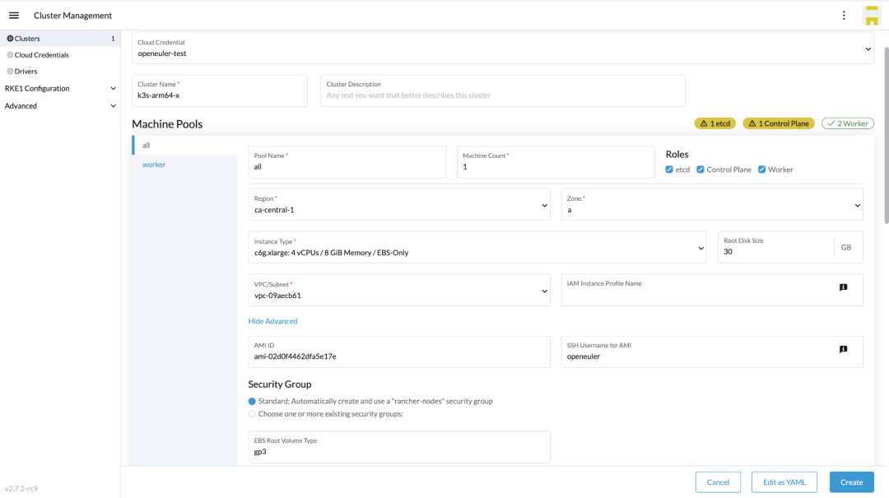
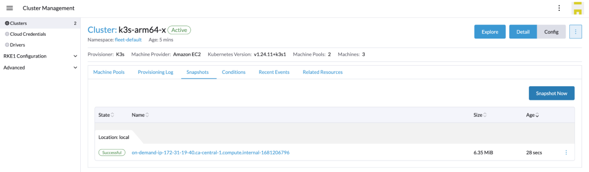
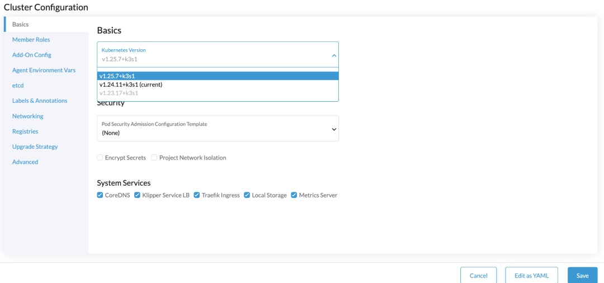

K3s是CNCF认证的轻量级Kubernetes发行版，在全球拥有广泛的安装量，主要由SUSE工程师在开源社区维护。K3s除了可以单独部署外，也可以通过Kubernetes管理软件Rancher进行管理。SUSE中国团队与欧拉社区合作，以RFO
SIG协作方式推动Rancher和K3s等相关产品与openEuler OS的兼容性。

Rancher v2.7.2版本迎来了较多重大更新，其中对K3s
ARM64集群的管理进一步增强，支持用户从Rancher配置创建K3s
ARM64集群，并通过Rancher实现该集群的生命周期管理。RFO
SIG在此基础上，确保了openEuler的兼容性。

**ARM64环境准备**

本文中使用的软件环境如下，通过AWS云环境展示相关产品能力：

备注：AWS的openEuler AMI，在openEuler KVM
镜像基础上构建，并内置了AWS相关驱动。此AMI由RFO
SIG维护，表格中的软件均支持ARM64架构。

# 部署Rancher管理平面

AWS可以很方便创建ARM64环境，使用openEuler AMI创建EC2实例，c6g.xlarge
规格完全可以满足Rancher的部署需求。Rancher管理平面需要部署在Kubernetes之中，作为一种快速开始的部署体验，我们推荐使用K3s作为管理平面的Local集群，并通过Helm安装Rancher。

在openEuler ARM64环境中，Rancher管理平面可以正常工作。启动完成后，通过
RancherForFun 密码激活，即可进入UI管理模式。

# 创建弹性的K3s集群

Rancher中内置了AWS
EC2的驱动，可以按照预期的AMI快速创建EC2实例。基于此能力，Rancher可以创建弹性的K3s集群，并且在openEuler
ARM64环境同样兼容。如下图，我们配置了1个ALL
Roles节点和1个worker节点的K3s集群，使用了openEuler 22.03
AMI，配置竞价实例以最大限度减少费用。K3s的集群版本可选择 v1.24.11+k3s1。

当集群资源不足时，我们可以在UI上操作，非常方便得扩容worker节点。Rancher会根据设置，使用内置的EC2
driver创建新的ARM64实例，并自动部署K3s程序。同时，Rancher也支持通过UI访问节点的SSH
Shell。

# 增强K3s集群的服务能力

日常的维护管理中，需要定期对K3s集群备份，除了可以设置定期备份外，也可以立即执行备份。Rancher会保存各个备份点的数据，用户可以基于某个备份执行恢复操作。

针对K3s的升级也是非常简单的，只需在UI上编辑集群，选择期望更新的版本即可。比如，可以从
v1.24.11+k3s1 升级到 1.25.7+k3s1。

Rancher内置了一些集群工具用来扩展下游集群的服务能力，其中一些工具已经具备了ARM64的兼容性，并且在openEuler
OS之上得到验证。比如：分布式存储组件Longhorn、监控、日志等。

当K3s集群已经不需要时，可以在Rancher中删除该集群，相关联的EC2实例也会被一并删除。

# 持续的产品化连接

RFO SIG通过工程化手段持续确保Rancher与openEuler的产品兼容性，K3s
ARM64场景的管理也是社区呼声较高的功能。同时，Rancher具备非常好的插件机制，可以方便扩展各种云的驱动，在各种云环境下接入openEuler。在非云环境下，也可以在已有openEuler主机上灵活配置。使用openEuler作为基础设施的OS与Rancher进行组合，可以快速建立产品化的容器管理平台，并能支持AMD64和ARM64环境。
