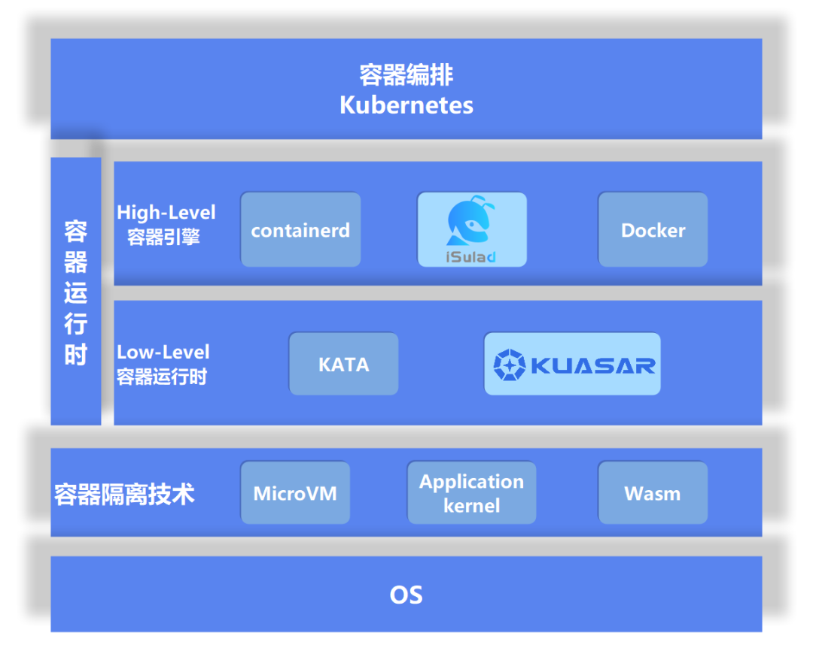
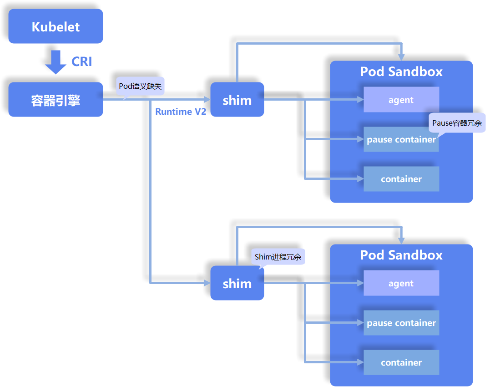
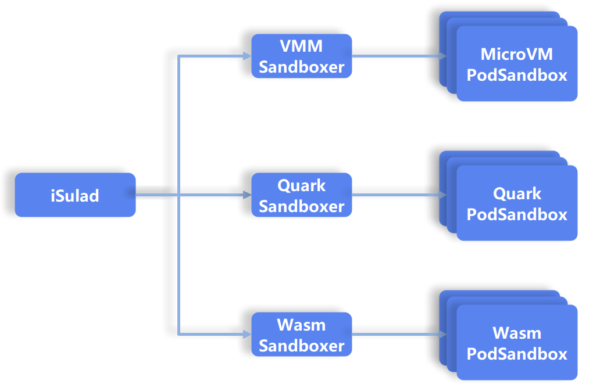

随着云计算和容器技术的不断发展，容器引擎和容器运行时已经成为了云原生时代的基石，它们负责了容器生命周期的管理以及容器运行过程中环境的创建和资源的配置。openEuler
社区基于容器引擎项目
iSulad[1\]在解决容器运行效率、安全性以及隔离性等问题上进行着不断地尝试与探索。

华为云在 2023 年 4 月 21 日阿姆斯特丹的 Kubecon+CloudNativeCon Europe
2023 云原生峰会上发布了多沙箱运行时Kuasar[2\]，将 Kubernetes
CRI([https://github.com/kubernetes/cri-api](https://github.com/kubernetes/cri-api)) 标准中的 Pod
语义准确地映射到了 Kuasar 的 Sandbox 语义。与此同时，iSulad
容器团队与华为云 Kuasar 紧密合作，率先支持了 Kuasar 的 Sandbox
语义，实现了从 Kubernetes 到 iSulad 容器引擎到 Kuasar
统一容器运行时的全栈打通。通过 iSulad 和 Kuasar
项目，统一了容器运行时应对不同容器隔离技术的 Kubernetes
生态场景，简化了单节点上多种容器（或沙箱）形态的统一部署。相比于
Containerd + Kata-Containers 的运行时组合，iSulad +
Kuasar **「不仅可以支持多种容器隔离技术，而且使容器运行时管理组件的内存消耗减少了
99%，并行启动时间缩短了 40%以上！」**

# 背景与现状

从容器编排组件 Kubernetes 的视角来看，能够处理 CRI(Container Runtime
Interface)请求的服务端都是容器运行时(Container
Runtime)。事实上，容器运行时还可以再细分为两个层次，即容器引擎和底层容器运行时。

容器引擎(Container
Engine)主要负责容器运行环境的创建、容器资源的配置和容器生命周期的管理，北向接收来自于
Kubernetes 或前端命令行的输入，南向则调用底层容器运行时(Low Level
Container Runtime)来完成最终容器环境的生成和容器生命周期的操作。

在业界，容器引擎和容器运行时的术语经常被交替使用。**「在本文的语义中，容器运行时特指底层容器运行时」**。除了
iSulad 以外，当前的容器引擎还包括 Containerd，Docker
等，底层容器运行时包括 runc，Kata-Containers 等。

这些容器引擎和容器运行时由于一些历史原因一直存在着不少遗留问题。这些问题主要是由于容器引擎和容器运行时没有妥善处理
CRI 中的 Pod 语义而引起的。下图以 MicroVM
为例，简单介绍了一些容器引擎和容器运行时中的主要问题。

## 1. Pod 语义缺失

Kubernetes 的 CRI 规范强化了 Pod Sandbox 的概念，将 Pod
作为容器编排调度的最小单元。Pod
是一个或多个容器的组合，他们共享一些命名空间和资源，沙箱(Sandbox)则通过容器隔离技术为这一组容器提供安全隔离的运行环境。然而，Pod
的语义在容器引擎和容器运行时的层面并没有很好的体现出来，这导致这些组件在架构上的不合理，同时也增加了实现的复杂度，带来了很多维护上的问题，比如
shim 进程的管理和维护，IO 通道的维护等等。

## 2. Shim 进程的冗余

在通过 shim v2 标准创建 Pod 的过程中，每创建一个新 Pod 都需要启动一个
shim 进程对 Pod 及其资源进行管理。由此而带来的问题有以下三点：

-   内存资源的消耗：shim 进程消耗了大量内存资源。经过测试，在
    Containerd + Kata 的组合中，每增加一个 Pod，由于 shim
    进程引起的管理层组件的内存消耗就增加了约 18MB。

-   启动时间的延长：由于 shim
    进程的存在，容器生命周期管理的调用链变长，增加了启动时间，消耗了更多的
    CPU 资源。

-   可靠性问题的增加：在大规模商用实践中，可靠性问题困扰着不少容器商用团队，这些问题不仅影响了业务正常开展，而且难以定位和解决。shim
    进程的存在带来了大量的类似问题，比如状态不一致、数据流卡死、进程残留等，大大增加了容器的维护成本。

## 3. Pause 容器的冗余

由于历史原因，早期的通用容器是通过 Linux 的 namespace + cgroups
实现资源隔离与资源限制的。Pause 容器就是早期的容器形态为了应对 CRI 中
Pod
语义而创建的特殊容器。这个容器的作用就是根据配置创建命名空间、限制共享资源。除此之外，Pause
容器不执行任何实际工作但却会消耗一些 CPU 时间和内存资源，同时由于 Pause
容器的存在也增加了系统被攻击的攻击面，会带来一些潜在的安全风险。事实上，对于当前的一些容器隔离技术来说，Pause
容器是可以消除的。比如说虚拟化隔离技术，虚拟机本身就已经具备了足够的安全性与隔离性，不需要
Pause 容器协助配置命名空间和共享资源。

## 4. 容器运行时隔离技术单一

容器隔离技术是推动容器运行时快速发展的主要动力之一。当前主流的容器隔离技术有以下几种：

-   Linux 容器隔离技术：Linux 容器主要采用 namespace + cgroups
    的方式实现隔离，其主要特点是高性能、低开销。LXC
    是比较早期的隔离技术，后来由于其安全性和可移植性的问题，逐渐被
    libcontainer 取代，但其隔离性一直较差，例如 runc 容器。

-   轻量级虚拟化容器隔离技术：MicroVM
    是一种基于虚拟化的容器隔离技术，它使用了轻量级的虚拟化技术来实现容器的隔离，具备了传统虚拟机的强隔离性和安全性，但带来的效率问题也颇为明显，比如
    QEMU， Stratovirt 等。

-   用户态内核隔离技术：用户态内核是将原来运行在内核态的大部分内核功能运行在用户态，通过对业务进程系统调用的代理实现系统调用的安全隔离。相比于虚拟化，用户态内核更加轻量化、性能更好，但由于依旧处于早期发展阶段，其稳定性、可靠性和兼容性存在不少问题，比如
    gVisor， Quark 等。

-   语言虚拟机隔离技术：语言虚拟机隔离技术本质上是将底层字节码通过专用的语言虚拟机来加载运行，从而达到隔离的目的。Wasm
    虚拟机就是语言虚机的一种。该类型语言虚拟机隔离技术利用与平台无关的系统接口（WASI），使
    Wasm 程序能够访问到系统资源。Wasm
    沙箱具备冷启动速度快、资源开销小的有点，但目前的使用约束较多，支持的语言也有限，成熟度不高，目前还有很多尚未解决的隔离、通用性和语言生态问题。

不同形态的容器隔离技术在性能、安全性以及通用性上都有各自的优劣，当下大部分容器运行时都只支持单一容器隔离技术，无法很好地发挥不同隔离技术的优势。因此在单节点部署多形态沙箱的成本与复杂度都会比较高。

# iSulad+Kuasar：新一代统一容器运行时解决方案

为了解决上述的这些痛点问题，openEuler
社区联合华为云推出了新一代统一容器运行时的解决方案，目标是让容器引擎和容器运行时更加优雅合理地解决由
shim v2 标准对 Pod 生命周期及其资源管理而引起的问题。

在容器隔离技术欣欣向荣的今天，业界对于将 Sandbox
语义引入容器引擎和容器运行时的思考与讨论一直在持续进行。事实上，Containerd
社区早就开始了对 Sandbox 语义引入的探讨，Sandbox API^\[3\]^也于 2020 年
3 月被提出，2022 年 4 月正式被合入了 Containerd 社区。

虽然 Sandbox API 的合入使 Containerd 内部对于 Pod
语义的处理更加清晰，但并不能够解决上述其他与 shim 相关的问题。iSulad 和
Kuasar 项目对于 Sandbox API
更深层次的创新为解决这些问题带来了可能性。在新的解决方案中，iSulad
作为容器引擎将 Sandbox API 的调用延伸出去，通过 RPC 让作为容器运行时的
Kuasar 来管理 Pod。与原有的基于 shim v2 的方案不同，新的方案不需要为每个
Pod 都创建一个 shim
进程。在新的架构中，同一类型的容器只需要使用同一个进程来管理。例如，上图中的
MicroVM Sandboxer 就是用于管理轻量级虚拟机的进程。iSulad 通过 Sandbox
API 与 MicronVM Sandboxer 进行交互，用于管理所有该类型的 Pod
的生命周期。同时，每当新的 Pod 被创建后，Pod 中的 Task Service
的地址就会通过 Sandbox API 返回给 iSulad，iSulad 便可通过 shim v2 接口与
Pod 中的 Task Service 进行交互，管理 Pod 中的容器。

这个新的解决方案完美地解决了容器引擎与容器运行时之间遗留已久的痛点问题：

1.  **「Sandbox 的语义被带入了容器引擎和容器运行时」**，在语义层面与 CRI
    保持一致，增强了在云原生架构上的连贯性。

2.  Kuasar 用一个 Sandboxer 进程取代了 shim v2 中的多个 shim
    进程，解决了由 shim 进程带来的多个问题：

    -   **「Sandboxer 削减了 shim 进程的冗余，大大减小了由于 shim
        进程带来的资源开销。根据测试在 50 个 Pod 的场景下，Kuasar
        在管理面的开销只有 shim V2 的 1%。」**

    -   **「容器的创建不需要通过 shim 进程代理，iSulad
        直接将容器生命周期管理的请求发送给 Task
        Service，从而使启动时间缩短了 40%以上。」**

    -   **「消除了 shim
        进程以后，各种状态不一致、数据流卡死、进程残留等可靠性问题都会随之有所改善。」**

3.  在新的架构中，Pod 是通过 Sandbox API 创建，不必遵循 OCI
    标准流程，从而**「消除了 Pause 容器的冗余」**。

4.  新的解决方案**「支持在单一节点上通过配置运行多种不同类型的沙箱，利用不同的隔离技术，在性能、安全性及通用性等各方面形成优势互补」**。

## iSulad

作为用 C/C++编写而成的容器引擎，iSulad 的内存底噪仅为 Containerd 的
50%，其轻、灵、快的特点使其能够在包括云原生、嵌入式等多种场景下部署使用。

在新的解决方案中，iSulad 在结构上也针对 Pod 的处理进行了创新与调整：

-   北向接口：与原有使用 Container 的语义处理 Pod
    管理请求的方式不同，iSulad 将 Sandbox
    的语义引入了架构和实现当中，针对 Pod 与 Container
    进行了语义上的区分，不仅更好地支持了 CRI 以及命令行对于 Pod
    的请求，而且也为后续容器形态的多样性提供了更大的拓展空间。

-   南向接口：iSulad 将 Sandbox API 延伸出去，通过 Sandbox API
    为不同的容器形态提供统一接口，实现归一化管理，同时也对容器运行时
    Kuasar 提供了更为清晰、精准的调用请求。

用户可以通过 iSulad 的dev-sandbox 分支^\[4\]^，体验 iSulad+Kuasar
的最新版本，具体可参见用户指南^\[5\]^。

iSulad 社区将在未来对新一代容器运行时的演进中，持续与 Kuasar
社区保持深入合作，共同扩大多沙箱容器技术在业界的影响力。

## Kuasar

Kuasar^\[6\]^作为新一代的容器运行时，不再采用通过 shim v2 接口来管理
Pod，取而代之的是 Kuasar 向容器引擎提供的新一代容器运行时 Pod 管理接口
Sandbox API。这套接口不仅逻辑更加清晰，而且可以支持多沙箱接入。

Kuasar 的设计引入了 Sandboxer 的概念。每一种 Sandboxer
都使用了自己的容器隔离技术，用来管理同一类型的 Pod。当前 Kuasar
已支持多种 Sandboxer 的实现，包括
QEMU，Cloud-Hypervisor，StratoVirt^\[7\]^，Quark 等。

## openEuler 全栈解决方案

openEuler 社区在容器引擎和容器运行时技术上的探索是多方位的。iSulad
项目已经活跃多年，并在功能上持续完善，性能上持续优化。轻量级虚拟机
StratoVirt 则着力于虚拟技术的突破，相比于 QEMU
在内存和启动时间上都有大量优化。如今，与华为云合作的新一代统一容器运行时
Kuasar 步入正轨，openEuler 社区具有了**「iSulad + Kuasar + StratoVirt
全栈国产安全容器解决方案」**。对比主流的 Containerd + Kata + QEMU
的解决方案，这套国产解决方案大大提升集群的整体性能和部署能力。

# 总结

新一代容器引擎与容器运行时的解决方案解决了当前主流方案由来已久的痛点问题，不仅完善了运行时在
Pod
语义上的缺憾，新增了多沙箱部署的能力，而且在性能和可靠性等方面也带来了大幅提升。目前已完成了功能上开发，后续特性的探索与质量的加固还在持续进行当中，欢迎大家提前试用并提出宝贵的意见，我们会尽快催熟相关特性并合入
openEuler LTS 版本。

openEuler
社区一直秉承着开放、合作、共享的开源态度，欢迎更多的开发人员加入
openEuler 参与 iSulad、Kuasar、StratoVirt 等容器和虚拟化项目共同探索。

## Reference

\[1\]

**容器引擎项目 iSulad**:[https://gitee.com/openeuler/iSulad](https://gitee.com/openeuler/iSulad)

\[2\]

**Kuasar**:[https://github.com/kuasar-io](https://github.com/kuasar-io)

\[3\]

**Sandbox API**:[https://github.com/containerd/containerd/issues/4131](https://github.com/containerd/containerd/issues/4131)

\[4\]

**dev-sandbox 分支**:[https://gitee.com/openeuler/iSulad/tree/dev-sandbox](https://gitee.com/openeuler/iSulad/tree/dev-sandbox)

\[5\]

**用户指南**:[https://gitee.com/openeuler/iSulad/blob/dev-sandbox/docs/manual/sandbox_zh.md](https://gitee.com/openeuler/iSulad/blob/dev-sandbox/docs/manual/sandbox_zh.md)

\[6\]

**Kuasar**:[https://github.com/kuasar-io](https://github.com/kuasar-io)

\[7\]

**StratoVirt**:[https://gitee.com/openeuler/stratovirt](https://gitee.com/openeuler/stratovirt)
