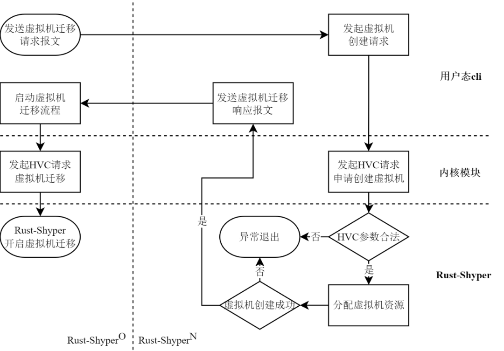
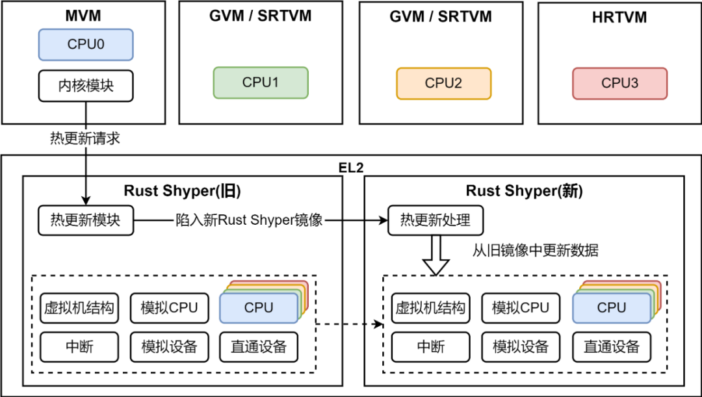

**「Rust-Shyper
是北京航空航天大学计算机学院王雷教授团队设计开发的虚拟机监控器，该系统基于
Rust 语言，实现了一个高可靠、嵌入式 Hypervisor。2023 年 2 月 15 日
Rust-Shyper 正式在 openEuler 社区开源。」**

项目地址：[https://gitee.com/openeuler/rust_shyper](https://gitee.com/openeuler/rust_shyper)

Rust-Shyper 是一款基于 AArch64 架构、**「Rust
编写」**、面向无人车、机器人等嵌入式场景的**「Type-1
型」**虚拟机监控器（Hypervisor）。其设计目标是在提高资源利用率的同时，保障虚拟机实时性、隔离性与内存安全。此外，Rust-Shyper
支持**「虚拟机迁移」**（VM
migration）和**「监控器动态升级」**（Hypervisor
Live-update）两种热更新机制，能够在不影响虚拟机运行的情况下，动态修复
Hypervisor 的软件漏洞。目前该系统可以在 NVIDIA Jetson TX2、Raspberry Pi
4 和 QEMU 平台上运行，支持实时和非实时虚拟机，可运行 Linux 和 RTOS。

今年的 **「openEuler Developer Day 2023 嵌入式分论坛」** 进行了
Rust-Shyper 项目 "基于Rust的嵌入式虚拟机监视器及热更新技术"
的主题演讲，可通过以下链接观看视频回放（21日嵌入式分论坛，议题从00:49:38开始）：

[https://www.openeuler.org/zh/interaction/summit-list/devday2023/](https://www.openeuler.org/zh/interaction/summit-list/devday2023/)

## 嵌入式虚拟化的挑战

物联网的不断发展使得现代嵌入式系统正在朝着通用系统和混合关键系统的方向演化，其承载的任务往往有着不同的可靠性、实时性和验证级别，如何保证不同关键性任务之间的相互隔离以及实时性成为了一个难题。虚拟化技术提供的资源隔离手段成为了解决上述问题的关键，但嵌入式虚拟化也面临一些挑战：

-   如何保证虚拟机之间的**「隔离性和安全性」**，防止恶意攻击；

-   如何保证虚拟机之间的通信效率和**「实时性」**，避免延迟或者抖动；

-   如何保证 **「Hypervisor 本身的稳定性和可靠性」**，防止出现故障。

## Rust-Shyper 的设计理念和特点

1.  **「内存安全」**：利用 Rust 语言类型系统和内存安全模型，保证
    Hypervisor 的内存安全；

2.  **「强隔离性」**：利用硬件辅助虚拟化，实现虚拟机间的安全隔离和故障隔离；

3.  **「丰富的设备模型」**：为提高资源利用率，实现了直通设备、中介传递和全模拟等多种设备模型；

4.  **「实时虚拟化」**：针对性能需求 ，实现资源直通以及实时虚拟化技术；

5.  **「虚拟机监控器热更新技术」**：实现了虚拟机迁移和监控器动态升级两类视器热更新机制。

## Rust-Shyper 系统架构和功能

Rust-Shyper 是一款基于 AArch64 体系结构的 Type-1
虚拟机监控器，整个结构包含三个层级：

-   最底层为硬件层级，对应 ARMv8 EL3 固件层级；

-   中间层为虚拟机监控器层，对应 ARMv8 EL2 虚拟化层级，该层级也是
    Rust-Shyper 代码所处的特权层级；

-   最上层为虚拟机层级，对应 ARMv8 EL1 和 EL0 层级。

为了符合嵌入式应用的需求，Rust-Shyper
通过提供不同的虚拟机类型，来提供差异化的虚拟化服务，Rust-Shyper
中支持管理虚拟机（MVM）、客户虚拟机（GVM）、实时虚拟机（RTVM）等三类虚拟机。

## Rust-Shyper 的**「虚拟机监控器热更新技术」**

为了提升嵌入式场景下 Hypervisor 的可靠性，Rust-Shyper
引入了跨硬件的虚拟机迁移技术和本地热更新技术。

### 虚拟机迁移

虚拟机迁移技术的整个流程如上图所示。Rust-Shyper 实现了基于 Pre-Copy
策略的虚拟机在硬件平台之间的迁移，可用于负载平衡和错误预防。

### 监控器动态升级

Rust-Shyper 设计实现了**「监控器动态升级技术」**，其最大延迟抖动低于
Jailhouse，显著降低热更新成本，满足虚拟机的实时性需求，可用于软件版本升级和错误修复。

## 应用场景与未来的规划

-   基于 Rust-Shyper 移植 NVIDIA Jetson TX2 硬件平台的无人车应用（预计
    2023 年 5 月完成）；

-   基于 Rust-Shyper 支持 ROS 系统，移植机器人应用；

-   针对 Virtio 等虚拟化设备模型的优化研究；

-   针对 RISC-V 平台的 Rust-Shyper 移植。

## 关于我们

北航王雷老师的团队承担了国家自然科学基金项目、863
课题和核高基等多项科研项目。在虚拟化方面，针对混合关键领域高可靠、强实时的要求，基于时空分区的隔离机制，开发了
C 语言的 Shyper 虚拟机监控器，该监控器已经通过了 EAL5+
认证。在操作系统内核方面，基于复杂网络理论，针对 Linux
内核提出了基于年龄的演化模型，合理地解释了操作系统网络特征的形成机理。
