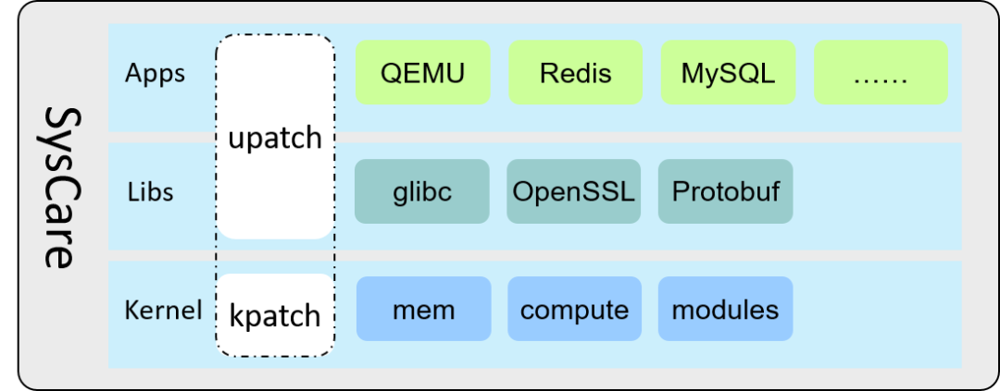
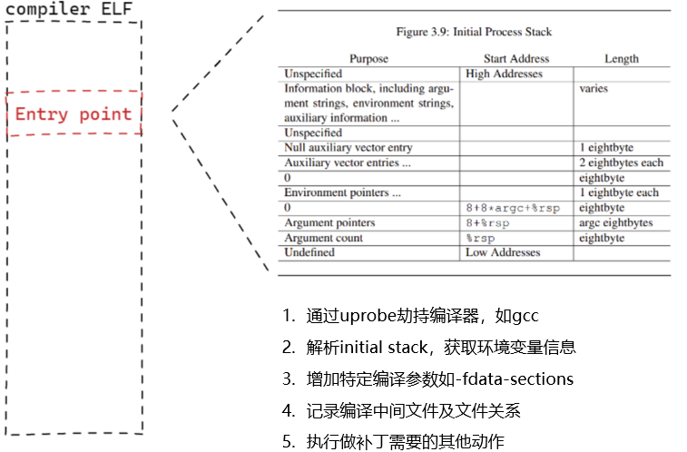

最近，openEuler 社区推出了一个创新项目：Linux 操作系统统一热补丁服务
SysCare。本文将带您探索 SysCare 的奥秘。

## 认识 SysCare

**「SysCare: I take care of your systems.」**

顾名思义，SysCare
是一款操作系统运维工具，解决系统运行过程中的各类故障和风险，为 Linux
操作系统提供全方位保护。

SysCare 提供一套简洁的命令，实现了内核热补丁 (kpatch) 和用户态热补丁
(upatch)
的制作及补丁管理能力。用户不需要关心技术细节和系统组件差异，也无需进行业务迁移，通过简单的命令就能在线修复系统漏洞。

如下 SysCare 系统示意图可知，支持如下三层热补丁：

-   底层内核热补丁 (Kernel)：包含所有组件和驱动的热补丁

-   中间层系统库热补丁（Libs）：包含 glibc、OpenSSL、Protobuf 等

-   上层应用热补丁（Apps）：支持 QEMU、Redis、MySQL 等应用

## 为什么开发 SysCare

在 Linux
世界，有一个困扰大家已久的难题：如何在不影响业务的情况下，快速可靠地修复漏洞、解决故障。

当前常见的方法是采用**热补丁** ：在业务运行过程中，对问题组件直接进行代码级修复，业务无感知。然而，当前热补丁制作方式复杂，补丁需要代码级匹配，且管理困难，特别是用户态组件形式多样，还没有简便统一的补丁机制。

为了解决热补丁制作和管理的问题，SysCare 应运而生。

## SysCare 补丁制作

内核热补丁已经有相对成熟的 kpatch、livepatch
等方案，并且已经有相对广泛的应用，此处对技术方案不再赘述。下文将重点介绍
SysCare 用户态热补丁的实现方法。

### 用户态热补丁的难题

正如大家所知，用户态热补丁面临许多困难：

-   **「编程语言多种多样」**：现有从汇编代码生成补丁的方式难以支持多种语言，代码改动的影响范围，不同语言也不尽相同。

-   **「单个程序文件会有多个运行实例」**：打补丁操作需要找到具体进程再执行，但程序可能已经在运行，也可能尚未运行，通过监控程序文件是否被执行的方式，代价较大，操作困难。

-   **「动态库」**：在进程运行过程中加载，无法提前确定被加载进程、位置和时机，现有技术无法对动态库制作热补丁。

-   **「编译方式、程序形态等多种多样」**：每个程序的编译和链接过程都不相同，需要跟踪每个进程各自的编译过程，才能制作出相应的热补丁，补丁制作难度急剧上升。

## SysCare 新方案

针对用户态热补丁问题，SysCare
提出了新的用户态热补丁解决方案，解决用户态热补丁的难题。

**「对比二进制编译目标文件，生成热补丁」**

通过对比修改前后的代码生成的.o
目标文件的不同，找到差异点，将差异点取出，生成热补丁。如下图所示：分别编译修改前后的代码，比较生成的
.o 文件 ( source file 和 after patched )，找到变化的部分：新增 (data_e,
func_6)，修改 ( func_4, func_3 )，删除 ( data_b, data_d, func_2 )
的部分，将这些差一点提取到一个 .o 文件中 ( real patch ) 。

**「劫持编译器，跟踪编译过程」**

通过 uprobe 技术，向 GCC
等编译器注入代码，跟踪程序的整个编译过程，在编译过程中获取制作热补丁所需的信息和
.o 目标文件。

**「针对 ELF 文件（程序可执行文件）的热补丁」**

使用 uprobe 技术，将热补丁与 ELF 文件绑定。在 ELF 文件运行时，通过
uprobe
触发补丁生效，这样就不需要监控进程，无论进程是否已经运行，都可以在打补丁后或新进程运行时使补丁生效；同时该技术也可以给动态库打热补丁，解决了动态库热补丁的难题。如下图所示，补丁生效流程为：

1.  执行 uprobe 系统调用，在待修改函数 func 处增加 uprobe 断点

2.  注册 uprobe handler

3.  进行运行到 func 时调用 uprobe handler

4.  将 patch 映射到当前进程地址空间

5.  进行安全检查，如果可以打补丁，将 func 的第一条指令修改为 jump
    指令，指向 patch 地址

6.  跳转到 patch 地址执行

## SysCare 补丁管理

由于当前的热补丁管理方案比较复杂，SysCare
通过屏蔽内核热补丁和用户态热补丁的差异，简化了补丁管理。通过 SysCare
build 命令，即可制作指定组件的热补丁。

另外，SysCare 也提供了
apply、active、deactive、remove、status、info、list
等补丁管理命令，用于应用、激活、去激活、移除、查询状态、查询信息、查询补丁列表等。

具体使用方法可参见官网文档：[https://docs.openeuler.org/zh/docs/22.03_LTS_SP1/docs/SysCare/使用SysCare.html](https://docs.openeuler.org/zh/docs/22.03_LTS_SP1/docs/SysCare/使用SysCare.html)

## 项目规划

SysCare 已在 openEuler 22.03 LTS SP1 版本首次发布，并将在 openEuler
22.03 LTS SP2 版本提供了完整的统一热补丁功能，支持 x86 和 ARM
架构，支持用户态和内核态热补丁。

SysCare 的后续规划如下：

-   openEuler 22.03 LTS SP2 版本：集成到 Apollo 服务平台，支持在
    openEuler 代码仓基于 PR 直接生成和发布热补丁，支持从 openEuler
    官方源获取和应用热补丁。

-   openEuler 23.09 版本：支持 Linux 6.x 内核，支持
    C++，完善复杂编译过程的应用支持，可靠性和性能提升。

-   openEuler 24.03 LTS
    版本：提供集群补丁管理能力，提供如快速重启等系统热修复能力。

## 加入我们

更多内容，也欢迎查看项目地址：[https://gitee.com/openeuler/syscare](https://gitee.com/openeuler/syscare)
