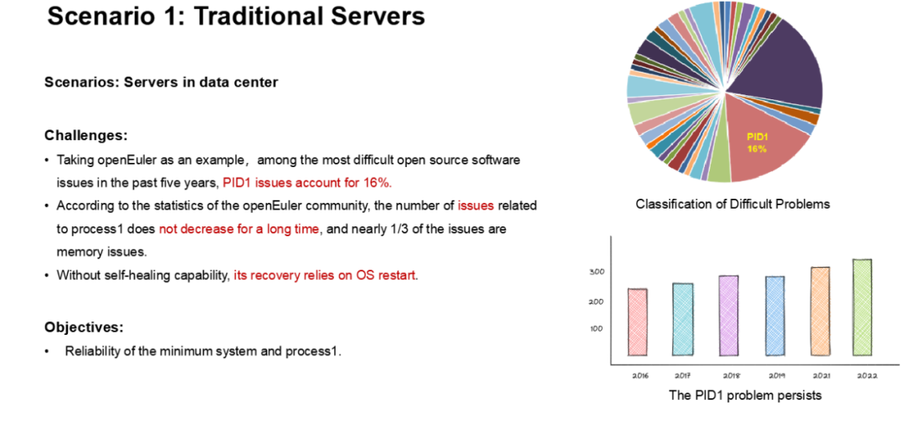
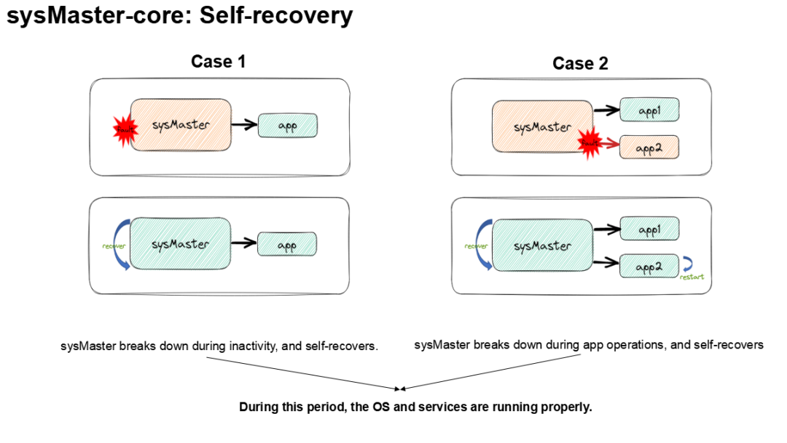

## 认识 1 号进程和 sysMaster

在 Linux 操作系统中，1 号进程是 init
进程，它是所有其他进程的祖先进程。init
进程是系统启动时第一个被创建的进程，它负责启动和管理其他所有进程，并在系统关机时关闭它们。在现代
Linux 系统中，init 进程已经被 systemd 进程所取代，但是 1
号进程的概念仍然存在。它的最小功能包括系统启动和回收僵尸进程。

**「sysMaster」** 是 openEuler 针对不同场景下 Linux
系统初始化和服务管理面临的问题和特点进行总结和思考后的一种改进和探索，旨在改进传统的
init
守护进程，提供统一的系统初始化和服务管理解决方案，支持嵌入式、服务器和云场景下的进程、容器和虚拟机管理。使用
rust 语言编码,引入故障监测和秒级自愈等多种技术手段,从而提升 OS
的稳定性和业务的可用度。

如下 sysMaster 系统架构图所示，主要包含三个方面的内容:

-   sysmaster-init：提供系统初始化/僵尸进程回收/监控保活等功能，功能极简，特别是可单独应用于嵌入式场景。

-   sysmaster-core：提供服务单元的生命周期管理等核心功能，支持热重启/热升级/秒级自愈等能力，保障业务
    24 小时在线。

-   sysmaster-extends：提供系统关键功能的组件集合(如设备管理
    devMaster,总线通信 busMaster，统一代理 uniMaster
    等)，各组件可单独使用,在不同场景下灵活选用。

## 为什么开发 sysMaster

常见的初始化系统有 sysvinit、Upstart 和
systemd，它们各有特点，如下表所示：

尽管 systemd
在启动速度和功能方面有很大的改进，但其系统架构和实现越来越复杂，不符合
Keep It Simple 的原则，也不支持灵活组合，对于嵌入式和一些 IoT
设备等场景的支持不足。此外，systemd
每个版本引入的问题都不是一个收敛状态，并且近些年问题越来越多，这些问题会带来系统级别的宕机。这与
openEuler 面向边缘、嵌入式、服务器和云场景的愿景不符。

在云化场景下，服务的管理对象由进程演变为虚拟机和容器。通过
OpenStack、Kubernetes 等平台结合节点上的 agent（如
kubelet、nova）进行管理。这些 agent 在节点上通过 Systemd
进行管理，并且也使用了 Systemd 提供的一些基础能力，如日志输出。对于
Node（VM、Host）内部的一些关键服务，如 Nginx，通过 Systemd
进行生命周期的管理。这些服务也是分布式的，当前出现问题时，由服务自行进行处理，无法像容器实例和虚拟机实例一样通过类似
Kubernetes、OpenStack 平台统一编排。

现有的成熟初始化系统，如 systemd 和
Upstart，明确不支持嵌入式场景。其中最有名的
systemd,组件众多，功能不独立，依赖关系复杂，且资源占用较高，无法在嵌入式等场景很好的发挥优势。

## sysMaster 应该聚焦什么

操作系统的初始化和服务管理是系统中非常重要的功能，随着场景和外部形式的变化，我们期望提供一套统一的系统初始化和服务管理框架，以消除现有问题并适应传统场景和云场景的需求。

我们的目标是：

1.  消除现有初始化系统内存安全类问题，降低故障发生的可能性。

2.  支持快速部署、升级和恢复，实现故障秒级恢复，对业务无感知。

3.  极致轻量、灵活，能够满足嵌入、服务器和云等场景对资源开销的不同需求。

对于云场景节点内部的运行实例（如容器、虚拟机和进程），我们的目标是：

1.  提供统一的实例生命周期管理接口，对接分布式管理框架（如 Kubernetes 和
    OpenStack），屏蔽容器引擎和虚拟化管理平台的差异。

2.  对于 VM
    中的关键云化服务，能够复用当前云实例调度平台的能力，实现分布式管理。

sysMaster 采用多级拆分的 1+1+N
架构，确保每个组件专注于自己的职责，降低单组件的复杂性，确保组件架构简单，从而提升系统整体架构的扩展性和适应性，降低开发和维护成本。sysMaster
具有以下主要特点：

1.  轻量化调度，支持更快的启动速度。sysMaster-core 中的 job
    调度器和事件驱动器负责相关启动任务的处理。job
    调度器提供轻量化、并行化的调度能力，并支持事务能力，保障服务启动的原子性。事件驱动器接受外部事件并驱动
    job 调度器完成事件相关任务，如管理控制命令和设备发现等。

2.  插件架构，支持服务类型灵活拓展。Unit
    管理器提供插件化机制，支持动态加载各种服务类型，实现按需加载，支持服务的灵活扩展。

3.  状态外置，多级还原点；语言级原生安全，支撑极致可靠。可靠性框架支持状态外置、多级
    checkpoint
    支持自定义，并实现资源对账、数据自恢复，实现故障的快速自恢复，同时具有热升级能力，实现不中断业务的版本快速升级能力。sysMaster
    选择内存安全的 Rust 语言进行开发，原生消除内存安全类问题，提高 1
    号进程自身的鲁棒性，提升系统整体的可靠性。

4.  迁移工具支持 Systemd 到 sysMaster
    无缝迁移。提供生态迁移工具，支持客户和开发者从 Systemd 快速切换到
    sysMaster，实现无缝切换和迁移。

5.  sysMaster 吸收现有云化场景的一些特点，结合容器引擎（iSulad）和
    Qemu，提供统一的容器实例和虚拟化实例的管理接口，并将由 sysMaster
    管理的一些关键应用实例的管理统一对接到 Kubernetes 和 OpenStack
    等分布式调度框架。这样，sysMaster
    可以提供单节点运行对象生命周期管理的统一接口。

6.  原生支持鸿蒙和 Linux 内核。sysMaster
    定位为支持嵌入式、服务器和云等全场景的支持，当前原生支持鸿蒙微内核和
    Linux 内核，为微内核和宏内核提供统一的服务管理框架。

## sysMaster 当前进展及规划

自 2022 年 9 月份发布首个技术验证版本以来，最新版的 sysMaster
引入了故障恢复机制，当 sysMaster
服务管理功能异常导致进程崩溃时，可以秒级恢复，而不是重启整个系统来恢复故障。同时，sysMaster
已完成 init 全部功能以及 core 主体功能，打通了系统容器/虚拟机的场景。

今年，sysMaster 将重点发力快速启动方面的特性，以提升 sysMaster
在启动速度和运行底噪方面的优势。这将包括对 sysMaster-core 中的 job
调度器和事件驱动器进行优化，以提高启动速度和响应速度。此外，sysMaster
还将重点开发设备管理及其他必要组件，以满足虚机场景的需求。设备管理(devMaster)是
sysMaster
的一个重要组件，它可以帮助用户管理和监控系统中的硬件设备，包括网络接口、磁盘、CPU
等。这将有助于提高系统的可靠性和稳定性。未来，sysMaster
将继续探索在云场景下的应用，以满足不断变化的需求。sysMaster
将继续优化其架构和性能，以提高系统的可扩展性和适应性。同时，sysMaster
还将继续开发新的功能和组件，以满足不同场景下的需求，如容器化、虚拟化、边缘计算等。sysMaster
将不断努力，成为一个强大的系统管理框架，为用户提供更好的使用体验和更高的效率。

## 加入我们

sysMaster 项目地址：https://gitee.com/openeuler/sysmaster

如果您对 1
号进程及系统管理感兴趣，欢迎加入我们。您可以添加小助手微信，回复
sysMaster 加入交流群。

