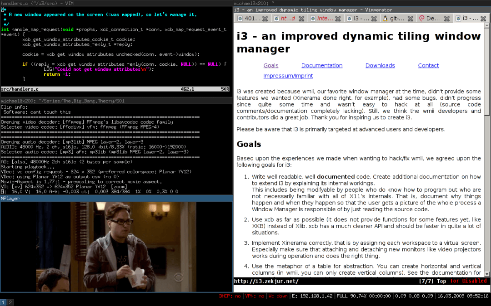

在操作系统的世界，软件包是一等公民，软件包的丰富程度和是否易于分发，一定程度上决定了操作系统用户和开发者的使用体验.。

**EUR**(openEuler User
Repo)是openEuler社区针对开发者推出的个人软件包托管平台，目的在于为开发者提供一个易用的**软件包分发平台**，支持自动从pypi，rubygem打包软件包，支持通过webhook自动触发持续构建，后续还将支持一键将个人仓库的软件包引入社区。

链接：https://eur.openeuler.openatom.cn/

随着越来越多人使用EUR，EUR上的项目也越来越多。如今已经有68个项目了，本文将分享在4月上新的2个项目，欢迎大家使用！

# 项目一：i3

## 项目介绍：


i3 是一款功能强大的基于X11的平铺式窗口管理器。



在i3的环境中，无需使用鼠标，就可以完成窗口的管理，移动，切换等动作，并且i3对多显示器的支持也非常优秀，推荐尝试使用。

## 如何安装：


目前暂时支持22.03版本，如果对其他版本感兴趣，欢迎联系作者。

```python
cd /etc/yum.repos.dcurl -OL
https://eur.openeuler.openatom.cn/coprs/mywaaagh_admin/i3wm/repo/openeuler-22.03_LTS_SP1/mywaaagh_admin-i3wm-openeuler-22.03_LTS_SP1.repodnf
makecachednf in i3

```

# 项目二：tide

## 项目介绍：


tide是一个fish下的命令提示符美化工具，要使用tide，需要安装fisher和较为新版本的fish。


地址：[https://github.com/IlanCosman/tide](https://github.com/IlanCosman/tide)

## 如何安装：

首先通过EUR安装新版本的fish和fisher。

目前暂时支持22.03和20.03版本，如果对其他版本感兴趣，欢迎联系作者。

```python

cd /etc/yum.repos.dcurl -OL
https://eur.openeuler.openatom.cn/coprs/mywaaagh_admin/fish/repo/openeuler-20.03_LTS_SP3/mywaaagh_admin-fish-openeuler-20.03_LTS_SP3.repo
*\# 20.03版本*curl -OL
https://eur.openeuler.openatom.cn/coprs/mywaaagh_admin/fish/repo/openeuler-22.03_LTS_SP1/mywaaagh_admin-fish-openeuler-22.03_LTS_SP1.repo
*\# 22.03版本*dnf makecachednf in fish fisherchsh -s /bin/fish *\#

```

切换默认shell为fish*

然后使用fisher安装tide。

重新登录shell，确认已经进入fish且fiser功能正常。

  ```python
\$ fish -vfish, version 3.6.0\$ fisher -vfisher, version 4.4.3
  ```

安装tide（需要访问网络）。

  ```python

fisher install IlanCosman/tide@v5

  ```

欢迎感兴趣的朋友使用，有任何建议欢迎在社区论坛一起交流。

**邮件列表**：infra@openeuler.org

**社区论坛**：[https://forum.openeuler.org/](https://forum.openeuler.org/)

**EUR(openEuler User Repo)**：

[https://our.openeuler.openatom.cn/](https://our.openeuler.openatom.cn/)

**如何使用openEuler用户仓（视频）**：

[https://b23.tv/sKHjKUU](https://b23.tv/sKHjKUU)
