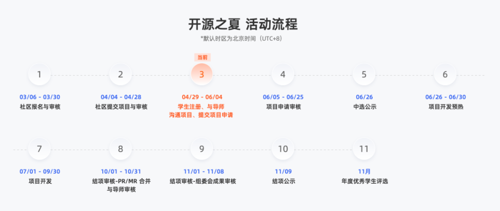

开源之夏是中国科学院软件研究所联合openEuler发起的开源软件供应链点亮计划系列暑期活动，旨在鼓励在校学生积极参与开源软件的开发维护，促进优秀开源软件社区的蓬勃发展。活动联合各大开源社区，针对重要开源软件的开发与维护提供项目，并向全球高校学生开放报名。

openEuler社区目前已上线94个项目！欢迎各大学子按照自己感兴趣或擅长的方向进行申请，扫码可查看全部项目。

今天给大家带来sig-eBPF的任务介绍，可编程内核在Linux系统里的重要性不用多说，sig-eBPF
本次发布了6个**可编程内核**方向的项目任务。

sig-eBPF的项目任务覆盖面广，难易程度适中。欢迎大家参与到sig-eBPF的项目中，我们将为大家提供丰富的学习资源和技术指导
。你的技术能力将得到快速提升，成长为极具竞争力的可编程内核领域技术人才。

# 项目1：基于ebpf实现容器网络中veth网络性能的优化

**项目描述：**

1、veth
pair是linux中提供的一种虚拟网络设备，veth总是成对出现，一个pair对中的veth就像一根网线的两端，数据从一个端点流进，就会从另一端流出，veth可以配置ip，实现不同netns间的通信；当前veth
pair容器网络中常用的网络模型；通过将veth的一段挂到Pod内，另一端在node上，实现Pod与外部网络的互通；\
2、Pod流量经过veth
pair后存在一定的性能损耗（对比测试主机进程直接通信的性能损耗约40%），存在较大优化空间；本项目期望基于ebpf技术对veth的网络性能做优化；

**产出标准：**

1、基于ebpf实现veth网络性能优化，性能可达成主机进程直通的90%+；

2、项目代码合入openEuler社区仓库；

**技术要求：**

1、对容器网络有一定的了解，了解veth网络的工作原理；\
2、了解ebpf的基本原理，可编写简单的ebpf程序；

**项目导师：**

wuchangye@huawei.com

**项目主页：**

https://gitee.com/openeuler/open-source-summer/issues/I6Z3S2?from=project-issue

# 项目2：基于Kmesh实现七层熔断限流的服务治理功能

**项目描述：**

Kmesh是一种服务网格数据面软件，通过可编程内核，将编排逻辑下沉OS，实现高性能、低底噪的编排逻辑；Kmesh当前对外提供了基于七层的路由、灰度、负载均衡等治理能力，对于大规模集群中，熔断限流能力能很好的处理突发流量，防止服务崩溃，为集群提供高可靠能力；本项目期望基于Kmesh实现七层熔断限流的服务治理功能；

**产出标准：**

1、支持对接基于xds协议标准的七层熔断限流的服务治理规则；\
2、基于ebpf实现七层熔断限流的服务治理功能，并合入Kmesh代码仓；

**技术要求：**

1、熟悉go语言开发；\
2、了解ebpf的基本原理，能开发简单的ebpf程序；\
3、了解服务网格（isito）、xds协议、服务治理等基本概念；

**项目导师：**

liuxin350@huawei.com

**项目主页：**

https://gitee.com/openeuler/open-source-summer/issues/I6YTY8?from=project-issue

# 项目3：基于ebpf实现高性能的服务负载均衡

**项目描述：**

1.当前k8s服务负载均衡是基于iptables实现，集群规模较大的情况下，iptables因其线性路由的机制，存在性能问题\
2.通过ebpf可编程技术，将k8s集群中服务路由信息记录到bpf
map中，并在内核协议栈对应hook点挂载bpf程序，实现高性能的服务负载均衡逻辑

**产出标准：**

1.控制面：基于go语言实现，订阅k8s集群服务信息，并转化为ebpf
map，提供一定的DFX能力（命令行、日志）\
2.数据面：基于ebpf map信息实现1\~2种高性能服务负载均衡方法\
3.代码合入openEuler

**技术要求：**

1.对k8s/云原生技术有一定了解，熟悉golang\
2.了解ebpf基本原理，可编写简单的ebpf程序

**项目导师：**

xiesongyang@huawei.com

**项目主页：**

https://gitee.com/openeuler/open-source-summer/issues/I6Z8XA?from=project-issue

# 项目4：基于动态冗余的高可靠系统

**项目描述：**

可靠性是关键领域系统的基础，其目标是在硬件可能出错的条件下，保证系统和应用稳定正确执行。进程级多模冗余是保证可靠性的主流技术，他的基本思想是：对一个进程，同时运行多个副本，并定期比对副本间的差异，如果某个副本出现问题，则用其他副本对其纠正，从而保证系统的绝对高可靠性。但当前多模执行性能差、成本高，实现低成本的多模冗余技术是业界和学术界研究的重点。

本项目目标为实现一个高效的、动态的进程多模冗余，降低冗余执行的硬件成本，优化冗余系统端到端的性能。通过该项目，可以掌握容错计算的基本原理，深入理解OS进程的核心实现和执行流程。课题指导专家都为国内顶尖学者，在国际顶会OSDI,
ATC等发表多篇论文。

**产出标准：**

1、提交代码，实现动态冗余的功能\
2、对典型应用做功能测试、验证\
3、通过故障注入等方式，模拟硬件故障，测试系统稳定性和正确性，并输出性能测试报告

**技术要求：**

1、基础知识：熟悉C语言，了解Linux编程，理解进程、系统调用、libc等OS基础概念。\
2、熟悉并行计算、容错计算、ebpf等编程能力。\
3、研究能力：能阅读并理解顶会前沿论文，能进行系统设计、架构设计。

**项目导师：**

胡万明/huwanming@huawei.com\
汪旭/wangxu72@huawei.com\
任玉鑫/renyuxin1@huawei.com

**项目主页：**

https://gitee.com/openeuler/open-source-summer/issues/I6YJAD?from=project-issue

# 项目5：eBPF软件版本兼容性技术工作

**项目描述：**

解决eBPF软件跨内核release版本的兼容性问题

**产出标准：**

1、构建openEuler BTF管理基础设施；\
2、配合eunomia项目，提供openEuler eBPF软件兼容性解决方案；

**技术要求：**

1、熟悉eBPF技术原理及eBPF软件开发过程；\
2、熟悉linux内核构建过程；\
3、熟悉btfhub-archive、eunomia等开源项目；

**项目导师：**

luzhihao@huawei.com

**项目主页：**

https://gitee.com/openeuler/open-source-summer/issues/I6YTBL?from=project-issue

# 项目6：混部场景基于oncn-bwm实现入方向网络QoS能力

**项目描述：**

混部场景下，需要对在离线业务做网络QoS管理，当前openEuler社区的oncn-bwm项目支持混部下出方向网络QoS管理，可实现在线业务\<100ms带宽抢占；但对于入方向流量当前并未提供网络QoS的管理能力；一旦入方向涌入大量报文，且未做带宽控制，会导致节点大量CPU被占用，影响节点内业务的正常调度处理，需要考虑补齐；

**产出标准：**

1、基于ebpf实现入方向网络QoS管理的设计思路及方案；\
2、提交入方向网络QoS管理代码，并合入oncn-bwm项目仓；

**技术要求：**

1、熟悉c语言开发，了解ebpf的基本原理，能开发简单的ebpf程序；\
2、了解tc等流控技术；

**项目导师：**

kongweibin2@huawei.com

**项目主页：**

https://gitee.com/openeuler/open-source-summer/issues/I6YW0T?from=project-issue

# 活动日程及参与方式

目前正处于学生注册、沟通导师、提交项目申请环节。

各位学生如果对上述项目感兴趣，欢迎扫码加入交流群。

若群已满可添加openEuler小助手微信"openeuler123"进入【开源之夏｜openEuler交流群】，请备注【开源之夏】噢～
