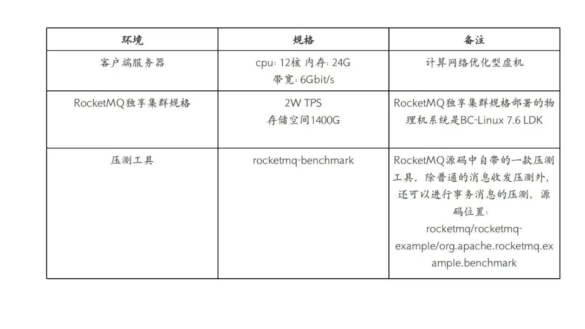
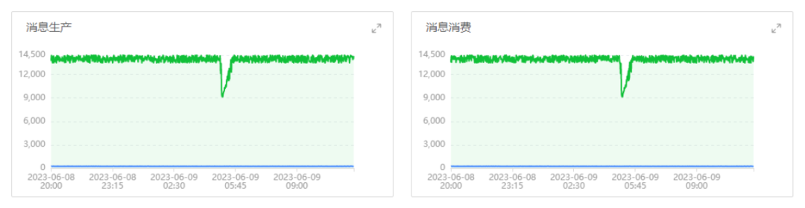
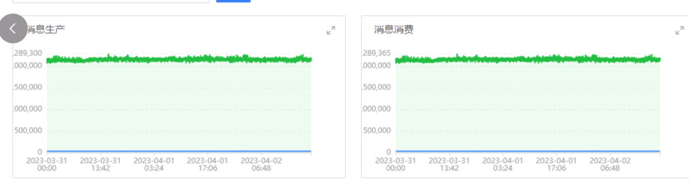
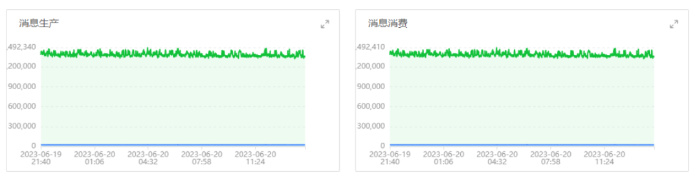

RocketMQ on openEuler，是一种将 RocketMQ
消息中间件通过容器化的方式部署在 openEuler 操作系统上运行，借助
openEuler 系统对于 OS
缓存回收效率增强的内核特性，提升消息中间件在面向超大规模高并发、高吞吐量、低延迟场景下稳定性和可靠性的软件解决方案。

## RocketMQ 消息队列在稳压测试中遇到的 OOM 问题

移动云 RocketMQ
消息队列产品正式上线前，通过压测工具，创建多组生产者/消费者进程对
RocketMQ 独享集群做多轮性能和稳定性的压力测试。

### 测试环境

### 压测结果

在某次持续长时间的压测过程中，发现消息收发吞吐，在一段时间内的某一时刻会出现大幅度
TPS（生产/消费）抖动下降的现象，并且是周期性的。

移动云 RocketMQ
消息队列一直都比较稳定运行，为何在高并发的压测下也会出现 TPS
的抖动？我们初步怀疑是 CPU 负载或者 RocketMQ Broker 组件 GC
频率过高导致，但通过查看 CPU 负载和 JVM GC
频率并未发现任何异常。最终，经过排查发现是由于 Broker Pod 进程中的
buff/cache 在持续长时间压测下不断增加，系统无法及时有效回收，导致 Pod
中的运行进程占用内存空间超出预先设置的 Limit 限制，触发了 OOM Killer
机制重启了 Broker Pod。

## RocketMQ on openEuler---解决大规模高并发场景下提升稳定性的新选择

为何在持续高并发下进行消息收发会导致系统的 buff/cache
的持续增加？通过翻阅操作系统手册，可知 buff/cache 主要体现在系统的
PageCache 上。

### PageCache 在 RocketMQ 消息存储中的重要作用

PageCache 也叫页缓冲或文件缓冲，在 linux
读写文件时，它用于缓存文件的逻辑内容，从而加快对磁盘上映像和数据的访问。

上图中，红色部分即为，PageCache。可见
PageCache 的本质是由 Linux
内核管理的内存区域。平时我们写的各种程序，通过 mmap 及 buffered I/O
将文件读取到内存空间实际上都是读取到 PageCache
中。为了在大规模高并发场景下实现实现低延迟、高吞吐的目标，RocketMQ
消息队列的存储模块主要采用如下两种方案。

1.  **「Mmap + PageCache
    的消息并发读写方案」**：在该方案中，消息的读写流程都会经过
    PageCache。在多线程并发读写的场景下，PageCache
    不可避免会有锁的问题，尤其是在维护 PageCache
    一致性时，系统回刷脏页时磁盘压力较高，会导致出现毛刺现象。

2.  **「堆外内存池化技术 + PageCache
    的消息读写分离方案」**：消息写入时候写至 RocketMQ
    启动时创建的堆外内存块（DirectByteBuffer）中，同时消息从 PageCache
    中读取。这样，消息读写分离使得整体流程并发性更好，有效降低时延，同时利用堆外内存池减少了用户态与内核态的切换开销。

PageCache 在 RocketMQ 消息队列的存储层扮演着举足轻重的作用，一旦系统的
PageCache
出现问题（如缓存回收、一致性和缺页中断等问题），都会对消息收发的主要流程造成严重的影响。

### openEuler 系统在缓存回收效率方面的优化

为了防止 PageCache 申请过多（默认无限制）将可靠内存耗尽，需要对
PageCache 的总量及使用可靠内存总量进行限制。相对于 CentOS
系统内核无法对未超出 node 节点内存资源的 PageCache
进行及时回收，openEuler 针对 PageCache
的回收增加了相关的系统内核参数，并为限制 PageCache 使用量的功能提供若干
proc 接口，接口定义在/proc/sys/vm/下，用来控制 PageCache
的使用量，具体如下：

1.  **「cache_reclaim_enable」**：表示 PageCache 限制的功能的使能开关；

2.  **「cache_reclaim_s」**：表示定期触发 cache
    回收的时间，以秒为单位。系统会根据当前 online 的 cpu
    个数来创建工作队列，如果有 n 个 cpu 则创建 n
    个工作队列，每个工作队列每隔 cache_reclaim_s
    秒进行一次回收。该参数与 cpu 上下线功能兼容，如果 cpu
    offline，则会减少工作队列个数；反之，cpu online
    则会增加工作队列个数。

3.  **「cache_reclaim_weight」**：表示每次回收的权值，内核每个 CPU
    每次期望回收 32 \* cache_reclaim_weight 个 page。该权值同时作用于
    page 上限触发的回收和定期 pageCache 回收；

### RocketMQ on openEuler 方案在生产环境中的验证

为解决遇到的 OOM
问题，我们针对独享集群所在机器进行了操作系统内核版本的升级，更新至最新的
BC-Linux for Euler 21.10 版本（BC-Linux for Euler 是移动云操作系统团队以
openEuler
社区操作系统为基础，借助开源社区的开放优势，通过定制化方式研发的企业级
Linux 操作系统）。更新系统后，采用两种消息体（1Kb 和
4Kb）分别对同样的测试环境进行长时间的压测。

#### 测试场景 1

测试消息大小 1Kb
消息收发性能及长时间压测稳定性，测试中，独享集群能够达到收发消息总和 TPS
为 2w+TPS（其中发送消息 1w+TPS，消费消息
1w+TPS）。消息生产和消费的速度规律，如下图所示：

从图中可见在消息体大小为 1Kb
的消息时，消息生产和消费速度在长时间压测下没有抖动，TPS
保持平稳，整个压测时间服务正常。

#### 测试场景 2

测试消息大小 4Kb
消息收发性能及长时间压测稳定性，测试中，集群能够达到收发消息总和 TPS 为
1.4w+ TPS（其中发送消息 0.7w+TPS，消费消息
0.7w+TPS）。消息生产和消费的速度规律，如下图所示：

从图中可见在消息体大小为 4Kb
的消息时，消息生产和消费速度长时间压测没有抖动，TPS
保持平稳，整个压测时间服务正常。

## 总结

移动云 RocketMQ 消息队列的独享实例在 22
年已完成了云原生化的完全升级，特别适合云原生、Serverless
化架构和大数据流计算的技术演进与相关应用场景。目前，RocketMQ on
openEuler 的解决方案已在广州 3
AZ2、呼和浩特、北京、杭州等多个资源池上线且完成了部分存量服务器的迁移与改造升级。后续，移动云
RocketMQ
消息队列并将不断提升服务质量，为广大客户创造更多的价值。欢迎大家多多关注。
