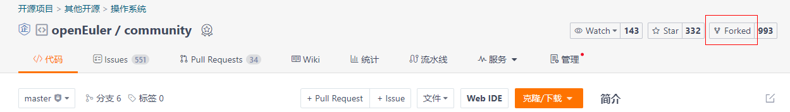

欢迎来到openEuler！

# 签署CLA {#签署cla .unnumbered}

您必须首先签署**签署CLA协议**，然后才能参与社区贡献。

根据您的参与身份，选择签署个人 CLA、员工 CLA 或企业 CLA。

协议的签署地址是：

[https://clasign.osinfra.cn/sign/Z2l0ZWUlMkZvcGVuZXVsZXI= ](https://clasign.osinfra.cn/sign/Z2l0ZWUlMkZvcGVuZXVsZXI= )

# 安装openEuler

请参考[[下载安装openEuler]](https://gitee.com/link?target=https%3A%2F%2Fopeneuler.org%2Fzh%2Fdownload%2F)

# 开始您的贡献

签署好协议以后，就需要考虑在社区里具体能做点什么了。参与社区有很多种方法和形式，如果总结起来，大体有下面的三类：

1.      **提交一些需求，或者bug**，简单来说就是在用openEuler的过程中发现了一些问题，然后需要在社区把这个问题提出来。

2.      **为社区修正bug**，这是更高一个层面的参与社区了，在这个层面，参与者实质上是以一个开发者的姿态进入到了社区中。一般我们都提倡，除了提出问题，更期待大家能解决问题。

3.      **贡献软件包**，发现openEuler缺失了一个软件包，帮openEuler把这个软件包补上。实际上贡献软件包的过程就是帮助openEuler提供更丰富功能的过程。希望随着大家的参与，openEuler能够成为一个"无所不有"的软件生态系统。

 

我们就来看看这3种参与方式如何进行吧。

在具体讨论参与方法之前，大家可以先保存下面三个网址链接。

1.  openEuler官网：<https://openeuler.org/>

2.  openEuler代码仓： <https://gitee.com/openeuler/>

3.  openEuler软件包仓：<https://gitee.com/src-openeuler>

第一个网址是openEuler的官网，是供大家获取一些通用信息的地方。而真正我们所谓的"社区"则是体现在2，3这两个网址上。

### 提出问题或建议（提Issue）

-   如果您发现并想向社区上报问题或缺陷，问题提交的方式就是创建一个Issue。您只要将问题以Issue的方式提交到该项目Repository的Issue列表内，并查看[[Issue提交指南]](https://gitee.com/openeuler/community/blob/master/zh/contributors/issue-submit.md)以获取更多的信息。提交问题时，**请尽量遵守**问题提交准则。

-   Issue有两个渠道 一个是Gitee 一个是
    [QuickIssue](https://quickissue.openeuler.org/zh/issues/)。

> openEuler社区的所有issue都可以通过QuickIssue提交，并且可以按图索骥找仓库，优化了查找issue归属仓库的途径。

-   如果您认为长时间没有得到回应，可以向邮箱[community@openeuler.org]求助。

### 提交一个PR

如果要参与代码贡献，您还需要了解如何在Gitee下载代码，通过PR合入代码等。openEuler使用的是Gitee代码托管平台，了解具体的指导请参考[[Gitee
Workflow
Guide]](https://gitee.com/openeuler/community/blob/master/zh/contributors/Gitee-workflow.md)。

### 新增软件包

操作步骤：

通过修改Gitee中在openeuler/community仓库实现新增软件包，具体操作步骤如下：

1.点击进入community仓库，将其fork到自己的仓库。

2.将fork完成的community仓库clone到本地。

3.修改community仓库。

-   明确软件包所属的sig组，如zip属于Base-service组（请参考[SIG列表](https://www.openeuler.org/zh/sig/sig-list/)找到您感兴趣的SIG或项目）；

-   修改所属sig文件夹下的内容，如项目清单等；

-   修改所属sig文件夹下的sig-info.yaml，将要新增的软件包以\"-
    src-openeuler/zip\"的形式添加到对应的sig组列表下；以zip为例，修改sig/Base-service/sig-info.yaml：

-   建仓，在 sig/{sig目录}/src-openeuler/软件名首字母
    新增下对应的yaml文件(openeuler社区维护项目:
    openeuler目录；其他社区引入包:
    src-openeuler目录。示例参考：sig/Base-service/src-openeuler/z/zip.yaml)

-   你要做的就是把文件修改了，然后提交PR就可以了。要在commit
    message里解释清楚为什么要添加这样一个包，或者为什么要创建这样一个仓库。commit
    message写的越好，越容易通过审核 。

4. PR合入后将会在gitee建立同名仓库。查看地址：[src-openeuler](https://gitee.com/organizations/src-openeuler/projects)。

具体流程可参考[[如何新增软件包]](https://gitee.com/openeuler/community/blob/master/zh/contributors/create-package.md)。

#### EUR 

EUR(openEuler User
Repo)是openEuler社区针对开发者推出的个人软件包托管平台，目的在于为开发者提供一个易用的软件包分发平台.

链接：<https://eur.openeuler.openatom.cn/>

如何使用openEuler用户仓（视频）：

<https://b23.tv/sKHjKUU>

**测试**

测试------是所有贡献者的责任，对于社区版本来说，[sig-qa组](https://gitee.com/openeuler/QA)是负责测试活动的社区官方组织。如果您希望在自己的基础架构上开展测试活动，可以参考：[社区测试体系介绍](https://gitee.com/openeuler/QA/blob/master/社区测试体系介绍.md)。

为了成功发行一个社区版本，需要完成多种测试活动。不同的测试活动，测试代码的位置也有所不同，成功运行测试所需的环境的细节也会有差异，有关的信息可以参考[[测试指南]](https://gitee.com/openeuler/QA/blob/master/%E7%A4%BE%E5%8C%BA%E5%BC%80%E5%8F%91%E8%80%85%E6%B5%8B%E8%AF%95%E8%B4%A1%E7%8C%AE%E6%8C%87%E5%8D%97.md)。

**选择社区组件打包**

您也可以参与社区组件打包，请参考：[[如何打包]](https://gitee.com/openeuler/community/blob/master/zh/contributors/packaging.md)

**社区安全问题披露**

-   [[安全处理流程]](https://gitee.com/openeuler/security-committee/blob/master/security-process.md)------简要描述了处理安全问题的过程

-   [[安全披露信息]](https://gitee.com/openeuler/security-committee/blob/master/security-disclosure.md)------如果您希望报告安全漏洞，请参考此页面

# 找到您感兴趣的组织 

**了解SIG**

SIG就是Special Interest
Group的缩写，openEuler社区按照不同的SIG来组织，以便于更好的管理和改善工作流程。

-   SIG组是开放的，欢迎任何人加入并参与贡献。

-   SIG都是针对特定的一个或多个技术主题而成立的。SIG内的成员推动交付成果输出，并争取让交付成果成为openEuler社区发行的一部分。

-   SIG的核心成员主导SIG的治理。请查看[[SIG的角色说明]](https://gitee.com/openeuler/community/blob/master/community-membership_cn.md)。您可以在贡献的同时积累经验和提升影响力。

-   每一个SIG在Gitee上都会拥有一个或多个项目，这些项目会拥有一个或多个Repository。SIG的交付成果会保存在这些Repository内。

-   可以在SIG对应的Repository内提交Issue、针对特定问题参与讨论，提交和解决问题，参与评审等。

-   您也可以通过邮件列表、IRC或视频会议和SIG内的成员进行交流。

**找到您感兴趣的SIG或项目**

找到您感兴趣的SIG组，可以帮助您在正确的地方提出问题，并得到更快的社区响应。

-   **方式一**：如果您不了解有哪些SIG或项目，您可以查看[[SIG列表]](https://gitee.com/link?target=https%3A%2F%2Fopeneuler.org%2Fzh%2Fsig%2Fsig-list%2F)，它包含当前openEuler社区成立的所有SIG团队的清单。您可以通过该列表快速的定位到您感兴趣的领域所对应SIG团队。同时还为您提供该SIG团队的如下信息：

    -   SIG下的项目，以及项目的Repository地址

    -   SIG内的交流方式，包括邮件列表、IRC会议频道等

    -   Maintainer的联系方式

-   **方式二**：如果您知道感兴趣的项目名称，可以在openEuler的Repository列表下进行模糊搜索，从而快速定位到对应项目的首页地址。通常情况下，在该项目首页地址的README.md文件中，可以找到该项目所属的SIG信息、交流方式、成员和联系方式等。

> 如果上述两种方式都定位不到您感兴趣的SIG，您可以向[[community@openeuler.org]](mailto:community@openeuler.org)发求助邮件。建议您在邮件列表内用"【开发过程疑问】"作为标题，在内容中写出你寻找的SIG或项目的特征，我们会为您提供帮助。

# 参与社区活动

**社区内沟通方式**

openEuler社区的交流方式有邮件列表和视频会议等

1\. 访问该地址https://www.openeuler.org/zh/community/mailing-list/

找到社区可用的邮件列表，请根据您的兴趣参照下面步骤去加入某个邮件列表。

2\. 访问该地址：<https://www.openeuler.org/zh/>

可以看到社区各SIG的例会安排，点击相关链接还可查看会议链接和会议纪要，欢迎感兴趣的开发者找到对应的SIG组，申报议题和参会。

**社区新闻和大事件**

openEuler参加或举办的社区和技术交流会议，关于这些事件和其他社区事件信息均可以在[[openEuler新闻]](https://gitee.com/link?target=https%3A%2F%2Fopeneuler.org%2Fzh%2Finteraction%2Fnews-list%2F)页面上找到

**社区聚会**

社区每年会定期举办开发者大会，您可以通过[[https://openeuler.org]](https://gitee.com/link?target=https%3A%2F%2Fopeneuler.org)上的信息或通过电子邮件[[dev@openeuler.org]](mailto:dev@openeuler.org)与我们联系。来加入我们吧\~

**问题反馈**

如果您在使用该贡献者指南或对开发过程有疑问，请随时通过电子邮件[[dev@openeuler.org]](mailto:dev@openeuler.org)与我们联系，并在邮件标题内用"【开发过程疑问】"作为邮件标题写出你的疑问和困惑，openEuler社区运营团队会并尽力确保您的问题得到解答。
