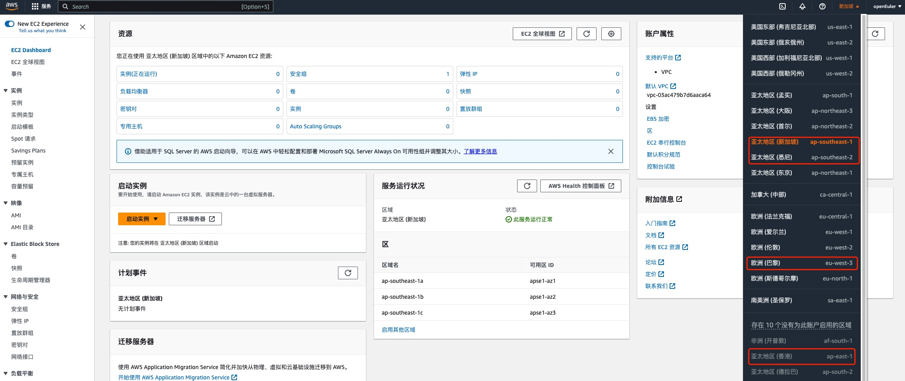
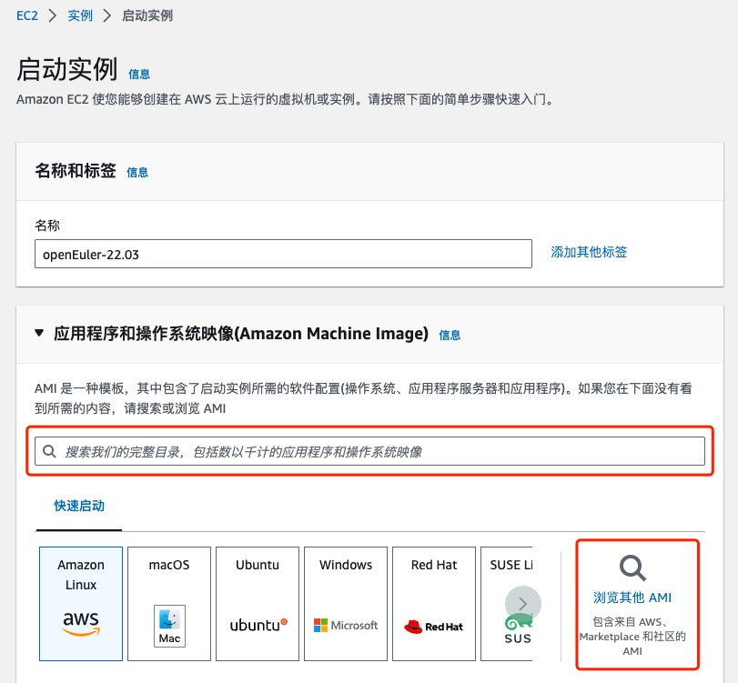
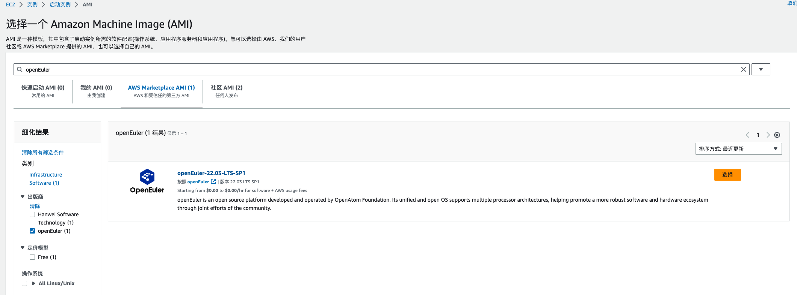
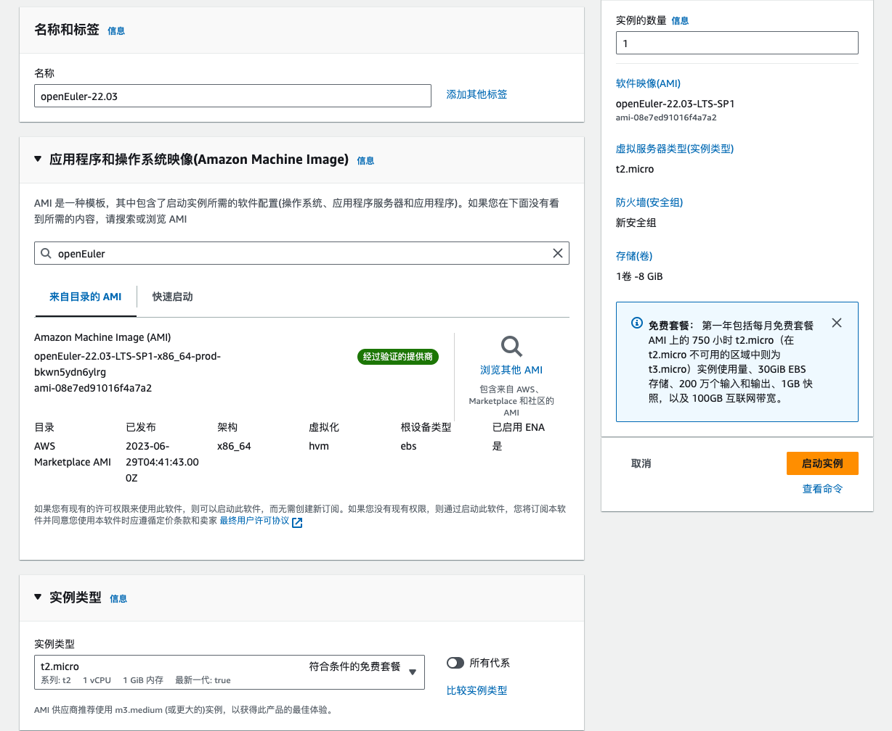
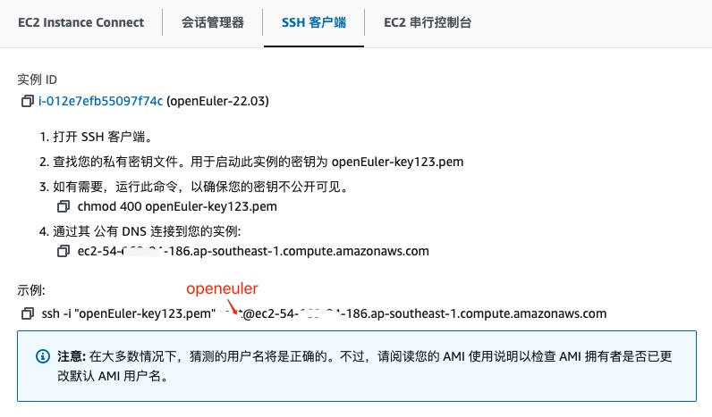
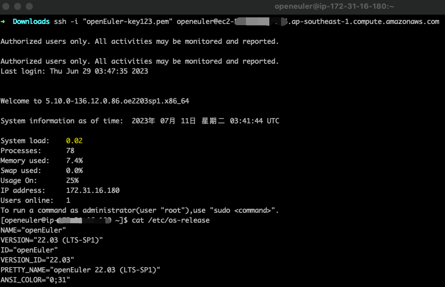
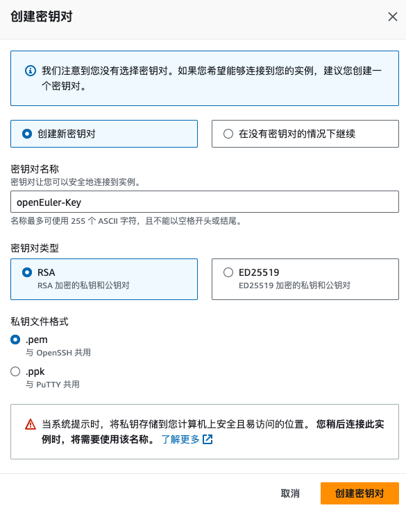

openEuler社区在AWS的多个区域提供多个版本的Amazon Machine Images(AMI)，openEuler镜像当前通过AWS Marketplace的方式对外提供，AWS Marketplace 是一个软件在线商店，帮助客户寻找、购买和快速启用 AWS
上运行的软件和服务，所有openEuler镜像均为免费镜像(虚拟机资源费用仍需向AWS支付)。

openEuler社区官方镜像通过openEuler官方账号在AWS
Marketplace进行发布(<https://aws.amazon.com/marketplace/seller-profile?id=seller-y5dyeyb4vjcfu>)

当前支持的镜像格式包括(持续发布中)：

| 版本     | 架构   |区域       |
| ----------- | ----------- |----------- |
|  openEuler 22.03  LTS SP1  | X86_64          | Middle East (UAE)  |  
|    |           |Asia Pacific (HongKong)         |
|    |           |Asia Pacific (Singapore)        |
|    |           |Asia Pacific (Sydney)  |
|    |           |Asia Pacific (Tokyo)  |
|    |           |Asia Pacific (Osaka) |
|    |           |Asia Pacific (Mumbai)  |
|    |           |Canada (Central) |
|    |           |Europe (Frankfurt) |
|    |           |Europe (Spain) |
|    |           |Europe (London) |
|    |           |Europe (Paris)|
|    |           |Africa (Cape Town) |
|    |           |US East (N. Virginia) |
|    |           |US West (N. California)|

<https://aws.amazon.com/marketplace/pp/prodview-bxuhwcmulvdmu?sr=0-1&ref_=beagle&applicationId=AWSMPContessa>

## 如何使用：

进入AWS
Console(控制台)，选择镜像可用Region，当前可用Region包括：EU(Paris)、Asia
Pacific (HongKong)、 Asia Pacific (Singapore)、Asia Pacific (Sydney)。

进入EC2控制面板，选择创建新的实例

在镜像搜索处直接搜索，或点击浏览社区Marketplace
AMI进行镜像搜索，选择openEuler镜像，并创建实例

openEuler AMI
仅允许通过秘钥注入的方式进行登录，因此在创建时需要创建或指定秘钥，ssh访问请注意正确配置安全组规则。

实例启动后，使用openeuler用户登录，具体操作方式可参考官方指导：

如有任何问题，欢迎前往社区提交ISSUE

