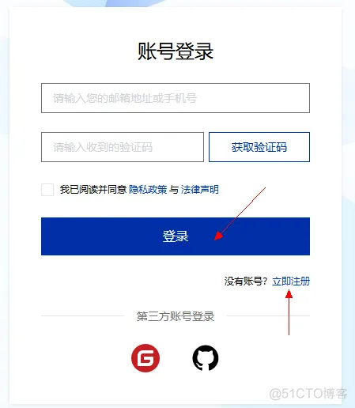
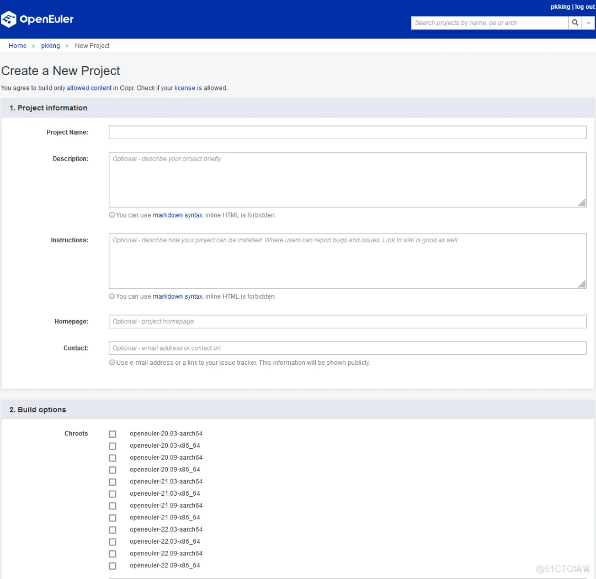
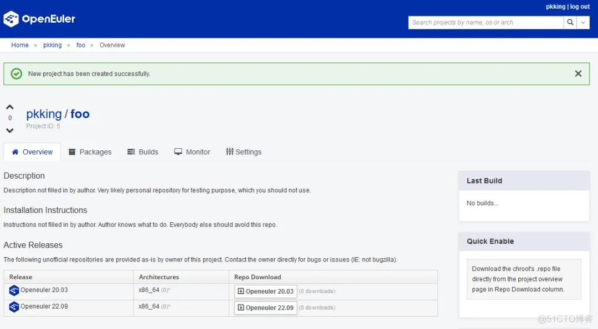
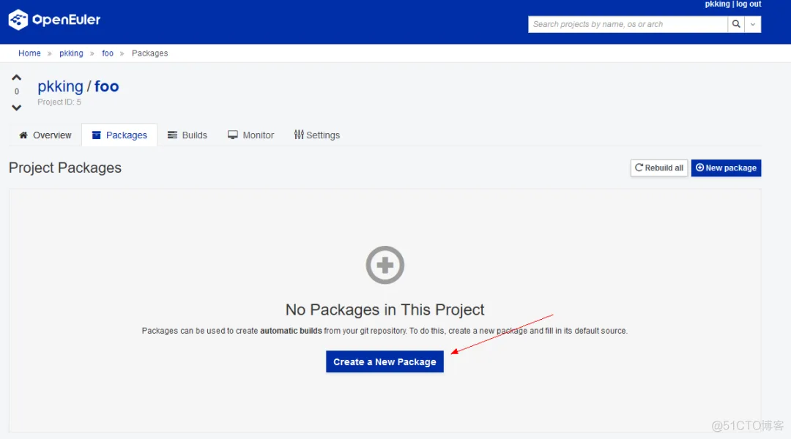
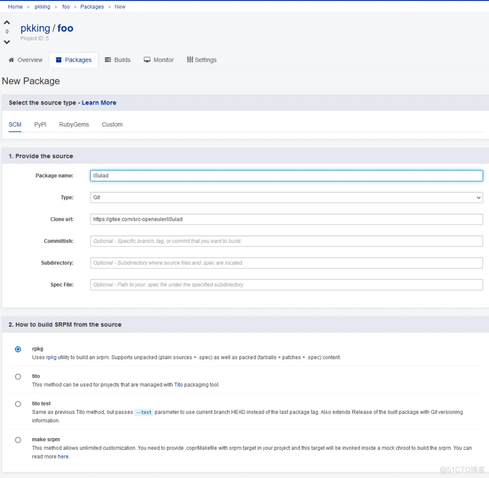
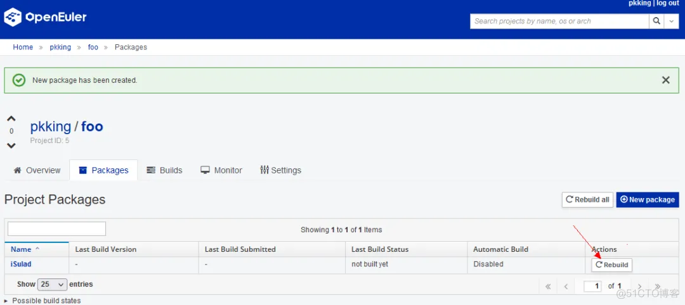
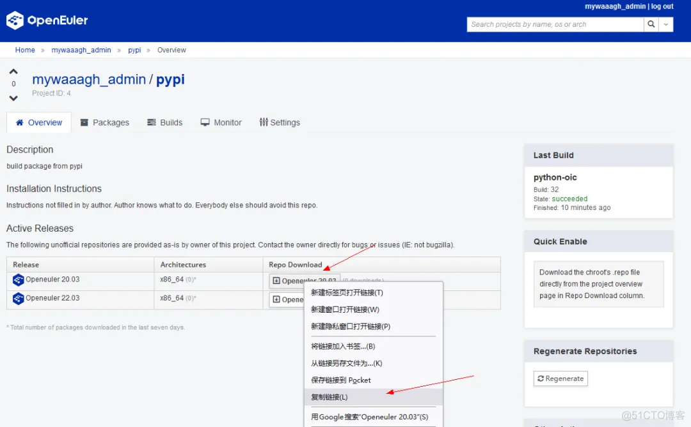
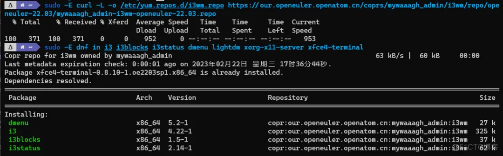

EUR(openEuler User Repository)，是由openEuler社区Infrastructure
SIG开发、维护的openEuler开发者、用户软件仓库，提供了端到端的openEuler软件包适配、验证、分发等功能。相较于社区ISO、EPOL等软件仓库，EUR具有更加灵活、易用的优势，对很多开发场景工作效率提升明显：

1.  在软件包构建完成后，就可以非常方便的通过dnf命令，一键获取个人在EUR上适配、构建的软件包，进行全量的验证和进一步开发和使用，而不必在等到openEuler新版本或Update版本发布后才能真正获取这些软件包。在推动上游社区对于openEuler的支持中，这项功能非常重要，对于上游社区来说，需要快速证明openEuler可以对其开发分支提供支持，通过EUR快速引入所有依赖的指定版本并展示验证成果(上游社区也可以从EUR直接取包来进行自验证)，对于上游社区快速接纳openEuler十分有效(已在Bioconductor、Ceph、OpenHPC等社区得到验证)。

2.  同时EUR还提供了对openEuler所有历史版本的构建支持，这对于存量用户来说很有价值：对于存量的老版本来说(例如20.03LTS或20.09)，这些版本已进入了生命周期末期，但仍有大量用户在使用这些版本，当我们想引入一些新的软件包，或之前软件包的不同版本时，就可以使用EUR指定老版本来进入软件包构建，并在构建完成后直接从EUR使用该软件包，避免对老版本中的其他软件造成影响。这对于新成立的SIG组来说是非常有用且高效。

3.  EUR提供了将软件包一键提交到openEuler社区其他仓库的功能，可以方便、快速的将完成适配、测试及广泛使用的EUR包提交到openEuler社区，提高了社区引入新包的效率和质量。

**基本概念**

在使用用户软件仓前，有如下几个概念需要您了解：

用户：用户是使用本系统的主体，也是所有操作的发起者；
项目：每个用户可以创建多个项目，项目用于组织一个或多个软件包，每个项目可以针对这组软件包生成针对各个openEuler版本的软件包仓库；
软件包：代表一个源码包；
构建：rpm包的一次构建的上下文，包括srpm包和其构建生成的一些rpm包；
仓库：针对特定openEuler版本构建的的软件包仓库。

**如何使用**

使用EUR无需任何门槛，您只需注册一个openEuler账号即可使用，openEuler
账号中心：https://id.openeuler.org/zh/profile

openEuler账号可以通过Gitee或Github账号直接登录，也可以直接通过邮箱直接注册。进入用户软件仓首页并且登录之后，就可以开始构建自己的软件包了。用户软件仓首页：https://eur.openeuler.openatom.cn/

**创建一个新的项目**

点击new project按钮，创建一个新的项目：

项目名称：后续无法再修改；

项目描述，指南，主页，联系人：可选配置，项目创建后支持修改；

Chroots：必须配置，选择需要的软件包构建环境，项目创建后支持修改，如图所示，这里可以选择众多openEuler版本及架构进行构建；

External Repositories:
可选配置，如果构建过程中依赖其他的软件仓库，可以填写在这里;

项目创建后，在Repo Download处，即可下载对应版本的仓库配置文件。

点击packages标签页，创建一个新的软件包：

EUR当前支持从远端git仓库(SCM)、Pypi仓库、RubyGems仓库及完全自定义等几种方式构建RPM软件包，非常灵活、易用。这里我们添加openEuler的isulad软件包为例展示构建功能。

软件包工程完成后，点击rebuild即可触发一次构建。

**应用EUR中的软件包**

软件包构建成功后，可以通过dnf命令非常便捷的对软件包进行使用：

使用curl -OL\<上面复制得到的url\>,可以直接下载对应的仓库配置，再使用dnf
in即可安装对应仓库中的软件包，EUR中每个project都有独立的gpg
key对rpm包进行签名。

在使用中有任何问题、意见或心得，欢迎到openEuler社区论坛、openEuler Infra
SIG、各交流群进行交流。
