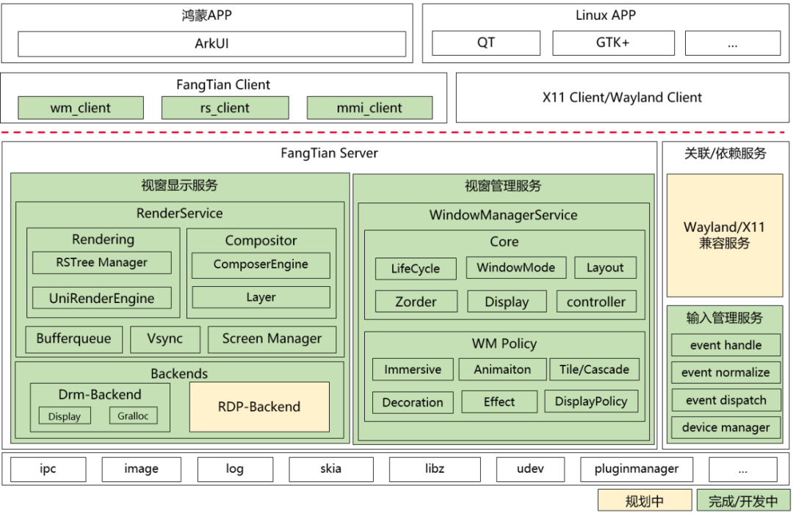
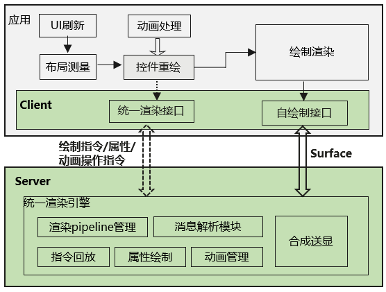

2023年5月份，openEuler 正式成立 FangTian SIG。FangTian
SIG**聚焦FangTian视窗引擎，包含显示服务，窗口管理，图形绘制、合成、送显等模块，同时推出新型FT显示协议，探索解决Linux桌面环境体验不佳的问题**。

经过2个多月的开发、调试，FangTian
SIG已在设备上流畅地运行Demo应用。本文将为大家介绍FangTian
SIG最新进展，同时对FangTian视窗引擎做个全面解读。

# FangTian SIG的进展

方天视窗引擎（下面简称方天引擎）已在设备上流畅的运行Demo应用：

具体效果如上图所示：该Demo实现了3个窗口，其中包括两个clock窗口和一个背景窗口，用户可以通过控制鼠标，实现对窗口的拖动及缩放操作。

该Demo展示了方天视窗引擎窗口创建、销毁、层叠、多窗口等基础功能，以及对输入事件进行识别、分发的能力，并能通过鼠标实现窗口移动、缩放等操作；FangTian
SIG将聚焦视窗引擎，持续为用户带来的全新显示体验。

# 方天引擎的全面认识

方天引擎主要专注于视窗显示和视窗管理两个部分。这里从软件架构及协议两个方面介绍方天引擎：

**1、方天引擎整体架构为C/S架构**，FangTian
Client为应用开发者或者GUI框架开发者提供API，开发者可以通过API调用对应的服务能力，例如：申请Surface、控制窗口位置大小、获取外设输入等。FangTian
Server是视窗显示和视窗管理能力的核心，FangTian Server包含2个服务：

① **视窗显示服务**，提供Buffer分配轮转、Vsync、渲染、合成、显示等能力。通过数据驱动接口及统一渲染架构，达成方天引擎的高性能、低内存的目标。

② **视窗管理服务**，提供窗口的创建、销毁、移动、缩放、布局等能力。通过独立的窗口策略模块，适应移动端、PC端等多种设备的多种场景。

方天引擎除了自身包含的视窗显示服务、视窗管理服务外，还需依赖输入管理服务。它将提供输入管理服务，提供输入设备管理及输入事件的识别及分发操作的功能，实现对触摸屏、鼠标、键盘、触摸板等多种外设的统一管理，**用于适配简化多模输入交互场景。**

**2、Client与Server之间通过FT协议进行交互**，主要特点是提供统一渲染及数据驱动接口，用于降低渲染负载，减少跨进程数据的交互量，提升应用的动画能力和性能。

FT协议主要包含基本的窗口协议、自绘制协议、统一渲染协议三个部分。下面主要介绍自绘制协议及统一渲染协议：

① **自绘制**，也叫直接渲染（direct
rendering），表示应用直接使用CPU或者GPU完成图像渲染，将渲染后的数据通过Buffer共享到Server端。方天引擎中自绘制接口将Surface（包含Buffer的句柄）发送到Server端，Server端直接使用渲染好的数据进行合成。自绘制的好处是天生的并行性，应用之间的渲染可以互不打扰、同时并行。

② **统一渲染**，与自绘制模式不同，C/S之间传递的不是Surface，而是2D绘制指令。在Server中，会将不同应用传递过来的2D指令进行统一绘制。统一渲染的优势是在渲染过程中能够充分利用窗口之间的遮挡信息，降低重复渲染。

方天引擎会结合使用上述两种渲染模式，后续会规划配合GUI框架实现渲染模式的统一调度，在保证性能的同时降低资源消耗。此外在统一渲染模式下，方天引擎将新增数据驱动的能力，每帧之间只需要发送对应变化信息，降低指令处理及渲染负载。

# 总结

方天引擎作为全新的一套视窗引擎，在为应用提供视窗显示能力的同时，提出新的FT协议，采用自绘制+统一渲染架构以及数据驱动表达，降低Cilent与Server之间交互数据量，达到性能、内存、功耗等各方面的提升。这使得**方天引擎既适用于PC、服务器场景，也适用于移动设备场景。**

FangTian
SIG目前在快速迭代中，后续会继续完善提供更多的视窗能力，详情请关注方天引擎主页：

<https://www.openeuler.org/zh/sig/sig-detail/?name=sig-FangTian>

也欢迎大家添加微信（vx:hxt_hhg），加入FangTian SIG交流群。
