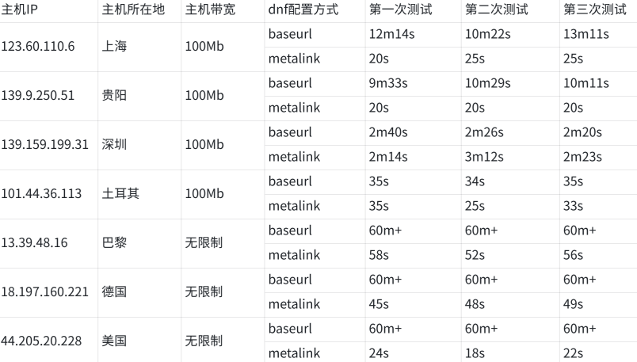

对于openEuler社区开发者来讲，下载openEuler中的软件是使用openEuler的重要一步。**如何更快速地下载openEuler中的软件，是开发者们关注的重点。**

为了优化用户体验，提高下载速度，openEuler在新版本（openEuler-22.03-LTS-SP2）的dnf配置⽂件中设置了metalink配置项。添加metalink配置项后，软件的下载速度有20+倍的提升。**用户无需任何操作**，**直接下载openEuler即可体验**。

# 下载案例

为了检验该⽅案的效果，我们分别在北美，欧洲，国内的客⼾端环境上进⾏下载测试，测试的结果如下:

可以看出添加metalink配置项后，**国内的下载速度有20\~30倍的提升；欧洲和北美有50\~100倍速度的提升。**

# 后续规划

后续openEuler将在更多版本中添加metalink配置项，保证用户在openEuler下载软件时更高效，稳定。

欢迎大家下载openEuler，也欢迎大家交流和反馈意见！
