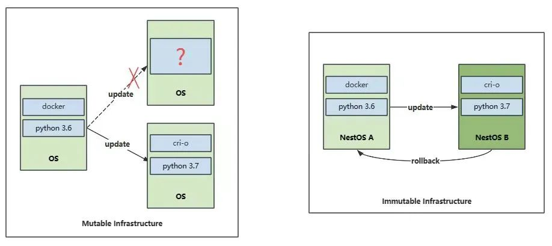
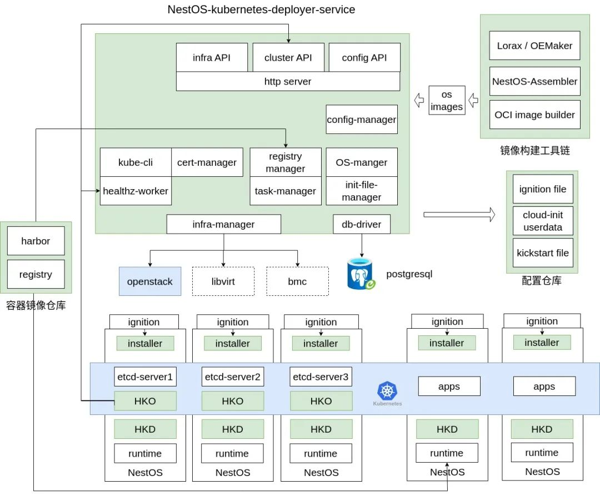

**NKD 是 NestOS-kubernetes-Deployer 的缩写，是为了基于 NestOS 部署的
Kubernetes
集群运维工作准备的解决方案。其目标是在集群外提供对集群基础设施（包括操作系统和
Kubernetes 基础组件）的部署、更新和配置管理等服务。**

## 1. 引言

Kubernetes
作为云原生领域容器云场景的事实标准，以其卓越的功能和灵活性，极大地简化了容器化应用程序的部署和管理。容器技术封装所需运行环境，实现与底层操作系统的解耦，而
Kubernetes
更进一步实现了与底层运行节点的解耦，使得应用在不同云提供商和环境中无缝部署。然而，这种解耦也带来了新的挑战。随着
Kubernetes 的广泛应用，运维复杂性逐渐凸显。维护 Kubernetes
集群需要大量技术和资源，运维人员必须熟悉复杂的 Kubernetes
配置和管理，以保证集群的稳定运行。为解决这一问题，运维人员主要将精力投入到集群本身的运维管理中，对于底层操作系统和
Kubernetes 基础组件持保守态度，避免频繁更新。然而，考虑到安全更新和
Kubernetes
新版本特性的支持，底层基础设施组件的更新势在必行。因此，需要一种解决方案来简化底层基础设施的运维工作，使运维更轻松地管理和更新集群的基础设施。

## 2. NestOS 云底座操作系统

NestOS 是一款在 openEuler 社区 CloudNative sig
组孵化的云底座操作系统，专注于提供大规模集群部署环境下最佳的容器主机。传统上，使用通用操作系统作为集群基础设施时，采用类似
Red Hat Satellite 或 SUSE Manager
等企业级系统管理平台是一个较为理想的解决方案。这些平台提供软件包管理、配置管理、补丁更新等功能，便于对大规模集群进行运维。然而，在对操作系统进行升级和管理的过程中，可能会遇到网络或电源等异常情况，导致部分节点处于不稳定的中间态。此外，这些平台仅限于支持其本身所覆盖的管理范围，对于集群中存在运维人员临时维护或开发人员临时调试导致的环境不一致，可能无法及时发现和修正。为解决这些问题，NestOS
采用基于 rpm-ostree
技术的操作系统封装方案，实现原子化更新，避免中间状态的存在，即使在升级过程中出现失败也能快速回滚至上一个稳定状态，保证系统的稳定性。在日常运行中，NestOS
采取安全措施保证系统稳定性，关键目录设为只读状态，核心系统文件和配置不会被意外修改，通过
ignition
机制导入和固化重要的系统配置，确保配置的持久性和一致性。这使得操作系统能够始终保持预期的状态，减少意外错误。NestOS
的核心思想类似于容器技术中的镜像，旨在为操作系统层面打造不可变基础设施。在部署时冻结了操作系统版本和配置，使其成为一个不可变的实体。这种做法有助于消除操作系统变体，确保基础组件版本与配置的一致性，从而提供了一个稳定可靠的基础设施环境。在集群中使用
NestOS
可以带来更高的一致性和可靠性，简化和高效地管理和维护操作系统。

**可变基础设施 vs 不可变基础设施**然而，引入 NestOS
在原理上简化集群运维工作的同时，也在实际落地中带来了一些新的挑战。例如，NestOS
作为一种新的操作系统形态需要运维人员熟悉理解其核心思想，接受任何改动均需在
CICD
流水线上重新构建系统镜像而不是登入系统操作、操作系统变更需重新引导等与通用操作系统迥然不同的使用习惯，以便有效地管理和维护。此外，NestOS
与传统操作系统存在差异，需要适应新的工具和技术，具体有如下几个方面：

1.  **「系统镜像构建工具链」**：NestOS
一切业务相关的组件及配置变更均需重新构建新版系统镜像，因此提供
NestOS-Assembler
编译工具链，可以完成从构建配置到多种系统镜像格式的生成，同时提供自动化测试工具，验证镜像基础组件可靠性。

2.  **「环境相关动态配置文件」**：NestOS 通过 ignition机制在部署阶段将与环境相关的动态配置（例如登录凭据、网络、外挂存储等信息）注入，因此需要运维人员提前编写配置文件，并通过NestOS 提供的工具转化为机器可读的 ign 文件，供操作系统部署时使用。

3.  **「系统镜像更新源」**：NestOS 支持通过 rpm-ostree直接下载当前版本树的最新版本，但需要运维人员对系统镜像更新源进行维护管理，相应也需要学习对应的部署工具。也可以通过容器镜像的形式分发新版本系统镜像，复用现有CICD 资源，但将无法应用增量更新方式，每次更新均需下载完整系统镜像。

4.  **「系统更新升级管理」**：上述工具为系统更新做好了准备，但没有解决何时可进行系统升级的问题。NestOS
虽提供了 zincati
组件实现基本的更新策略管理，但最佳实践仍应当为结合操作系统当前运行业务状态，在业务允许的时间窗口对节点执行更新维护操作。对于容器云场景，NestOS
提供基于 operator 机制实现的 housekeeper
服务，在对节点上运行的容器业务进行驱逐后再行升级，用户也可基于此制定更为复杂的升级维护策略。

接纳操作系统使用的新方式需要成熟案例与时间积淀，但引入的运维挑战可以通过方便的运维工具去解决。在这一背景下，NestOS-kubernetes-Deployer
应运而生，旨在提供集群外的部署、更新和配置管理等服务，为运维人员提升
NestOS 运维体验。

## 3. NKD 对容器云运维场景的助力

NKD 是面向 kubernetes
集群场景的解决方案，主要简化集群部署和升级流程，具体如下：

1.  **「集群基础设施创建」**：NKD
根据集群需求，连接基础设施提供商动态创建所需的 IaaS
资源，支持裸金属和虚拟化场景，目前优先实现 openstack 场景。

2.  **「操作系统镜像构建」**：NestOS
提供完善的镜像构建工具链，可以轻松集成到用户现有 CICD
流程中，便于根据 openEuler
官方或用户自定义软件源快速构建定制镜像。NKD
目前获取镜像构建结果，并将相应更新源配置应用到集群中，未来将支持
NKD 配置托管镜像构建流程。

3.  **「动态配置注入」**：在部署 NestOS 系统时，需要通过 ignition
点火机制传入系统部署后所需的动态配置。NKD
目前提供工具形式，支持通过命令行参数或配置文件将用户配置转换为 ign
点火文件。最终目标是提供用户友好的前端配置界面，便于轻松生成所需配置，并提供配置变更版本管理功能。

4.  **「kubernetes 集群部署」**：这也是 NKD 的核心能力，将 k8s
集群部署所需配置自动合并到用户配置生成的 ign
文件中，使得节点在部署完成操作系统引导后自动开始创建 k8s
集群，无需手动干预。

5.  **「集群状态检测与 housekeeper 部署」**：NKD 持续检测 k8s
集群状态，一旦集群创建完成，向用户提供访问凭据，并部署 housekeeper
自定义资源，用于后续维护升级功能。用户可选择默认不部署该 CRD。

6.  **「操作系统或 k8s 基础组件升级维护」**：当操作系统或 k8s
基础组件需要升级维护时，NKD
housekeeper CR 资源。集群中的 housekeeper
服务按照配置逐次对集群节点进行升级，完成整个集群的升级工作。

通过以上整体方案，用户可只通过 NKD
一键式完成集群创建和后续更新工作，而无需手动进行繁琐步骤，简化运维步骤。接下来我们对
NKD 架构及未来规划作一个简要介绍。

## 4. NKD 完整规划

**NKD 整体架构与集群交互全景**NKD
的整体架构由多个组件构成，主要包括
NKDS（NestOS-kubernetes-deployer-service）作为主体、部署到集群中的
HKO（housekeeper operator）以及集成在 NestOS 镜像中的
installer。此外，还可以配合 NestOS 镜像构建工具链、配置管理仓库（如
git）和私有化部署的容器镜像仓库，共同完成集群运维任务。目前 NKDS
以命令行工具提供，暂不提供对外 http
接口和前端配置页面，但主体功能所需的基础设施管理、配置管理、系统镜像管理、证书管理、健康检测等模块已初步形成。HKO
主要包括面向集群的 HKO 组件和集成在 NestOS 镜像中的 HKD（housekeeper
daemon）组件。目前 installer 组件负责在系统点火阶段部署创建 K8S
集群，未来计划将其功能融合到 HKD
组件中，使整体方案更加精简，更易于用户根据个性化需求管理所需的 K8S
基础组件。NKD
的最终目标是以长期驻留服务形式提供运维服务，同时支持多个集群的管理。它将提供持久化配置变更记录、证书管理、多种更新升级策略和镜像源频道等功能。未来，我们将持续优化
NKD
的功能和性能，并引入更多智能化特性，如自动化故障处理和资源优化等。我们的目标是将
NKD 打造成 NestOS
生态中的核心组件，为云原生场景下的运维工作提供全方位支持，进一步推动云原生技术的发展和应用。

## 5. 总结

NestOS
作为专为云原生场景设计的操作系统，为容器云运维带来了巨大的助力，而 NKD
则是针对 NestOS
运维中新引入的问题所提供的解决方案。通过持续优化和创新，NKD
将使业界更易接受以 NestOS 为代表的不可变基础设施，同时随着 Kubernetes
社区的发展，更多创新解决方案将推动云原生技术向更成熟和可持续的未来发展。**欢迎大家访问
NestOS
项目官网（https://nestos.openeuler.org/）以及NKD项目主页（https://gitee.com/openeuler/nestos-kubernetes-deployer）交流讨论。**
