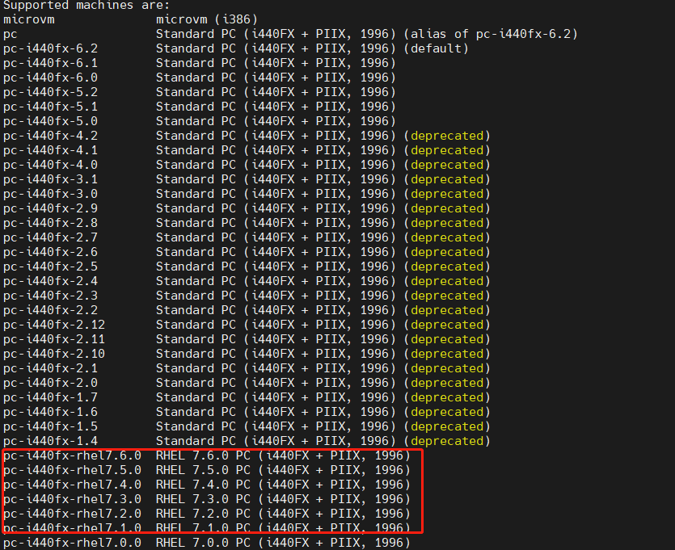

近年来，Linux
操作系统在技术、社区和商业化方案均取得了快速发展，移动云先后发布了**新一代天元操作系统和易行迁移工具**，保障了移动云全场景业务高效迁移。在移动云
CentOS
迁移实践过程中，跨操作系统虚机迁移是改造中的一个重要环节，现网环境错综复杂，如何保证客户业务在虚机迁移过程不中断，确保迁移后的虚机在
Linux 操作系统上平稳运行，在底层虚拟化侧面临诸多技术挑战。

## 关键挑战

### 虚拟化组件同源异构

新的虚拟化组件需要在多款 Linux 操作系统上稳定运行，在不同操作系统和 CPU
架构上共用同一份源码，因此首先需要解决同源异构难题。

### OS 兼容适配

计算、存储、SDN 等核心业务需要在 OS
之上相互兼容，在新的平台上需要在中间层即虚拟化层解决一些业务兼容适配问题。

### 跨 OS 不停服热迁移

跨操作系统、跨虚拟化组件大版本的迁移，可能因虚机 cpu
能力、内存布局、设备结构体等差异，导致迁移失败影响业务连续性，这是虚机跨操作系统迁移过程中的一大难题。

## 虚拟化组件同源异构

同源异构可以屏蔽不同系统、不同架构的差异，收缩现网版本，减小代码维护的压力。实现"一份代码，一次编译，处处运行"。

在同源异构改造过程中我们解决了诸多问题，如：不同系统、不同架构其编译安装依赖包会有差异，需要在
spec
文件中根据不同系统、架构指定相应的依赖。新旧虚拟化组件软件包安装时存在冲突，需利用
rpm 的 Obsoletes
机制删除对应安装包，实现组件的平滑升级。另外由于新旧虚拟化组件差异大，导致旧版补丁回合后函数调用失败，需要根据代码差异重新设计实现部分功能。

## OS 兼容适配

为了保证虚机能在 OS 上平稳运行，需要解决一些计算、存储、SDN
同虚拟化组件在平台上适配存在的问题，并做一些优化。

### Python2 版本的兼容

随着 Python2 的生命周期结束，libvirt-python 自 6.0.0 就停止了对 Python2
的支持，但由于部分产品改造周期长，需要暂时维持使用 Python2
环境作为过渡，虚拟化作为底层组件，需要构建一个基于 Python2 的
libvirt-python 组件包。我们从 Python3 和 Python2
间语法差异、接口改变、模块变化等方面入手，对适配 OS 上的 libvirt-python
代码做了修改，包括：

-   针对数据类型、类的定义等语法差异上做了对应修改。

-   针对异常捕获、输入输出、迭代器等 API 使用差异部分做了对应修改。

-   针对 Python3 和 Python2 间名称变化或废弃的模块做了对应修改。

在修改了 50 多个文件，上千行代码后，最终得到了一个基于 Python2
的稳定可靠的 libvirt-python。

### OVS-dpdk 与 QEMU 的适配

SDN 的稳定性和可靠性直接影响到用户虚机的网络服务质量，为了保证 SDN
能在新平台上平稳运行，我们积极推动各 SDN 厂商在 OS
上的适配工作，解决了多个适配问题。

SDN 适配时发现当 QEMU 作为 server 时，重启
ovs，虚机可能会 crash。查看 QEMU 的 coredump 文件,定位到如下代码触发了
crash。

当 QEMU 作为 server 端时，一旦 ovs
重启，按照上面代码逻辑 QEMU 会主动尝试进行
reconnect，过程中会改变网卡设备 tcp 状态字为
TCP_CHARDEV_STATE_DISCONNECTED，此时会造成处理逻辑 bug，使得 QEMU 发生
crash（实际上 QEMU 作为 server 端时，不应进行 reconnect 操作，而是由作为
client 端的 ovs 进行 reconnect）。具体触发 crash
的流程如下：

解决方案是只有当 QEMU 作为 client，重启
ovs,QEMU 才做
reconnect，问题得到修复。除上述问题外，我们还解决了一些其他问题，包括
ovs 热升级后 windows 虚机网络不通、海光平台执行 testpmd
测试程序虚机卡住等多个问题。

### 卷迁移操作的效率优化

分布式存储为云平台提供基础存储服务，在使用中往往伴随着一些卷迁移和容量查询的操作，但这些操作实际执行效率并不高，需要做一些优化。

在 QEMU 原生版本实现 Ceph 卷迁移功能时，迁移前将 bitmap
每位都置脏，首轮迁移时会将源盘所有数据迁往目的盘(未写入数据的部分以 0
写入)，导致迁移数据量增多，时间变长。我们对 ceph
卷迁移做了优化，减少了首轮迁移的数据量，效率得到大幅提升（尤其是源盘空间较大数据量较少时），具体步骤：

1.  修改 QEMU 组件的 rbd 驱动，增加获取后端集群 Ceph卷已使用空间分布的接口。

2.  迁移开始时，利用接口初始化卷迁移的 dirty bitmap。

3.  迁移过程中，如果虚机新增 IO，将对应 dirty bitmap 置脏。不断迭代清理dirty bitmap，只对有数据的存储块进行迁移拷贝，无数据的块直接跳过。

4.  当 dirty bitmap 全部清理时卷热迁移完成。

此外还有一些其他优化：

1.  优化 ceph 卷容量查询，调用新的接口，其查询效率提升 30%+。

2.  QEMU 支持 ceph 卷 snapshot 迁移功能，迁移后依然保有源卷的快照信息。

## 跨 OS 不停服热迁移

解决了同其他核心产品适配的各种问题后，我们工作重点转向了跨 OS
的迁移适配上来。我们与 openEuler 社区的 Virt SIG
成员进行了深度协同联创，解决了跨 OS 迁移需要考虑 Guest 的 CPU
能力、设备状态等多个方面的问题。

### 目的端主板类型不兼容迁移失败

从 BC-Linux7 系列系统往 BC-Linux For Euler
系列系统迁移时会有"unsupported machine type"的报错，对比两个操作系统
QEMU 组件支持的 machine type，发现 BC-Linux7 的虚拟化组件裁剪了 QEMU
社区原生的 Machine Type，完全自定义了私有的主板类型，无法正常热迁移到
openEuler
上。

由于 machine type
在迁移时不能被改变，要想迁移成功，就必须在 BC-Linux For Euler
系统上的高版本 QEMU 兼容低版本的 machine type。为此，我们梳理低版本 QEMU
中每种 machine type 支持的设备，并在高版本 QEMU 上移植相应的 machine
type，这样迁移时便不会出现主板类型不支持的问题。

### 设备结构体差异引起迁移失败

QEMU 使用
VMStateDescription（VMSD）数据结构来对设备状态进行描述和管理，迁移时
VMSD 的 fields 和 subsections
会被发送到目的端。要想虚机迁移成功，如果源端设备结构体字段多于目的端，则目的端
vmstate_load_state 加载设备状态时，需要将多出来的字段 disable
掉，反之则需将缺少的字段跳过加载。

测试时我们发下虚机从 BC-Linux For Euler
系列系统往 BC-Linux7
系列系统回迁时，对端无法成功接收键盘的设备状态。对比键盘的 VMSD，高版
QEMU 增加了 kbd_extended_state
字段的发送，目的端因缺失该字段导致迁移失败。

kbd_extended_state_needed 是判断是否将
kbd_extended_state 字段发送的函数（默认 True)。为了保证虚机不会因为
kbd_extended_state 而导致回迁失败，回迁时须将多出的 kbd_extended_state
字段不发送。

此外我们还比较了其他设备，尤其是 virtio 和
vhost_user 设备的 VMSD 在高低 QEMU
版本间的差异，对有差异的地方做了修改。

### cpu feature 不兼容热迁移失败

虚机 CPU 有 3
种模式：custom（指令集最少但热迁移兼容性最好）、host-passthrough（指令集最多但热迁移兼容性最差）和
host-model（介于两者之间），但虚机 cpu features
不仅和虚拟化配置有关，还与宿主机的 CPU
型号、操作系统内核等有关。即使是在 custom 或 host-model
模式下，我们也遇到一些因目的端缺失 cpu features
而导致的迁移失败的问题。

#### case1：目的端缺失 arch-facilities 特性

由于高版本 libvirt 将同一 cpu feature 名称由 arch-facilities 变为了
arch-capabilities，目的端不识别
arch-facilities，导致热迁移失败。需要在源端的 cpu_map.xml 中将其修改为
arch-capabilities 才能通过 cpu feature 兼容性检查。

#### case2：目的端缺失 spec_ctrl 特性

BC-Linux7 系列系统上使用的 3.10 内核需要使能 spec_ctrl
来避免"幽灵漏洞"，但 BC-Linux For Euler 系列系统使用的 4.19
内核通过其他方式避免了该漏洞，关闭了
spec_ctrl，需要更新微码才能在目的端使能 spec_ctrl 特性。

#### case3：目的端缺失 hle/rtm 特性

配置 host-model 的模式虚机因目的端缺失 hle/rtm
特性导致热迁移失败。需要在目的节点的内核的启动参数增加"tsx=on"来使能相关指令集。

## 总结

我们做了虚拟化组件的同源异构、对 OS 兼容适配，并与 openEuler
社区进行深度联创，实现跨 OS
不停服热迁移优化，从原理和实践两个方面，保障了 CentOS
的迁移改造任务得以高效进行。然而移动云现网有海量的节点需要做迁移，这对迁移的效率与成功率有了更高的要求，在下期的分享中，我们将带来对热迁移性能提升优化做的技术分享，敬请期待！
