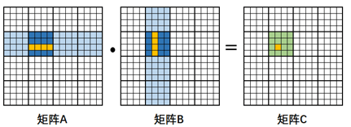
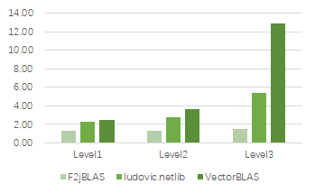

# VectorBLAS简介

VectorBLAS是一个使用Java语言实现的向量化BLAS高性能库，**目前已在openEuler社区开源。**

VectorBLAS通过循环展开、矩阵分块和内存布局优化等算法优化，对BLAS函数进行了深度优化，并利用VectorAPI
JDK提供的多种向量化API实现。

可以理解为：VectorBLAS = VectorAPI + BLAS。

## BLAS简介：

BLAS（Basic Linear Algebra
Subprograms）是进行向量和矩阵等基本线性代数操作的数值库，是LAPACK(Linear
Algebra Package)的一部分。

在高性能计算领域中被广泛应用，由此衍生出大量优化版本，如OpenBLAS、Intel的Intel
MKL等优化版本。

主要支持三个级别的运算：分别支持向量与向量、向量与矩阵、矩阵与矩阵的相关操作。

## VectorAPI简介：

VectorAPI是Java端为实现SIMD向量化功能提供的一个抽象层，从JDK16开始发布，目前已孵化到第六代(JDK21)。

VectorAPI提供的能力包括：

1\. 定义更清晰及准确的向量化API，使用户更直接的实现向量化；

2\.
与平台无关：支持AArch64和x86等平台，支持NEON、SVE、AVX等多种向量化指令，一份代码多处可用；

## 应用场景：

目前BLAS库在大数据、HPC和机器学习等高性能计算中被广泛使用。例如大数据组件\`Spark\`中的多种机器学习算法（如：\`KMeans\`、 \`LDA\`、 \`PCA\`、 \`Bayes\`、 \`GMM\`、 \`SVM\`等）都用到了BLAS函数接口\`gemm\`、 \`gemv\`、 \`axpy\`、 \`dot\`、 \`spr\`等。

# 主要优化方法

## 1. VectorAPI向量化

BLAS库中的函数分为矢量-矢量、矢量-矩阵、矩阵-矩阵的计算，其中多数场景为对数组、矩阵进行计算，因此使用向量化进行优化，一次处理多个数据，提升效率，下面以daxpy函数为例：

daxpy =\> y = alpha \* x + y,
其中alpha为常数，x和y为一维向量，数据类型均为double；

原生朴素实现：对x和y中的元素逐个计算；

向量化实现：以256位宽的寄存器为例，一次可以处理2个double类型，即一次对alpha、x和y做两次乘加操作；

可以看出，向量化操作可以成倍的提升处理效率，目前的向量化寄存器有128、256、512等大小的位宽，SVE等指令集甚至最高可支持2048位。

## 2. 循环展开

循环展开是一种循环转换技术，
通过减少或消除控制程序循环的指令，来减少计算开销，这种开销包括增加指向数组中下一个索引或者指令的指针算数等，还可以减少循环的次数，每次循环内的计算也可以利用CPU的流水线提升效率；

JDK中的JIT即时编译器也有针对循环进行自动优化，尤其是使用int, short,
或者char变量作为计数器的计数循环（counted loops）

VectorBLAS主要分析函数特性，通过把循环改造为counted
loop，或手动对关键循环进行展开，以此提高执行效率；

## 3. 矩阵分块

矩阵分块是一种cache优化手段，当数组、矩阵的规模较大的时候，在N层循环中的跨度太大时，无法\`fit
in the cache\`，数据则会被清出了缓存，造成较高的\`cache miss\`率；\
通过矩阵分块，可以将小块数据锁在L1/L2
Cache中，提高cache命中，降低\`cache miss\`率。

## 4. Packing

Packing优化又称为内存布局优化，因矩阵在数组中一般是按列存储或者按行存储，若计算时不是按照整行整列的顺序进行，那么就需要跨列或跨行读取数据。

Packing指的是在内存中新开一块空间，在这块空间内重新排布数据，使得数据的读取可以变得连续，减少cache
miss，提升读取速度，Packing一般与矩阵分块搭配使用。

# 性能数据

现有版本基于鲲鹏服务器测试验证，性能相较于业界同类库F2jBLAS/ludovic.netlib都有提升，如下图所示：

# 后续规划

本项目已开源在openEuler社区，当前版本实现了BLAS库中的主要接口，后续规划如下：

1\. 支持Level1、Level2、Level3中更多的函数接口；

2\. 补充完善UT和Benchmark；

3\. 对于不同平台/指令集的调优；

4.结合Spark MLlib等机器学习算法库进行性能优化。

欢迎感兴趣的朋友们参与进来，代码地址：<https://gitee.com/openeuler/vectorBlas>
