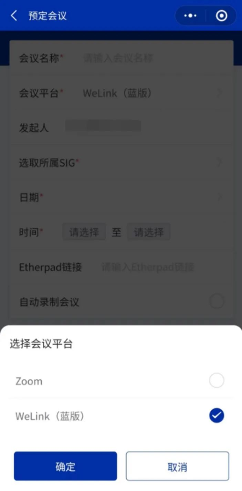
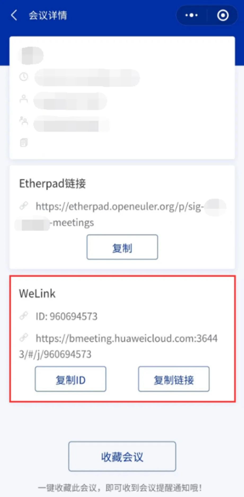
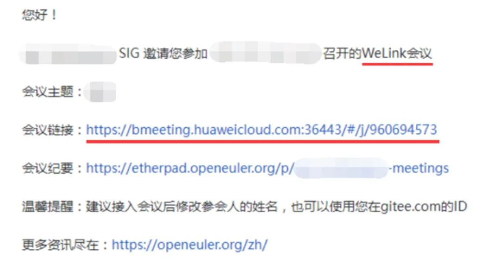
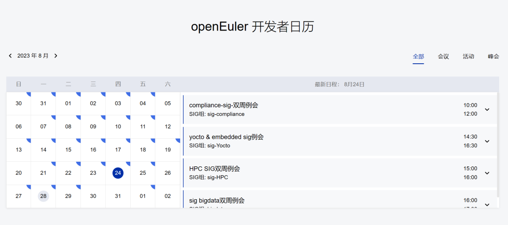
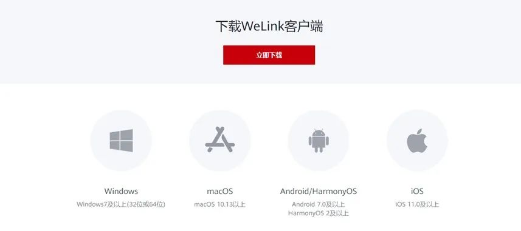
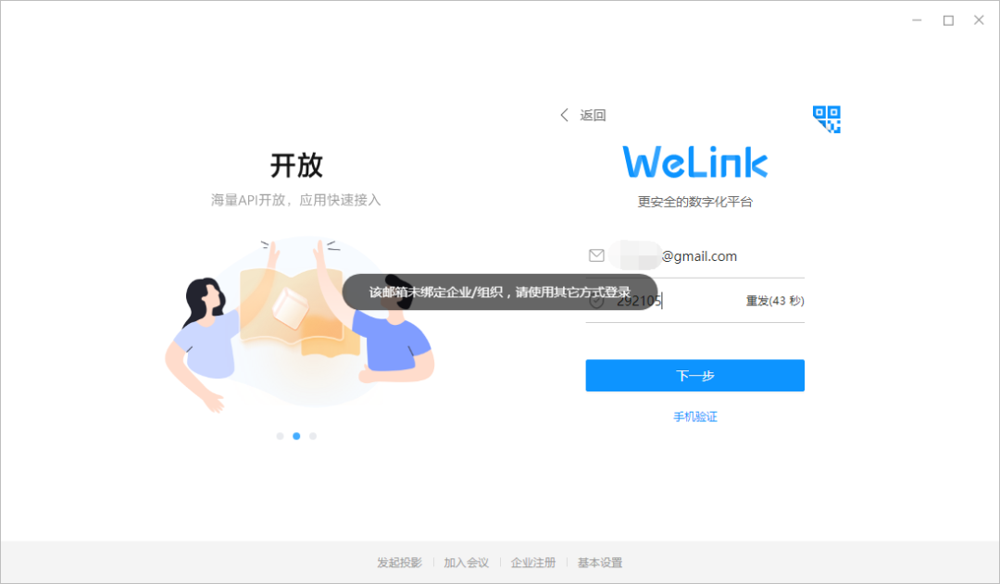
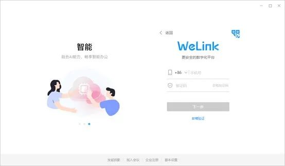
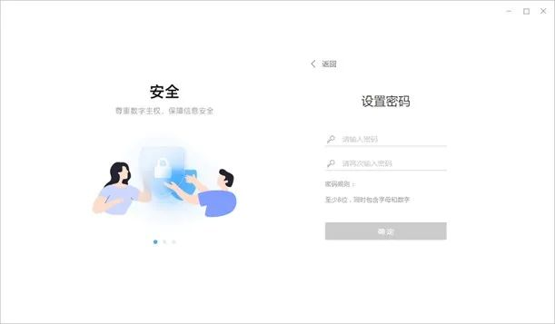
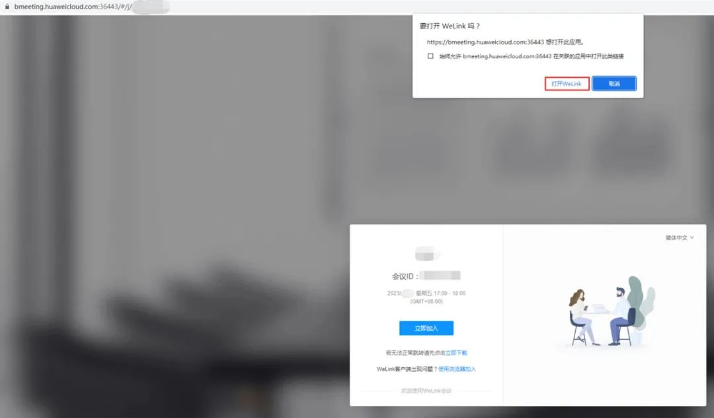

为社区 SIG
会议提供多样选择，我们在openEuler小程序原先的会议预定方式 Zoom[（会议预定指南）](https://mp.weixin.qq.com/s?__biz=MzI2NDE4OTE2Mg==&mid=2247495334&idx=1&sn=66a318f8247031cbeb692ffc2d04713e&scene=21#wechat_redirect)的基础上，新增对 **WeLink
会议（蓝版）  **的支持。本文将从**会议预订**和**参会**两个角度为您介绍在openEuler小程序上，如何预定
WeLink 会议以及如何获取WeLink会议链接参会。

**预定Welink会议**

 SIG Maintainer 在openEuler小程序预定会议时，选择
WeLink（蓝版）方式进行会议预定。成功预定会议后，可从会议详情中获取
WeLink 会议的会议号以及入会链接。

Maintainer 也可以在预定会议时，选择发送邀请邮件，将会议信息发给与会人。

**参加会议**

当Maintainer预定会议之后，作为参会者，我们怎么获知会议信息，准确接入会议呢？

首先，我们需要明确想参与的SIG组，并订阅该SIG组的邮件列表（查找SIG：https://www.openeuler.org/zh/sig/sig-list/），以便及时获悉SIG动态消息。如果您在邮件中查看不到会议消息，可以在 **openEuler官网的开发者日历**（https://www.openeuler.org/zh/）中查找每一场SIG会议。

说完上面的关键点，下面我们重点聊一下怎么通过WeLink（蓝版）准确进入SIG会议。WeLink
会议（蓝版）可通过浏览器和客户端两种方式接入。

-   **方式1：浏览器接入**

通过浏览器访问入会链接，关掉弹窗，选择使用浏览器加入即可接入会议。

-   **方式2：客户端接入**

如果您想通过客户端接入 WeLink 会议，可按如下操作：

1.下载安装客户端

访问WeLink官方下载链接，根据设备系统选择下载对应的蓝版WeLink客户端。MacOS在App
Store中直接获取，下载完成即可使用。

WeLink官方下载链接：https://www.huaweicloud.com/product/welink-download.html

2.注册账号，并联系openEuler小助手为您绑定企业组织，需提供**昵称、手机号/邮件等信息**，确保顺利登录。

注意：如果您无其他的企业，会默认绑定openEuler；如果有其他企业组织，请先切换至openEuler。

3.绑定企业组织后，即可通过手机或邮箱获取验证码来登录账号，首次登录需要先设置密码。

4.通过上文的指引获取WeLink会议链接后，在浏览器中打开。点击唤醒弹框中的打开WeLink，即可通过客户端接入会议。

我们将在近期为会议预定添加更显著的平台标识，使参会者能更加清晰地获悉会议的接入平台。如果您需要更多帮助，可联系小助手（微信号：openeuler123）
