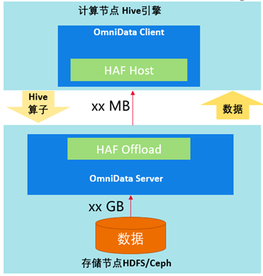
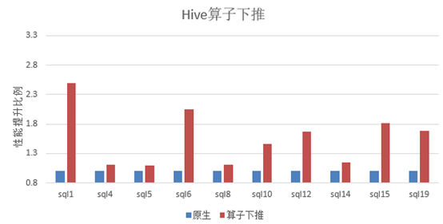
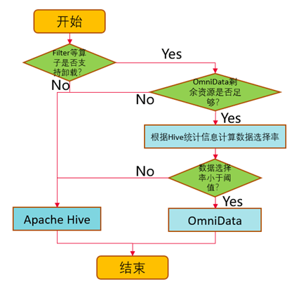
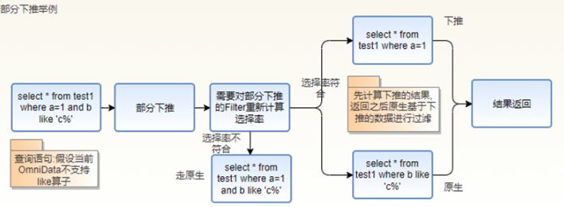
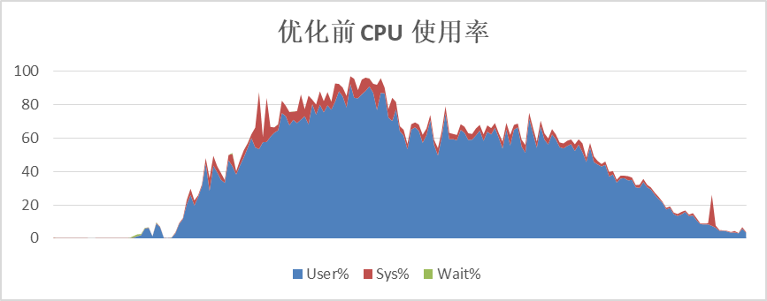
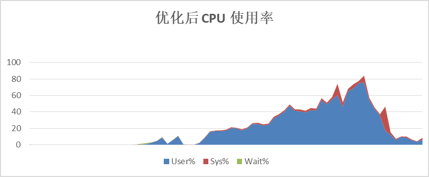
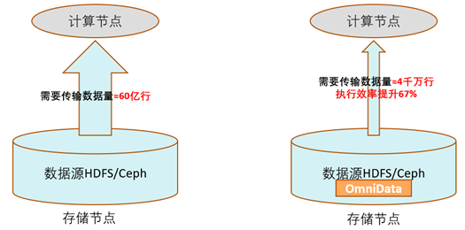

## omnidata-hive-connector介绍

omnidata-hive-connector是一种将大数据组件Hive的算子下推到存储节点上的服务，从而实现近数据计算，减少网络带宽，提升Hive的查询性能。目前支持Hive
on Tez。**omnidata-hive-connector已在openEuler社区开源。**

## OmniData架构

OmniData是算子下推的总称。OmniData主要由以下四个部分组成：\
1.  OmniData
Client属于开源的部分，为不同的引擎提供相应的插件。对于Hive引擎，omnidata-hive-connector作为OmniData
Client，并通过HAF注解和编译插件能力，实现自动下推任务到存储节点的OmniData
Server中。\
2.  Haf
Host为lib库，部署在计算节点，对外提供任务卸载的能力，把任务下推到Haf
Offload。\
3. Haf
Offload为lib库，部署在存储节点提供任务执行的能力，用来执行OmniData
Server的作业。\
4. OmniData Server提供算子下推的执行能力，接收Haf Host下推下来的任务。

## omnidata-hive-connector功能

1.  实现将Hive的Filter、Aggregation和Limit算子下推到存储节点进行计算，提前将数据过滤，降低网络传输数据量，提升性能。

2.  实现插件化的方式注册给Hive，以松耦合的方式实现算子的下推，可通过特性开关激活或使能。

3.  实现HDFS/Ceph文件系统的下推。

4.  实现Orc/Parquet文件存储格式的下推。

5.  实现Hive内置UDF（cast、instr、length、lower、replace、substr和upper）的下推。

## omnidata-hive-connector应用场景

在大数据组件Hive典型硬件配置的存算分离场景下，分别运行标准测试用例TPC-H和omnidata-hive-connector。

可以看出运行omnidata-hive-connector后，10条SQL**性能平均提升40%以上**。

## omnidata-hive-connector主要优化方法

1.  基于数据选择率，做到动态的下推。

omnidata-hive-connector通过Hive统计信息计算数据选择率（选择率越低，过滤的数据量越多），通过参数设置下推的选择率阈值，omnidata-hive-connector就能够动态地将选择率低于阈值的算子推到存储节点上执行，实现存储节点在本地读取数据进行计算，再将计算过滤之后的数据集通过网络返回到计算节点，提升网络传输效率，优化性能。除了数据选择率，还会根据算子是否支持，剩余资源是否足够等条件进行判断。

2.  Filter的部分下推。

当一个Filter中同时存在支持下推和不支持下推的算子时，omnidata-hive-connector对不支持的算子构造成新的Filter走原生Hive计算流程，对支持下推的算子重新计算数据选择率并根据新的选择率判断是否下推。

3.  存算协同，合理利用计算资源。

omnidata-hive-connector将算子下推到存储节点执行计算，可以有效地降低计算节点的CPU使用率，并且能将存储节点的CPU使用起来，提升总体计算效率。以TPC-H的SQL为例，优化前计算节点CPU平均使用率60%以上，优化后，计算节点CPU平均使用率在40%左右。

4.  提前过滤数据，减少网络传输。  

数据的提前过滤是omnidata-hive-connector性能收益的主要来源，在存储节点过滤数据，减少网络传输，减少计算节点处理的数据量。

以TPC-H的SQL为例，SQL中含有多个Filter，优化前的算子需要跨网络从远端存储节点读取近60亿行的数据；优化后只需要传输过滤后的有效数据4000万行。执行效率提升60%以上。

##  omnidata-hive-connector后续规划

本项目已开源在openEuler社区，omnidata-hive-connector特性会积极地支持新功能，后续规划如下：

1. 支持timestamp和decimal数据格式。

2. 支持BloomFilter算子的下推。

3. 支持用户自定义函数的下推。

代码地址：

<https://gitee.com/openeuler/omnidata-hive-connector>

欢迎感兴趣的朋友们参与到openEuler Bigdata SIG，探讨大数据领域技术。

加入微信群：添加openEuler小助手（微信：openeuler123），备注【Bigdata】加入交流群。

openEuler小助手
