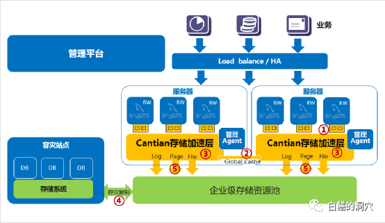
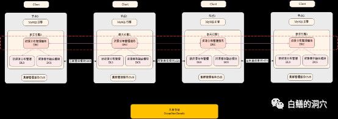
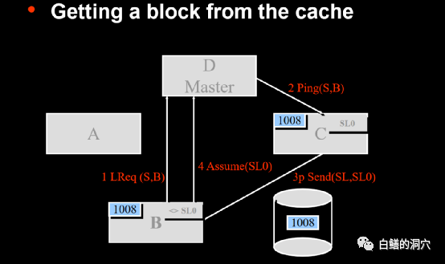
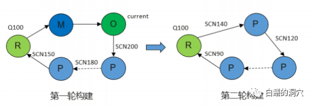
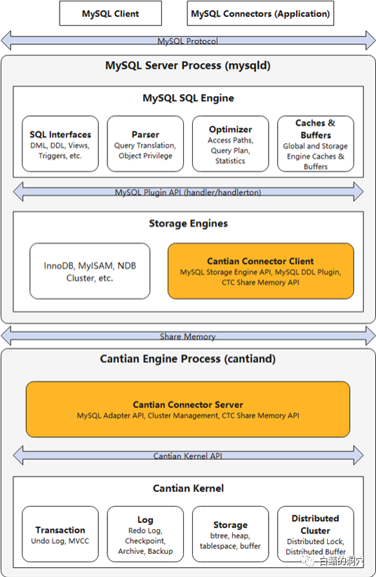
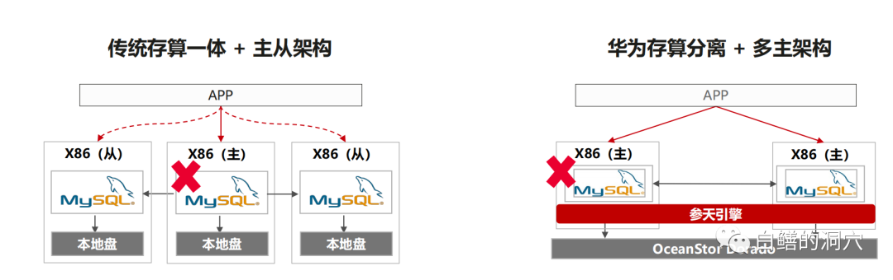
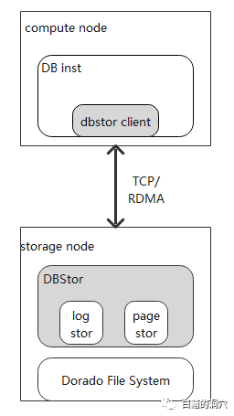
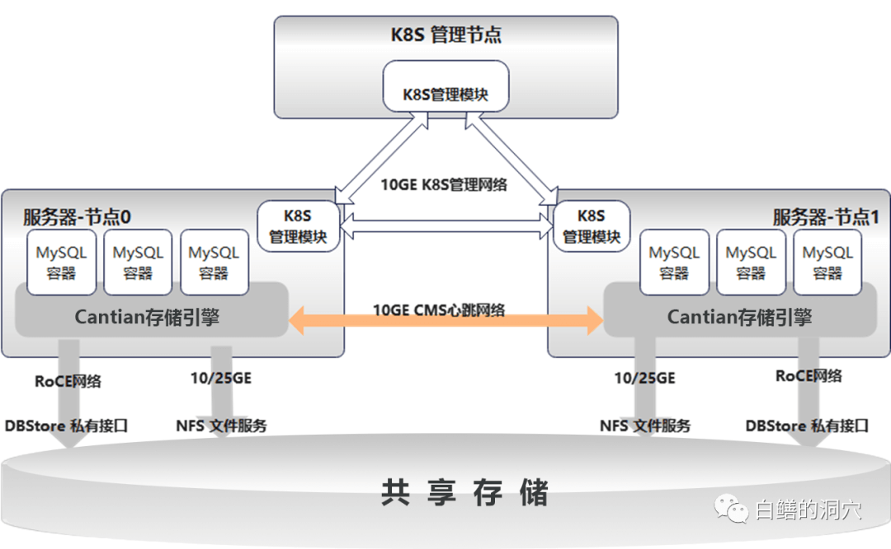

在前阵子的DTCC
2023上，华为团队与万里开源联合发布了一个Mysql的共享存储并发读写的解决方案，其核心技术就是Cantian引擎。**Cantian是一个能让普通的单机数据库变成具有类似Oracle
RAC能力数据库的中间件，目前支持innodb，今后将支持更多的数据库存储引擎。目前已经在openEuler社区开源**。

仓库地址：https://gitee.com/openeuler/cantian      
 

上图是Cantian的一个逻辑架构图，基于企业级集中式存储，Cantian引擎在MySQL的SQL引擎与innodb存储引擎之间构建了一个中间层，这个中间层可以模拟innodb的行为，因此MySQL的SQL引擎可以十分方便地与之对接。因为innodb和事务控制是紧密相关的，因此Cantian里除了包含MySQL的存储层外还包含了MySQL的事务管理层。

在MySQL中引入Cantian引擎的好处是，加入这个中间层后，MySQL就具备了多节点并发读写的能力，摇身一变就变成了MySQL
RAC了。上面这张图能够让大家更好地理解参天引擎。
在Cantian中，undo/temp/log虽然也存储在共享存储中，不过是实例独占式访问的，不在集群层面共享，平时只能在实例内读写。只有故障恢复时，集群中的其他实例才能读取。控制文件、system/users等表空间是可以在集群中并发读写的。 

那么Cantian是如何实现多实例并发读写的呢？在本文第一张图中有一个Global
Cache的示意，在多个实例之间通过缓冲区融合技术实现了多实例一致性访问。

Cantian实现全局缓冲的算法与Oracle 9I
RAC有些类似，根据算法，可以确定某个缓冲块的Master实例，当某实例拥有current
block的时候可以直接访问，否则需要通过Master咨询该block是否在某个实例的缓冲中。Master通知该块的持有者将其发送给需要的数据库实例。

大家看看上面这张Oracle 9i RAC Cache
fusion的示意图，是不是有点和上面的图十分相似的感觉。不过Cantian在缓冲区融合算法的实现上和Oracle
Cache
Fusion有较大的差别，并且由于UNDO的访问特性限制，当MVCC需要一个经过多个实例多次变更的PRE-IMAGE的时候，在Cantian引擎里的组装过程有些复杂，需要一级级的向前传递，最终才能完成获取。

这种模式的数据访问如果发生在一个多实例环境下，Cantian引擎可能存在一定的性能问题。如果能够实现在一个实例完成多次构建，则效率要高很多，只不过这可能会让分布式锁管理更为复杂。目前Cantian实现的Cache
Fusion算法还只是第一代，随着该项目的发展，我想这方面的算法会进一步优化。

目前Cantian已经实现了与MySQL的对接。MySQL SQL 层与 CTC 通过 MySQL
预定义的 hanlder/handlerton 接口进行交互，CTC插件接收到 MySQL SQL
引擎调用存储引擎插件执行的请求，通过共享内存通信模块以及对接层逻辑将请求转到
Cantian 引擎内核，CTC 插件与 Cantian
引擎通信模块设计为统一接口，动态可替换机制，支持单进程接口直接绑定、双进程共享内存通信两种部署模式。一个
Cantian 引擎进程可以对接一至多个 MySQL
实例，不同实例间通过不同的共享内存通道与 Cantian 引擎进行通信，CTC
插件会维护实例的启停时集群资源的分配与释放。MySQL 元数据仍通过 InnoDB
引擎存储与维护，但 MySQL 对元数据的修改操作会通过 CTC 与 Cantian
引擎广播到集群中存活的其他 MySQL
实例以保证集群的元数据一致性。广播过程中远端 MySQL
实例会使用对应权限的代理用户执行修改操作，从而保证集群执行语句时的用户权限的一致性。

在高可用方面，Cantian引擎加持下的MySQL数据库无需主从架构的故障切换，应用可以在0数据丢失的情况下实现秒钟级切换。这对于关键业务来说至关重要。

Cantian引擎中的另外一个重要组件是DBStor，DBStor 通过直接提供数据库 Log
和 Page
的存储接口，将数据库业务的存储逻辑卸载，实现计算和存储的分离。DBStor
采用 c/s 架构，客户端部署在计算侧，提供给计算节点 Log和 Page
存储接口；服务端部署在存储节点，实现 Log 和 Page
的存储能力；客户端和服务端基于 TCP/RDMA 来进行通信。

DBStor私有接口适配其他友商的存储需要一定的适配工作。项目组也会陆续开展一些国内外存储系统的适配工作。这是一个生态构建的过程，需要通过社区生态来共同工作才能完成。在数据库存储引擎方面，Cantian目前已经适配了innodb，PostgreSQL存储引擎也在开发中，我想依托开源社区的力量，会有越来越多的数据库适配Cantian。 

最后再分析一下Cantian的应用场景，我首先想到的是做数据库一体机。Cantian可以让一个单机集中式数据库快速地变成一个高性能、多读多写或者强一致性读写分离的数据库系统。如果在后端用高性能分布式存储替代集中式存储，还可以形成一个全软的解决方案。只不过目前Cantian引擎要想获得高性能，还必须依赖高速CMS网络和高性能低延时的集中式存储系统，因此全软的方案还不是目前的选项，不过作为一个开源项目，随着Cantian引擎的迭代发展，一切都是可能的。
