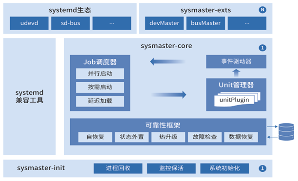

近期，sysMaster发布0.5.0版本，并集成到openEuler
23.09创新版本中。相比之前版本，本次主要新增设备管理devmaster模块以及对虚机场景的支持。

## **关于 devmaster**

设备管理器承担着设备热插拔处理、设备节点创建与更新等操作，是系统初始化流程中必不可少的一个环节。**devmaster
作为 sysMaster
的设备管理模块，是支撑系统快速启动、保证系统功能正常运行的重要功能组件。**

devmaster
的软件架构遵循高内聚、低耦合的设计原则，保证各组件职责独立，提高软件可复用、可替换、可扩展能力，降低开发维测成本。devmaster
主要包含四部分组件，分为常驻进程devmaster、客户端工具devctl、对外库以及兼容性工具。devmaster使用Rust语言编写，能够原生消除内存安全类问题。

## **devmaster的核心原理如下：**

**事件驱动：**

实时监听设备热插拔事件，并利用队列分级技术，满足事件高并发场景，缓解设备竞争问题，同时使用
worker
池机制支撑事件并发处理能力，提高事件处理的吞吐量，支撑秒级启动能力。

**机制与策略分离：**

通过将事件处理的行为定义在外部规则文件中，避免设备处理逻辑硬编码，并支持设备规则按需组合、定制、裁剪，提供灵活、强大的可扩展能力。

**可维可测：**

通过客户端工具 devctl 提供对 devmaster 的用户端控制接口，提升 devmaster
的可维可测能力，并兼容 udevadm 选项，支持用户使用习惯的平滑迁移。

**生态兼容：**

提供完善的南北向兼容性工具，比如 udev 规则转译工具、对外库的 Rust2C
接口迁移、特殊设备组件等，支持 udev 到 devmaster
生态的无缝迁移。依托欧拉鸿蒙生态，打通嵌入式/物理机/虚拟机OS全场景。

总的来说，devmaster
的设计旨在简化系统架构，并通过多项关键技术确保设备管理器具备机制的可扩展性、可靠性、可维可测能力、软件性能以及生态兼容能力，是一款非常有价值的设备管理工具。

## **支持的新场景**

**当前sysMaster支持busybox、容器、虚机场景下，以1号进程来管理系统中的服务。**

**兼容busybox运行：**

http://sysmaster.online/use/01-run%20sysmaster%20with%20busybox/

**容器中管理sshd等服务：**

http://sysmaster.online/use/01-run%20sysmaster%20with%20container/#sshd

**虚拟机中以pid1运行：**

http://sysmaster.online/use/01-run%20sysmaster%20with%20vm/#pid1

## **关于 sysMaster**

sysMaster是openEuler社区发起并创建的开源软件项目，支持进程、容器和虚拟机的统一管理，
并引入了故障监测和自愈技术，从而解决 Linux
系统初始化和服务管理问题，其适用于服务器、云计算和嵌入式等多个场景。它的实现思路是将传统
1 号进程的功能解耦分层，结合使用场景，拆分出 1+1+N 的架构。

如下面 sysMaster 系统架构图所示，主要包含三个方面 :

**sysmaster-init**：新的1号进程，功能极简，代码千行，极致可靠；

**sysmaster-core**：承担systemd原有核心功能，引入可靠性框架、插件机制，使其具备崩溃快速自愈、热升级、灵活组装能力；

**sysmaster-exts**：使原本耦合的各组件功能独立，支持抽屉式替代systemd的对应组件，支持有节奏的分场景替换。

sysMaster
力求架构简单，通过可靠性框架提升了系统可靠性，通过1+1+N架构，提升系统整体架构的扩展性和适应性，从而降低开发和维护成本。同时我们聚焦最小功能，分场景、多方案、有节奏的达成既定目标。根据服务器、嵌入式、云等使用场景，提炼了四大竞争力，在可靠性、性能、可维可测等方面发力，将sysMaster构筑成替代systemd的自主可控的竞争力根组件。

**短期竞争力：** 极致的可靠性和系统启动速度

1\.
永不宕机：通过状态外置、savepoint等技术实现故障秒级自愈，保障1号进程持续在线，业务不受影响

2\. 快速启动：解耦去重、极简镜像，支撑服务器重启时间从3-5min优化到1min

**长期竞争力**：全场景应用、云平台运维效率提升

1\. 全场景应用：支持云、边、端等场景，统一init，支持裸机、虚机、容器

2\.
容器型OS：kernel+sysMaster=容器OS底座，通过对接k8s、openstack等，支撑云场景下运维效率X倍提升

未来，sysMaster
将继续探索在多场景下的应用，并持续优化架构和性能以提高可扩展性和适应性。同时，我们还将开发
新的功能和组件以满足容器化、虚拟化、边缘计算等场景的需求。让 sysMaster
成为一个强大的系统管理框架，为用户提 供更好的使用体验和更高的效率。

## **相关链接：**

\[1\] 2022 HC大会 sysMaster首次对外发布 \-- openEuler 22.9
全场景创新版本：

https://live.huawei.com/huaweiconnect/meeting/cn/12050.html

\[2\] 2022 openEuler Summit 技术分论坛 \--
sysMaster：重新定义服务管理，秒级启动、保障系统24小时在线：

https://www.openeuler.org/zh/interaction/summit-list/summit2022/

\[3\] 2023 FOSSASIA Summit \-- sysMaster首次亮相国际开源峰会：

https://eventyay.com/e/7cfe0771/schedule?search=sysMaster

\[4\] 2023 开放原子全球开源峰会 \-- sysMaster亮相展台：

https://gongyi.cctv.com/special/opensource/index.shtml

\[5\] 2023 openEuler公众号对外宣传：

https://mp.weixin.qq.com/s/DaKM7f6tEAGNkBGeZwfzIA
