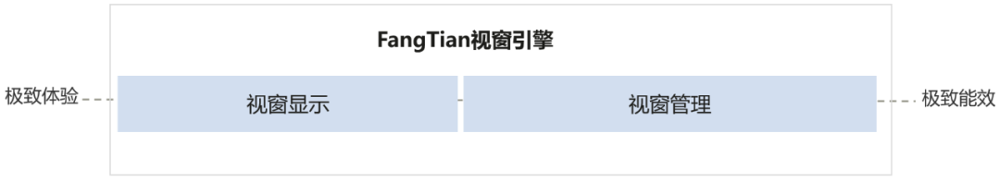
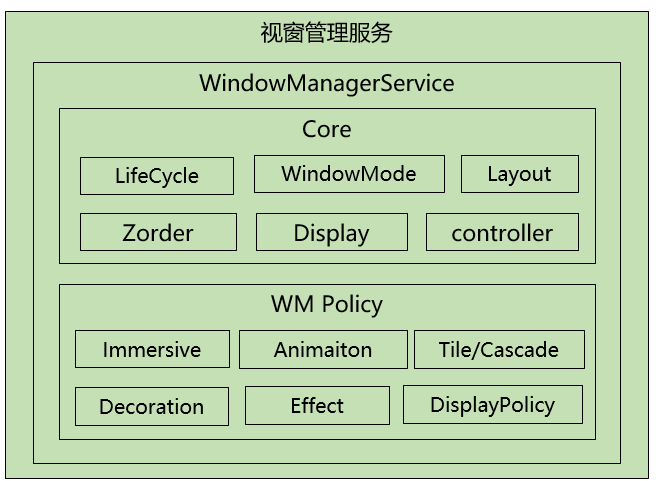
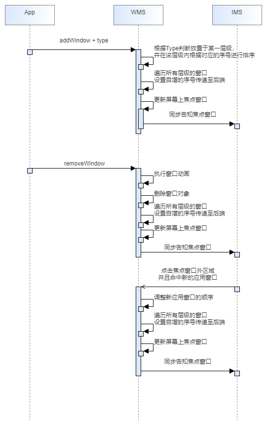
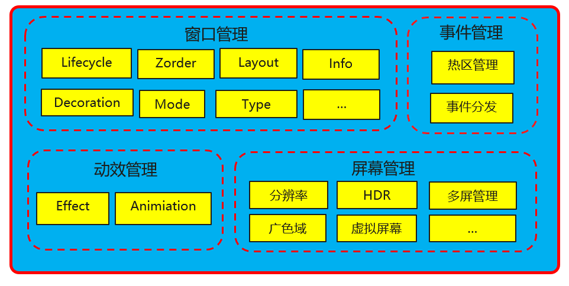
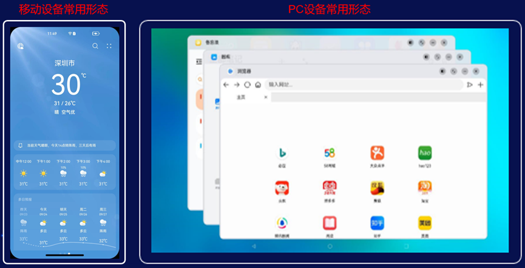

视窗管理作为方天视窗引擎两大核心组件之一，提供了让多个应用界面复用同一块物理屏幕进行显示和交互的机制。应用程序只需要实现自身显示区域内的交互界面，由视窗管理系统负责将这些交互界面组织成用户最终见到的形态。**本文将为大家介绍方天视窗引擎在多设备类型窗口的显示能力，欢迎大家使用。**

窗口管理组件由接口层和服务端组成，接口层向应用提供窗口能力，服务端是窗口能力的实现。如上图所示，视窗管理服务分为核心模块和策略模块，核心模块提供视窗管理最基本的能力，包括窗口的信息、生命周期、布局等管理。策略模块提供动效、样式、装饰等能力。\
以核心基础功能为例，介绍添加/删除窗口功能的实现，详细流程如下图所示：

## 视窗管理组件的职责

**视窗管理组件的功能职责分为4个部分：**

- 1. 窗口管理能力：窗口管理是视窗管理组件的核心能力。

   - 提供应用和系统显示界面的窗口抽象窗口对象代表屏幕上一块矩形区域，具有位置、宽高和叠加层次（Z轴）属性。

  - 组织不同窗口的显示关系视窗管理系统维护了不同窗口间的叠加层次和位置属性，并根据用户的操作动态调整。

  - 提供窗口装饰栏自由窗口模式下，视窗管理系统会在应用窗口外部增加装饰栏，提供最大化、最小化、关闭操作的按钮等界面元素。

  - 组织窗口内容的合成显示根据窗口的位置、大小、层级，指导合成显示。

- 2. 动效管理能力：在窗口显示、隐藏、切换时，提供过度动画，模糊、阴影等效果使得整个交互过程更加连贯流畅。

- 3. 事件管理能力：根据窗口信息管理窗口操作热区，根据事件坐标分发指向性设备事件（如鼠标事件、触摸事件），根据焦点窗口分发非指向性设备事件（如键盘事件）。

- 4. 屏幕管理能力：屏幕管理能力隶属视窗管理组件，由独立的显示器管理服务（DMS）提供能力。DMS负责屏幕的添加、删除、旋转、屏幕参数（分辨率、HDR等）能力的设置及维护。

##  多设备类型窗口能力归一

多设备支持是方天视窗引擎的重要特点，方天视窗引擎同时面向企业及消费者场景。为适配不同类型的设备，方天引擎的视窗管理组件做到如下三方面的能力归一。\
1.
形态归一提供全屏、分屏、自由窗口、画中画四种基本窗口模式，用户可根据产品诉求组合实现，满足不同设备形态要求。2.
策略归一方天引擎通过抽象出窗口策略层，提供自适应布局能力并开放自定义接口，默认窗口形态、层级等均可配置，并支持深度定制。3.
接口归一接口是应用测与视窗管理服务交互的唯一通道。方天引擎使得应用在不同平台及设备间，面向同一套接口，从而支持应用在不同平台及设备间进行快速迁移。

**FangTian
SIG目前在快速迭代中，后续会继续完善提供更多的视窗能力，欢迎大家关注。**

**相关链接：**

1\. 方天引擎主页：

https://www.openeuler.org/zh/sig/sig-detail/?name=sig-FangTian

2. 一文帮你全面认识方天视窗引擎：

https://www.openeuler.org/zh/blog/20230728-FangTian/20230728-FangTian.html

3\. FangTian视窗引擎技术直播\--IPC（视频）：

https://www.bilibili.com/video/BV1Nj411z783/?spm_id_from=333.999.0.0

4. 欢迎大家添加微信（vx:hhd_kkx2023），加入FangTian SIG交流群。
