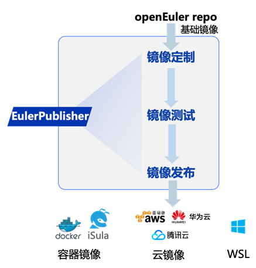
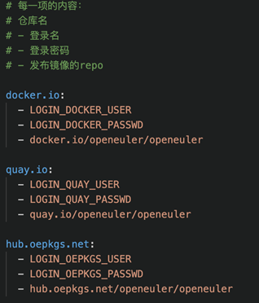

KubeCon + CloudNativeCon + Open Source Summit China 2023 于2023 年 9 月
26-28
日在上海举办。本次峰会的OpenSpeech议题中，**openEuler社区开发者分享了社区创新项目---EulerPublisher。**

云原生时代，云镜像及容器镜像是用户使用OS的主流形态，这与OS社区典型的ISO发布有较大区别；同时，各公有云平台对OS镜像的具体要求各有不同，这对于OS开源社区提出了新的挑战。**面对云原生场景下用户定制和获取openEuler镜像难的问题，EulerPublisher应运而生。**

## 什么是EulerPublisher?

EulerPublisher作为"一键式"自动构建、测试和发布openEuler镜像的工具链，可以对接AWS、华为云、腾讯云、阿里云等主流公有云平台，以及Docker
Hub等主流容器镜像仓库，极大地提升openEuler镜像发布效率，降低用户获取和体验openEuler的门槛。



## 如何体验EulerPublisher?

EulerPublisher源码托管在gitee上
，目前已向PyPI发布v0.0.2版本供用户使用体验。

链接：https://gitee.com/openEuler/eulerpublisher

### 一．安装环境依赖

1、EulerPublisher实现多平台容器镜像构建功能依赖于docker和qemu，安装执行以下命令：

```c
yum install qemu-imgyum install docker
```

多平台镜像构建使用docker buildx功能，安装的docker版本需满足\>=
19.03或单独安装buildx插件，单独安装docker buildx方法如下：

1). 从Docker buildx项目的release页面找到适合自己平台的二进制文件。

2). 下载目标二进制文件到本地并重命名为docker-buildx，移动到docker的插件目录\~/.docker/cli-plugins。

3). 向二进制文件授予可执行权限chmod +x
\~/.docker/cli-plugins/docker-buildx。

2、EulerPublisher使用python实现，依赖见源码目录下的requirement.txt文件，安装命令如下：

```c
pip install -r ./requirement.txt
```

### 二．安装EulerPublisher

```c
pip install eulerpublisher
```


### 三．发布openEuler容器镜像


**配置环境：**


为保证能够成功推送镜像到目标仓库，需要先配置目标仓库username和password的环境变量用以登陆，配置命令：

```c  

export LOGIN_USERNAME=usernameexport LOGIN_PASSWORD=password
```


**一键发布：**

```c  

eulerpublisher container publish -v {VERSION} -p {REPO} -g {REGISTRY} -f
{DOCKERFILE}
```

上述执行的效果是向{REGISTRY}的{REPO}仓库发布由{DOCKERFILE}定制的tag为{VERSION}的支持arm64、amd64多平台的openEuler容器镜像。

**逐步操作：**


除一键发布镜像功能外，用户也可根据自身需求选择手动依次执行镜像的构建、推送、测试步骤。

i\. 预处理

```c  

eulerpublisher container prepare -v {VERSION}
```

该命令实现从openEuler
Repo下载{VERSION}版本的基础容器镜像，并准备dockerfile、以及完成构建前的相关操作。

ii.构建并推送到仓库

```c

eulerpublisher container push -v {VERSION} -p {REPO} -g {REGISTRY} -f
{DOCKERFILE}
```

该命令实现由{DOCKERFILE}定制的tag为{VERSION}的支持arm64、amd64多平台的openEuler容器镜像，并且将其推送到{REGISTRY}/{REPO}仓库。

iii\. 测试（可选）

```c

eulerpublisher container check -v {VERSION} -p {REPO} -g {REGISTRY}
```

用于测试步骤ii生成的镜像，目前仅适用于测试使用默认Dockerfile构建的镜像。

**多仓库发布**


EulerPublisher提供将容器镜像推送到多个仓库的能力，执行命令如下：

```c

eulerpublisher container publish -v {VERSION} -f {DOCKERFILE} -m
```

此命令使用-m（或\--mpublish）使能\"publish one image to multiple
repositories\", 不再需要在执行命令时设置-p {REPO}和-g { REGISTRY
}参数。目标repositories的信息由etc/container/registry.yaml指定，内容示例如下：



执行多仓库发布命令之前需要预先配置好每个registry的登录用户名和密码环境变量，如LOGIN_DOCKER_USER和LOGIN_DOCKER_PASSWD等。

### 四． 构建openEuler云镜像

以构建通用云镜像为例，说明EulerPublisher构建云镜像的使用方法。

**环境准备**


本地使用EulerPublisher构建云镜像时，需要准备与目标镜像操作系统版本相同或兼容的执行机。

**通用云镜像构建**


i\. 预处理

```c

eulerpublisher cloudimg gen prepare -v {VERSION} -arch {ARCH}
```

此命令{VERSION}是构建目标镜像的openEuler版本号，{ARCH}指定构建镜像的架构类型，支持aarch64或x86_86。这一步下载openEuler社区发布的镜像并解压，获得基础镜像。

ii.构建

```c

eulerpublisher cloudimg gen build -v {VERSION} -a {ARCH} -o {NAME} -p
{RPMLIST}
```

此命令中{NAME}指定最终构建镜像的名称，{RPMLIST}是用户需要预安装的软件包列表文件，一旦指定不能为空。其余参数作用与eulerpublisher
cloudimg gen prepare命令一致。


*\# rpmlist内容示例*tarmakezipcurl\...

执行此命令后，会在执行机/etc/eulerpublisher/cloudimg/gen/output/目录下生成一个命名为{NAME}的最终镜像，该镜像满足目前大多数主流公有云厂商云市场镜像发布的技术要求，用户可手动进行镜像发布。

**AMI构建**

特殊地，AWS云镜像市场仅支持AMI(Amazon Machine
Image)镜像发布，且AMI只能由AWS云实例创建得到。

目前，EulerPublisher已支持构建AMI镜像，且构建结果满足AWS
Marketplace云镜像发布的要求，如有需要可进行镜像产品发布，详细使用指导见【1】。

## 未来规划

目前，已使用EulerPublisher构建镜像向腾讯云【2】、华为云【3】镜像市场发布通用云镜像，向AWS
Marketplace发布AMI【4】，其容器镜像发布能力也用于周期性发布openEuler容器镜像到Docker
Hub等主流仓库【5】。

EulerPublisher功能还在完善中，目前聚焦于以下工作：

1\. 补全openEuler WSL容器镜像构建、发布能力

2\. 补全满足更多云厂商镜像发布要求的openEuler云镜像构建能力

3.探索openEuler裸机镜像构建、发布能力

未来还将探索更多EulerPublisher的使用场景并完善，欢迎广大开发者参与其中！

相关链接：

\[1\] EulerPublisher项目链接：https://gitee.com/openeuler/eulerpublisher

\[2\]
腾讯云市场发布openEuler镜像：https://market.cloud.tencent.com/products/39669

\[3\]
华为云商店发布openEuler镜像：https://marketplace.huaweicloud.com/contents/b03bbb0a-6e72-49f1-84de-c3169e9fc88d#productid=OFFI918779310579093504

\[4\] AWS
Marketplace发布openEuler镜像：https://aws.amazon.com/marketplace/pp/prodview-cgu5xymg7qnqg?sr=0-4&ref\_=beagle&applicationId=AWSMPContessa

\[5\] Docker
Hub的openEuler镜像仓库：https://hub.docker.com/r/openeuler/openeuler/tags
