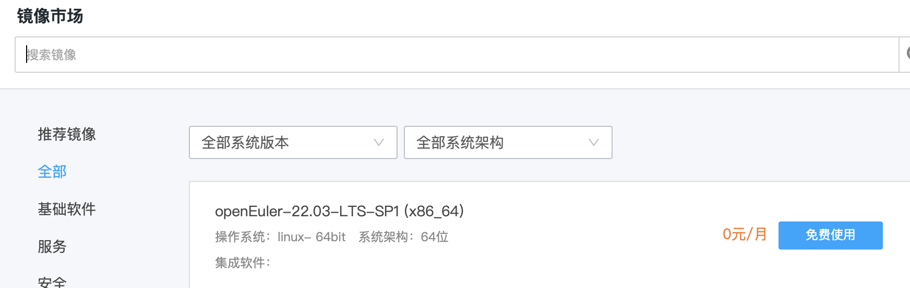
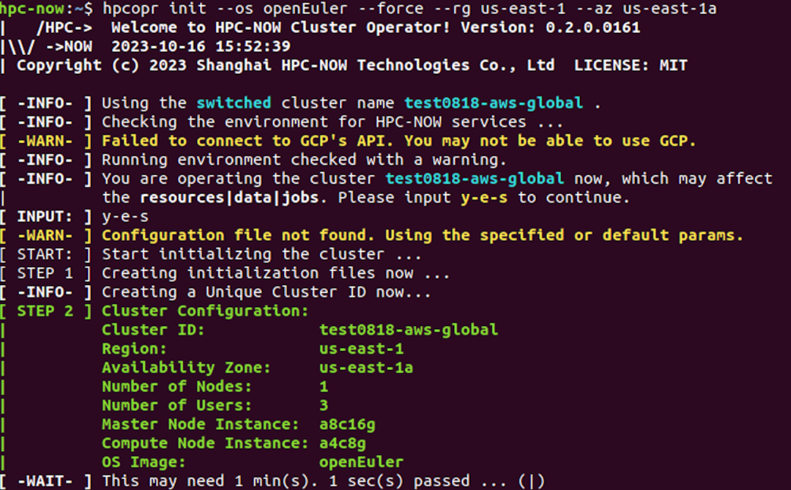
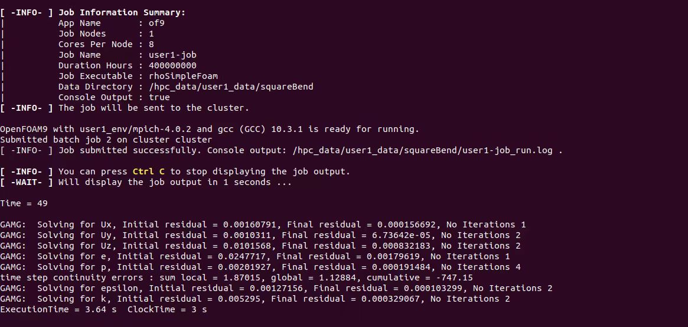
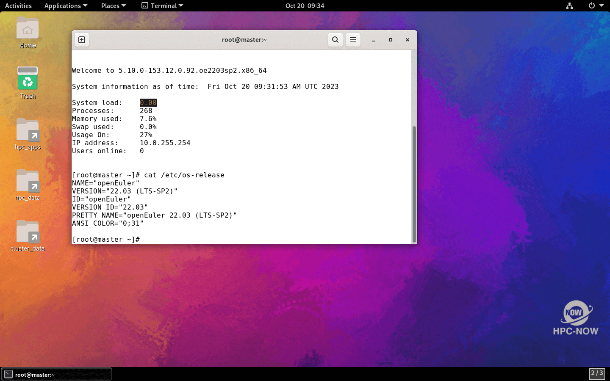
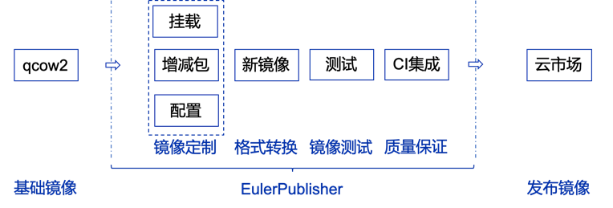

Cloud HPC[1]是开放原子基金会孵化筹备期的项目。上海即算科技有限公司贡献该项目，并且基于Cloud
HPC打造了云上高性能计算商业方案HPC-NOW。几个月来，openEuler社区与Cloud
HPC团队合作，共同推动基于openEuler操作系统的完整云上高性能计算（Cloud
High-Performance Computing, Cloud HPC）解决方案。

**原始诉求**

合作之初，Cloud HPC团队希望默认OS从CentOS切换为openEuler之后能够满足：

1.  运行稳定：HPC负载需要长时间满负荷（24 x 7）运行

2.  包管理器：要有丰富的软件包，满足HPC软件编译与运行的需求

3.  桌面UI：能够支持流畅和可扩展的图形化操作界面

4.  云镜像支持：在主流云厂商的各个区域基于openEuler一键拉起虚拟机

从这些基本诉求出发，Cloud HPC和openEuler的开发者相互配合进行了多轮调试验证。

**openEuler镜像获取**

在公有云平台上部署并运行HPC-NOW，获取openEuler镜像的方式一般有两种：

1.  从公有云平台公共镜像列表或镜像市场中获取。

2.  采用私有镜像导入的方式上传openEuler云镜像到公有云平台。

对于用户来说，方式1是云上使用openEuler最为便捷、也更受欢迎的方式。目前华为云、天翼云公共镜像列表，以及腾讯云、华为云、AWS镜像市场均已发布了openEuler云镜像，可方便用户直接使用。

图1 腾讯云创建实例时直接从镜像市场获取openEuler

如果用户选择通过方式2导入私有镜像到云平台，推荐使用openEuler社区工具链EulerPublisher[2]定制openEuler云镜像，它可以根据用户需求灵活预置软件，适应多种场景。此外，OpenStack社区的diskimage-builder[3]自2022年起已原生支持构建openEuler镜像，也可作为一种用来制作私有镜像的选择。

**openEuler集群创建**

在云上可以很方便地部署HPC-NOW[4]的openEuler集群，核心操作如下：

1.  创建集群：

1）***hpcopr new-cluster***

2）***hpcopr init \--os requiredOS \--rg clusterRegion \--az clusterAZ***

2.  集群创建完成后，用户可以通过 hpcopr rdp -u USER_NAME --copypass 直连至集群的图形化桌面环境。openEuler 的桌面环境已经在集群创建过程中自动化完成部署和安装，用户无需手动安装。

图2 AWS上一键拉起openEuler集群

**openEuler集群运行**

**基础功能**

按照上述步骤拉起openEuler集群后，即可运行作业任务。目前Cloud
HPC作业任务已完美运行在openEuler集群上。

图3 openEuler集群成功运行OpenFOAM

**桌面效果**

HPC-NOW的用户多是研究机构和高校群体，对操作系统桌面存在很强的需求。openEuler 支持主流的桌面UI基础和扩展组件，且安装部署非常便捷[5]。在 openEuler社区的指导下，HPC-NOW 已经将桌面环境的安装部署集成至自动化脚本之中，用户可开箱即用。

图4 openEuler 使用GNOME组件的桌面效果

**openEuler云镜像发布流程**

回顾HPC-NOW云上部署的实践过程，已上线openEuler镜像的公有云平台，可以很方便地为用户提供openEuler镜像服务。那么，加快openEuler镜像覆盖更多主流云厂商也是一件非常重要且紧迫的事情，为此openEuler社区提出了一套完整的向主流云厂商平台发布云镜像的流程。

图5 openEuler云镜像发布流程

openEuler云镜像发布过程如上图所示

1.  首先获取openEuler社区官方发布的qcow2镜像

2.  以此为基础镜像使用EulerPublisher^\[2\]^二次定制以满足用户需求

3.  联合oESP将定制后的镜像发布到各个云厂商平台^\[6\]^

此次合作，不仅是openEuler连接上游项目的一次宝贵实践，更是openEuler迈向主流公有云平台的重要一步。目前，使用EulerPublisher制作的云镜像已发布到腾讯云、AWS镜像市场；未来，我们将持续推进openEuler覆盖主流云厂商镜像市场，提升openEuler的云上体验。

\[1\] Cloud HPC项目链接：

<https://www.openatom.org/project/projectPjVzJsmXW3kG>

\[2\] EulerPublisher项目仓库：

<https://gitee.com/openeuler/eulerpublisher>

\[3\] Diskimage-builder官网：

<https://docs.openstack.org/diskimage-builder/latest/>

\[4\] HPC-NOW详细部署运行教程见：

<https://gitee.com/zhenrong-wang/hpc-now/tree/master/Docs>

\[5\] openEuler桌面安装教程：

<https://docs.openeuler.org/zh/docs/>

\[6\]
目前已通过EulerPublisher向aws、华为云、腾讯云发布openEuler云镜像，链接如下：

<https://www.openeuler.org/zh/blog/20230711-AMIs/AMIs.html>

<https://marketplace.huaweicloud.com/contents/b03bbb0a-6e72-49f1-84de-c3169e9fc88d#productid=OFFI918779310579093504>

<https://market.cloud.tencent.com/products/39669>
