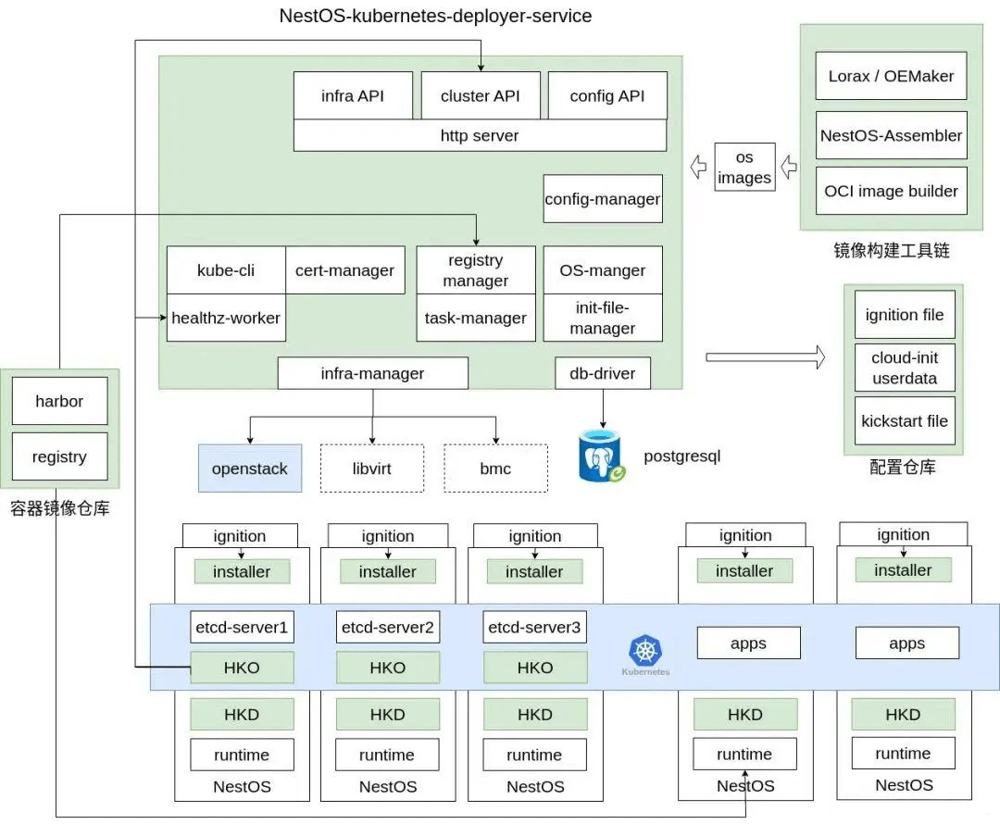

近日，openEuler 社区云底座操作系统 NestOS
项目完成重新定位思考，正式推出双模式版本，旨在满足云场景中容器化和虚拟化两种主要场景下用户的多样需求，既使用户更易于了解接受不可变基础设施形态的底座操作系统，也为用户基于熟悉的使用模式更好的发挥
openEuler
创新特性提供选择。这次发布引入了全新的运作模式，提供了两款分别专注于容器化和虚拟化场景的操作系统版本，并且引入了六大基础特性，旨在满足各种应用场景的需求。

## 双模式云场景全覆盖

在快速发展的云原生场景中，容器化和虚拟化技术已经成为了现代应用程序交付和管理的核心。为满足这个不断增长的需求，我们以全新的
NestOS-22.03-LTS-SP2 版本为基础，推出了 NestOS For Container（NFC） 和
NestOS For
Virt（NFV）两个版本，这两个版本专注于提供卓越的容器主机和虚拟化解决方案，旨在满足各种应用场景下的需求。NFC
版本针对容器化应用场景进行了优化，提供了出色的容器环境，以支持现代应用程序的无缝部署和运行。而
NFV
版本专注于虚拟化环境，为虚拟机提供了高性能和稳定性，以满足虚拟化工作负载的需求。

### NestOS For Container

NFC 专注于以容器化应用为代表的云原生业务场景，整合了 rpm-ostree 和
Ignition 配置等先进技术，采用了双根文件系统和原子化更新的设计理念，以及
nestos-assembler 的快速集成构建能力。NFC
秉持不可变基础设施思想，支持以容器镜像方式管理操作系统，自主构建应用系统镜像。此外，NFC
还进行了针对 Kubernetes、OpenStack
等平台的适配，通过优化容器运行性能，使系统轻松构建集群，同时能够高效安全地承载大规模容器化工作负载。

### NestOS For Virt

NFV 专注于以虚拟化为主的云计算业务场景，采用通用的 RPM
包管理方式，并经过系统裁剪、性能优化和虚拟化增强等方面的精心设计。NFV
预先安装了虚拟化的关键组件，旨在使用户能够轻松创建和管理虚拟机。无论是在开发、测试还是生产环境中，都能够提供卓越的虚拟化性能。不仅允许在高性能的虚拟机上运行各种工作负载，还实现了资源隔离和安全性，为用户提供了强大的虚拟化解决方案。

无论需要运行云原生应用程序、虚拟化环境，或者两者同时涵盖，NFC 和 NFV
版本的操作系统都是您的理想选择。它们提供了卓越的稳定性和安全性，以满足现代数据中心和云环境的各种需求。

## 六大特性助力 NestOS 全新出发

### 云原生一体化运维工具

NKD，全称为 NestOS Kubernetes Deployer，是一套基于 NestOS 设计，在 NFC
上独有的容器云部署和运维工具，目的是为容器云业务和云底座操作系统提供一致性的运维解决方案。NKD
的设计初衷是提供在集群外部署、更新和配置管理等服务的能力，涵盖集群基础设施，包括操作系统以及
Kubernetes
核心组件。这一综合性的解决方案极大地简化了集群的部署和升级流程。

**项目地址**

**https://gitee.com/openeuler/nestos-kubernetes-deployer\
\
**

### PilotGo 插件式运维管理平台

PilotGo 是麒麟软件在 openEuler 社区孵化的插件式运维管理平台。本次
PilotGo 针对 NestOS 平台特性及最佳应用实践，为 NestOS
平台带来了定制化的运维管理功能及全新的架构感知插件特性。NestOS 默认集成
PilotGo agent 及 Topo 架构感知插件 agent，提供开箱即用的 PilotGo
平台运维管理及 Topo 架构感知可视化能力。

**项目地址**

https://gitee.com/openeuler/PilotGo

### x2NestOS:不可变模式转换工具

x2nestos 是一款将通用形态操作系统转换为 NestOS For Container
版本的快捷部署工具。NestOS For Virt 版本默认集成，也可通用于以 yum 或
apt 主流包管理器管理的其他通用 linux 操作系统。该工具基于 kexec
动态加载内核特性，实现跳过引导阶段完成操作系统部署，有效降低现有集群转换为
NestOS For Container 难度和成本。

**项目地址**

https://gitee.com/openeuler/x2nestos

### 轻松定制系统镜像

NestOS for
Containers，作为基于不可变基础设施思想的容器云底座操作系统，将文件系统作为一个整体进行分发和更新。这一方案在运维与安全方面带来了巨大的提升。然而，在实际生产环境中，官方发布的版本往往难以满足用户的需求，因此需要更方便的定制手段。现
NestOS For Container 集成 ostree native container
特性，可使容器云场景用户利用熟悉的技术栈，只需编写一个
ContainerFile(Dockerfile)文件，即可轻松构建定制版镜像，用于自定义集成组件或后续的升级维护工作。

### 支持 Rubik 在离线混部

Rubik 是一个自适应单机算力调优和服务质量保障的容器混部引擎，NestOS For
Container 版本已预开启 Rubik 在离线混部相关内核特性，支持基于 rubik
容器混部引擎的整体解决方案，通过对资源进行合理调度与隔离，在保障关键业务服务质量的前提下极大提升容器云场景资源利用率。

### 内核特性增强

我们对 nestos-kernel 进行了独立维护，并基于 openEuler-22.03-sp2
内核版本进行开发，仓库地址https://gitee.com/src-openeuler/nestos-kernel。在这个过程中，我们专注于改进mm、cpu、cgroup等方面的内核特性，以打造出与Euler内核有所差异并具有更好优化性能的特点。

1.  Compact Numa Aware (CNA) spinlock 功能支持

2.  虚拟机启动优化，加速高密度场景下虚拟机的并发启动

3.  支持 memcg THP control

4.  支持 UKFEF 功能，方便开发和运维人员定位问题

5.  一系列性能调优，提升系统性能

6.  支持线程 NAPI，提高网络资源的管理效率

7.  支持 pagecache limit 功能

## 容器性能测试

## 版本特别说明

-   本次发布版本号为 22.03-LTS-SP2.20230928，已发布的 NestOS
    22.03-LTS-SP2 版本可平滑升级为本次的 NestOS For Container
    22.03-LTS-SP2.20230928 版本。

-   因本次发布团队工作流程变更较大，双模式首发版本仍基于 openEuler 22.03
    LTS SP2 长生命周期版本构建。

-   未来我们仍将跟随 openEuler
    社区长生命周期版本和创新版本周期发布节奏，推出相应版本。

-   NestOS 后续规划按照 LTS
    和创新版本分别维护发布流，如有重大更新或补丁将滚动更新相应版本。

## 欢迎体验&参与项目

-   NestOS 官方网站：https://nestos.openeuler.org/

-   NestOS 镜像下载：https://nestos.openeuler.org/

-   NestOS 项目仓库：https://gitee.com/openeuler/NestOS

-   建议&反馈：https://gitee.com/openeuler/NestOS/issues

## 合作下游厂商

