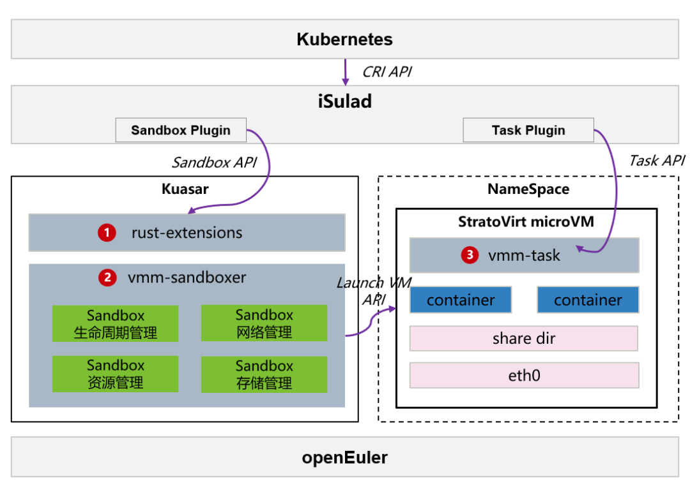

## 概述

    Kuasar是今年华为在 CNCF 峰会上发布的支持多种沙箱隔离技术的容器运行时 [1]，可以在单个节点上运行多种不同类型的沙箱容器；同时采用了 1:N 的容器进程管理模型，对比当前 Shim 进程 1:1 的设计，在容器并发时能够提升启动速度 2 倍以上、并节省容器管理进程 99% 的内存增量。Kuasar 基于 Sandbox API [2] 接口开发，区别于当前的 Shim v2 接口，对沙箱的生命周期管理具有内存消耗小、调用链简短等优势。

​    openEuler 社区通过 iSulad 组件率先完成了对 Sandbox API 的支持，并在近日发布的 openEuler 23.09上内置了 Kuasar，用户可以一键部署 iSulad+Kuasar+StratoVirt 这一套极速轻量的安全容器解决方案 [3]。关于 iSulad+Kuasar 统一容器运行时解决方案所带来的架构和优势，可参考上一篇系列文章 [4]。

​    本文将详细介绍该解决方案的安装与使用方式，支持用户快速上手。



​                      **图 1** iSulad+Kuasar+StratoVirt 安全容器解决方案架构

 

 

## 安装与配置

**说明：** kuasar 的安装和使用均需要 root 权限。

### 前提条件

- 为了获取更好的性能体验，该方案需要运行在裸金属服务器上，暂不支持运行在虚拟机内。

- 安装 openEuler 23.09 操作系统。

- 安装启动沙箱及容器需要使用的 cri 命令行工具 crictl 。

  ```bash
  # arm环境
  $ wget https://github.com/kubernetes-sigs/cri-tools/releases/download/v1.25.0/crictl-v1.25.0-linux-arm64.tar.gz
  $ tar -zxvf crictl-v1.25.0-linux-arm64.tar.gz -C /usr/local/bin
  # x86环境
  $ wget https://github.com/kubernetes-sigs/cri-tools/releases/download/v1.25.0/crictl-v1.25.0-linux-amd64.tar.gz
  $ tar -zxvf crictl-v1.25.0-linux-amd64.tar.gz -C /usr/local/bin
  ```

- 安装配置网络需要使用的 cni 插件。

  ```bash
  # 创建cni目录
  $ mkdir -p /opt/cni/bin && mkdir -p /etc/cni/net.d
  # arm环境
  $ wget https://github.com/containernetworking/plugins/releases/download/v1.3.0/cni-plugins-linux-arm64-v1.3.0.tgz
  $ tar -zxvf cni-plugins-linux-arm64-v1.3.0.tgz -C /opt/cni/bin/
  # x86环境
  $ wget https://github.com/containernetworking/plugins/releases/download/v1.3.0/cni-plugins-linux-amd64-v1.3.0.tgz
  $ tar -zxvf cni-plugins-linux-amd64-v1.3.0.tgz -C /opt/cni/bin/
  ```

 

### 一键安装

通过下述指令可以在 openEuler 23.09 上一键安装 iSulad、kuasar 和 stratovirt 组件：

```bash
$ yum install iSulad kuasar stratovirt
```

### 组件配置

#### crictl 命令行工具的配置

修改 crictl 配置文件 /etc/crictl.yaml 以对接 isulad

```bash
$ cat /etc/crictl.yaml
runtime-endpoint: unix:///var/run/isulad.sock
image-endpoint: unix:///var/run/isulad.sock
```

#### iSulad容器引擎的配置

修改 iSulad 容器引擎的配置文件 /etc/isulad/daemon.json ，以支持 iSulad 调用 kuasar 启动 vmm 类型的 sandbox ，需在配置文件中新增如下字段：

```bash
$ cat /etc/isulad/daemon.json
...
    "cri-sandboxers": {
        "vmm": {
            "name": "vmm",
            "address": "/run/vmm-sandboxer.sock"
        }
    },
    "cri-runtimes": {
        "vmm": "io.containerd.vmm.v1"
    },
...
```

保存后重新启动 iSulad 服务

```bash
$ systemctl restart isulad
```

之后可通过指令 `systemctl status iSulad` 确认 iSulad 服务已处于 running 状态

#### kuasar的配置

修改对接 stratovirt 的 kuasar 配置文件（可直接使用 kuasar rpm 包安装好后的默认配置，路径位于 /var/lib/kuasar/config_stratovirt.toml ）

```bash
$ cat /var/lib/kuasar/config_stratovirt.toml
[sandbox]
log_level = "info" #指定kuasar日志级别，默认为info

[hypervisor]
path = "/usr/bin/stratovirt" #指定stratovirt二进制路径
machine_type = "virt,mem-share=on" #指定模拟芯片类型，ARM架构为virt，x86架构为q35
kernel_path = "/var/lib/kuasar/vmlinux.bin" #指定guest kernel执行路径
image_path = "" #指定guest image执行路径
initrd_path = "/var/lib/kuasar/kuasar.initrd" #指定guest initrd执行路径，与image二选一
kernel_params = "task.log_level=debug task.sharefs_type=virtiofs" #指定guest内核运行参数
vcpus = 1 #指定每个沙箱的默认vCPU数量，默认为1
memory_in_mb = 1024 #指定每个沙箱的默认内存大小，默认为1024 MiB
block_device_driver = "virtio-blk" #指定块设备驱动
debug = true #指定是否开启debug模式 
enable_mem_prealloc = false #指定是否开启内存预占

[hypervisor.virtiofsd_conf]
path = "/usr/bin/vhost_user_fs" #指定vhost_user_fs路径
```

保存后重新启动 kuasar-vmm 服务

```bash
$ systemctl restart kuasar-vmm
```

之后可通过指令 `systemctl status kuasar-vmm` 确认 kuasar-vmm 服务已处于 running 状态

 

## 部署沙箱与容器

### 启动沙箱与容器

以上配置完毕后，可以使用 crictl 命令行部署 pod 沙箱和容器，操作步骤如下：

1. 准备 pod 和 container 的 yaml 配置文件，范例如下：

   ```bash
   $ cat podsandbox.yaml 
   metadata:
     name: busybox-sandbox
     namespace: default
     uid: hdishd83djaidwnduwk28bcsc
   log_directory: /tmp
   linux:
     namespaces:
       options: {}
   
   $ cat pod-container.yaml
   metadata:
     name: busybox
   image:
     image: docker.io/library/busybox:latest
   command:
   - top
   log_path: busybox.log
   ```

2. 通过 `crictl run`命令启动一个 pod 以及对应的业务容器，指定 runtime 为 vmm

   ```bash
   $ crictl run -r vmm container-config.yaml podsandbox-config.yaml
   ```

3. 查看 pod 列表，pod 为 Ready 状态

   ```bash
   $ crictl pods
   POD ID              CREATED              STATE               NAME                NAMESPACE           ATTEMPT
   5cbcf744949d8       About a minute ago   Ready               busybox-sandbox     default             1
   ```

   查看容器列表，容器为 Running 状态

   ```bash
   $ crictl ps
   CONTAINER           IMAGE                              CREATED             STATE               NAME                ATTEMPT             POD ID
   c11df540f913e       docker.io/library/busybox:latest   2 minutes ago       Running             busybox             0                   5cbcf744949d8
   ```

至此，pod 和容器已启动完毕，均处于运行状态。

 

### 检验沙箱与容器

进入 pod 沙箱的 shell 环境进行调试：

```bash
# 查看获取pod对应stratovirt进程内的vsock guest-cid
$ ps -ef | grep stratovirt | grep 5cbcf744949d8 
/usr/bin/stratovirt -name sandbox-5cbcf744949d8500e7159d6bd1e3894211f475549c0be15d9c60d3c502c7ede3 ...
-device vhost-vsock-pci,id=vsock-395568061,guest-cid=395568061,bus=pcie.0,addr=0x3,vhostfd=3 
...
# 使用ncat命令进入沙箱shell
$ yum install -y nmap && ncat --vsock 395568061 1025
bash-6.4#
```

测试 pod 网络连接：

```bash
# 在pod shell环境内执行
bash-6.4# ip addr show
1: lo: <LOOPBACK,UP,LOWER_UP> mtu 65536 qdisc noqueue qlen 1000
    link/loopback 00:00:00:00:00:00 brd 00:00:00:00:00:00
    inet 127.0.0.1/8 scope host lo
       valid_lft forever preferred_lft forever
    inet6 ::1/128 scope host 
       valid_lft forever preferred_lft forever
2: eth0: <BROADCAST,MULTICAST,UP,LOWER_UP> mtu 1500 qdisc pfifo_fast qlen 1000
    link/ether 42:e2:92:d4:39:9f brd ff:ff:ff:ff:ff:ff
    inet 172.19.0.240/24 brd 172.19.0.255 scope global eth0
       valid_lft forever preferred_lft forever
    inet6 fe80::40e2:92ff:fed4:399f/64 scope link 
       valid_lft forever preferred_lft forever
# 测试pod与主机之间网络连通性（172.19.0.1为主机上的网关）
bash-5.1# ping 172.19.0.1
PING 172.19.0.1 (172.19.0.1): 56 data bytes
64 bytes from 172.19.0.1: seq=0 ttl=64 time=0.618 ms
64 bytes from 172.19.0.1: seq=1 ttl=64 time=0.116 ms
64 bytes from 172.19.0.1: seq=2 ttl=64 time=0.152 ms
```

能够观察到，pod已经正常工作起来并已经完成与外部主机的连通。

以上创建 pod 沙箱的过程并没有新增 shim 进程，而是在 kuasar 提供的 vmm-sandboxer 进程内部新增了 sandbox 实例实现的。通过下述方式也可以查看 kuasar 与虚拟化引擎 stratovirt 的联系。查看该容器 pod 所对应 stratovirt 进程，其 kernel 与 initrd 等路径均与 kuasar 配置文件中指定的一致。

```bash
$ ps -ef | grep stratovirt | grep 5cbcf744949d8 
/usr/bin/stratovirt -name sandbox-5cbcf744949d8500e7159d6bd1e3894211f475549c0be15d9c60d3c502c7ede3...-kernel /var/lib/kuasar/vmlinux.bin -initrd /var/lib/kuasar/kuasar.initrd...
```

同时该 pod 沙箱与主机侧通信的 sock 套接字、日志等文件均位于 kuasar 路径下：

```bash
$ ls -al /run/kuasar-vmm/5cbcf744949d8500e7159d6bd1e3894211f475549c0be15d9c60d3c502c7ede3/
console.sock
sandbox-5cbcf744949d8500e7159d6bd1e3894211f475549c0be15d9c60d3c502c7ede3.log
sandbox-5cbcf744949d8500e7159d6bd1e3894211f475549c0be15d9c60d3c502c7ede3.pid
...
```

 以上就是 iSulad+Kuasar+StratoVirt 安全容器解决方案的使用介绍，更多关于 Kuasar 的使用可以进入 openEuler 官网查看 [5]。

后续 CloudNative SIG 将继续对 iSulad 实现 Sandbox API、Kuasar 支持 wasm 等特性进行详细介绍，敬请期待！

 

## 参考

[1] 多沙箱容器运行时 Kuasar 技术揭晓！100% 启动速度提升，99% 内存开销优化 ：https://mp.weixin.qq.com/s/4L7f8pAlt9KCoyDhkW0mUQ

[2] Sandbox API : [https://github.com/containerd/containerd/issues/4131 ](https://github.com/containerd/containerd/issues/4131)

[3] openEuler 23.09 ：[https://www.openeuler.org/zh/download/?version=openEuler%2023.09](https://www.openeuler.org/zh/download/?version=openEuler 23.09)

[4] iSulad+Kuasar：管理面资源消耗锐减 99% 的新一代统一容器运行时解决方案 ：https://mp.weixin.qq.com/s/uxpsV2yLVobiuYeaAhA_Lg

[5] openEuler 23.09 Kuasar 多沙箱运行时使用手册 ：[https://docs.openeuler.org/zh/docs/23.09/docs/Container/kuasar%E5%A4%9A%E6%B2%99%E7%AE%B1%E8%BF%90%E8%A1%8C%E6%97%B6.html](https://docs.openeuler.org/zh/docs/23.09/docs/Container/kuasar多沙箱运行时.html)

 

## 加入我们

文中所述的 iSulad、Kuasar 和 StratoVirt 组件，由 CloudNative SIG、Virt SIG 共同参与，相关源码均已在 openEuler 社区开源。如果您对相关技术感兴趣，欢迎您的围观和加入。您可以添加小助手微信，加入对应 SIG 微信群。


扫码添加小助手
