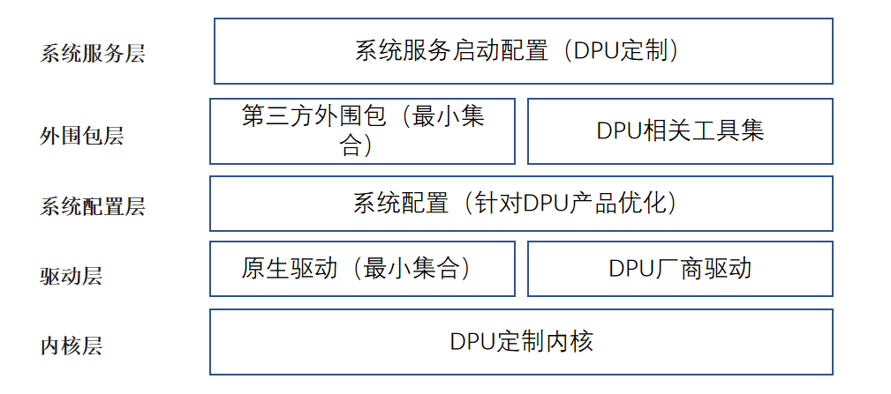

在数据中心及云场景下，摩尔定律失效，通用处理单元 CPU 算力增长速率放缓，而网络 IO 类速率及性能不断攀升，二者增长速率差异形成剪刀差，即当前通用处理器的处理能力无法跟上网络、磁盘等 IO 处理的需求。传统数据中心下越来越多的通用 CPU 算力被 IO 及管理面等处理占用，这部分资源损耗称之为数据中心税（Datacenter Tax）。据 AWS 和 Google Cloud 统计，数据中心税可能占据数据中心算力的 30% 以上，部分场景下甚至可能更多[1][2]。

DPU (Data Processing Unit) 的出现就是为了将这部分算力资源从主机 CPU上解放出来，通过将管理面、网络、存储、安全等能力卸载到专有的处理器芯片上进行处理加速，达成降本增效的结果。目前主流云厂商如 AWS 、阿里云、华为云都通过自研芯片完成管理面及相关数据面的卸载，实现数据中心计算资源 100% 售卖给客户。

DPU 发展非常火热。云厂商及大数据在相关场景下对 DPU 存在较强烈的需求，国内也有很多 DPU 初创公司推出不同的 DPU 产品。在这一背景下，云和大数据等厂商需要考虑如何整合使用不同 DPU 产品，而 DPU 厂商也面临对不同客户交付时设备驱动适配客户指定操作系统的问题。

openEuler 作为国内领先的开源开放操作系统，通过基于 openEuler 构建的 DPU-OS ，解决 DPU 厂商及客户之间的适配问题。除此之外， DPU 上 OS 用于承载部分业务加速的需求，需要对 DPU-OS 进行性能优化加速，可以基于 openEuler 构建 DPU 相关加速能力，内置在 DPU-OS 中，构建 DPU 相关软件生态。

## DPU 现状

DPU 普遍具有以下特点及问题：

* DPU 通用处理能力资源受限
  
  当前 DPU 仍处在发展早期阶段，硬件上仍在不断演进，而且由于 DPU 供电限制，当前硬件规格普遍较低。主流 DPU 中通用处理器 CPU 核数较少，约 8-24 CPU ，且单核处理能力弱。内存大小受限，普遍在 16-32GB 。DPU 本地存储空间为几十到几百 GB 不等。运行于 DPU 之上的操作系统也需要考虑这些限制。
* DPU-OS 安装方式多样
  
  当前 DPU 厂商及产品多种多样，对应操作系统的安装部署方式也不尽相同，包括 PXE 网络安装、U盘安装或其他自定义安装方式（由 HOST 下发安装镜像）。
* DPU 性能需求
  
  DPU 的应用场景决定其对性能有强烈需求。相比于通用服务器操作系统，DPU-OS 可能对内核特性或功能组件有特殊要求，比如用于设备直通热迁移的 vDPA 特性、厂商特定驱动适配支持、DPU 进程的无感卸载特性、定制优化的用户态数据面加速工具如 DPDK/SPDK/OVS、DPU 管理监控相关的工具类组件。

## DPU-OS 需求

针对以上 DPU 现状，提出对 DPU-OS 的需求如下：

* **极致轻量的 DPU-OS 安装包**
  
  通过裁剪 openEuler 系统镜像，减少非必要安装包的空间占用；通过优化系统服务，减少资源底噪开销。
* **裁剪配置及工具支持**
  
  提供裁剪配置及裁剪工具支持，客户或 DPU 厂商可根据各自需求进行定制；openEuler 提供 ISO 参考实现。
* **定制化内核及系统，提供极致性能**
  
  通过定制内核及相关驱动，提供 DPU 竞争力内核特性；定制化加速类组件，使能 DPU 硬件加速能力；优化系统配置提供更优性能；通过 DPU 相关管理控制工具，方便用户统一管理。

## DPU-OS 设计

图1 DPU-OS 整体设计

如图所示，DPU-OS 分为五层设计：

* **内核层**：通过定制内核 config ，裁剪非必需内核特性及模块，达成内核轻量级效果；使能特定内核特性提供高性能 DPU 内核能力。
* **驱动层**：对 openEuler 原生驱动进行裁剪定制，选择最小集合；DPU 厂商相关底层驱动集成，原生支持部分 DPU 硬件产品。
* **系统配置层**：通过对系统 sysctl 、proc 进行配置，为 DPU 相关业务提供最优性能。
* **外围包层**：对 openEuler 外围包进行裁剪定制，选择最小集合；提供 DPU 相关的定制工具集合。
* **系统服务层**：通过优化系统原生服务启动项，减少非必要系统服务运行，保证系统运行时底噪最小化。

通过上述五层设计达成轻量化、极致性能 DPU-OS 的目标。该方案为相对长期设计，且对 DPU 相关软硬件生态有较强的依赖。

当前对 DPU-OS 的实现还处于第一阶段，专注于通过 openEuler imageTailor 工具进行进项裁剪，提供最小化的 DPU-OS 实现。后续规划通过对内核及 DPU 相关组件的定制化修改、配置提供专用 DPU-OS 能力，提供高性能 DPU-OS 。

> **说明**：
> 
> 1. 当前阶段的 DPU-OS 先基于 openEuler 现有内核及外围包，使用镜像裁剪工具 imageTailor 进行裁剪，提供轻量化 OS 安装镜像。后续可根据实际诉求，进行相关内核及外围包特性的开发及集成。
> 2. DPU-OS 的**裁剪步骤**可参考社区文档 DPU-OS 裁剪指导[3]，**验证与部署**可参考 DPU-OS 部署验证[4]。

## 客户声音

### 天翼云

作为 openEuler 的重要合作伙伴，天翼云自身的 CTyunOS 系统脱胎于 openEuler，CTyunOS 目前在 DPU-OS 方面也进行了一些前期的构建与试验工作。包括：

* 基于 CTyunOS3 系统和 sig-DPU 发布的 DPU-OS 组件，构建 x86\_64 和 aarch64 架构的 DPU-OS 镜像。
* 针对 kernel 包根据 DPU 实际要求进行定制（剔除 builtin 的 virtio-pci、virtio-ring 模块等）。
* 镜像中增加定制外围包，如 bash 命令补全、自定义工具、DPU 驱动包等。
* DPU-OS 配置相关组件及服务，联网情况下支持 yum 方式进行包更新升级。

天翼云 DPU 团队在后续的 DPU 2.0 规划里，将全面采用自身的 CTyunOS 系统，主推使用基于 CTyunOS3 构建的 DPU-OS 。相关需求与特性反馈给社区，与 openEuler 协作共建 DPU 软件生态。

### 中科驭数

openEuler 为 DPU 应用发展落地提供良好的土壤，DPU 作为新生事物快速发展。DPU 往往会包含通用 CPU 架构的芯片来处理复杂的控制面逻辑。例如在虚拟化网络体系中，需要 CPU 来运行复杂的网络控制面程序；在网络安全领域，众多不同的安全框架也依赖 CPU 提供基础算力。

而在 CPU 的具体选型上，DPU 产品面临在不同应用场景、不同算力需求下的选择问题。如 x86 可以提供强劲的性能，但是无法和 DPU 芯片做到较好融合；ARM 可以解决上述难题，但是在重应用卸载的场景存在性能问题；RISC-V 在成本与灵活性上能提供最优方案，但是代价是应用场景的适配性不高。总之，在 CPU 的选型上目前还没有最优解。在这种背景下，操作系统的选型至关重要。DPU 厂商在自己的操作系统选型中，往往会优先考虑下面几个问题：

* 稳定与安全性
* 对底层不同架构的适配性
* 可裁剪与灵活性

经过充分的调研论证与测试，中科驭数为自己的 DPU 产品选择 openEuler 作为底层基础操作系统。首先 openEuler 操作系统已经过充分的落地实践考验，在系统稳定性上具有明显优势。其次 openEuler 可以提供完善的工具链支撑，不管是进行业务开发还是系统裁剪，都可以快速高效地完成。最后 openEuler 系统设计之初便考虑到对多样性设备的支持，能够与现有硬件生态紧密融合，极大的降低了 DPU 厂家的研发成本。

得益于 openEuler 系统的出色的工具链支持，中科驭数已经完成第一代 DPU-OS 的裁剪定制开发并在众多客户业务中落地应用。后面中科驭数也将继续深入探索 openEuler 系统，一方面继续深化定制，打造最符合 DPU 应用场景的操作系统。另一方面也将持续为 openEuler 社区贡献自身的力量，助力整个 openEuler 社区繁荣发展。

## 加入我们

sig-DPU 致力于以 openEuler 生态作为底座，打造轻量化、极致性能的 DPU-OS，助力客户及 DPU厂商解决不同板卡与服务之间的兼容性问题。sig-DPU 依托 openEuler 生态，统一 DPU 与 HOST 操作系统底座，提供 DPU 场景定制化特性及组件，打造 DPU 软件生态，更好地发挥其硬件卸载加速能力，进一步释放 DPU 的商业价值。openEuler DPU-OS 已经联合包括天翼云及中科驭数在内多家企业进行验证。

当前 openEuler 社区 sig-DPU 对 DPU-OS 的实现已经开源，可通过 gitee 源码仓地址访问[5]，也可以添加小助手微信，加入sig-DPU 技术交流微信群。欢迎您的围观和加入！

## 参考链接

1. DPU的技术价值与投资前景分析: https://www.icspec.com/news/article-details/1392086?type=prefecture
2. Profiling a warehouse-scale computer: https://ieeexplore.ieee.org/document/7284063
3. DPU-OS 裁剪指导文档：https://gitee.com/openeuler/dpu-utilities/blob/master/dpuos/doc/DPU-OS%E8%A3%81%E5%89%AA%E6%8C%87%E5%AF%BC.md
4. DPU-OS 部署验证文档：https://gitee.com/openeuler/dpu-utilities/blob/master/dpuos/doc/%E9%AA%8C%E8%AF%81%E4%B8%8E%E9%83%A8%E7%BD%B2.md
5. DPU-OS gitee 源码仓：https://gitee.com/openeuler/dpu-utilities/tree/master/dpuos
