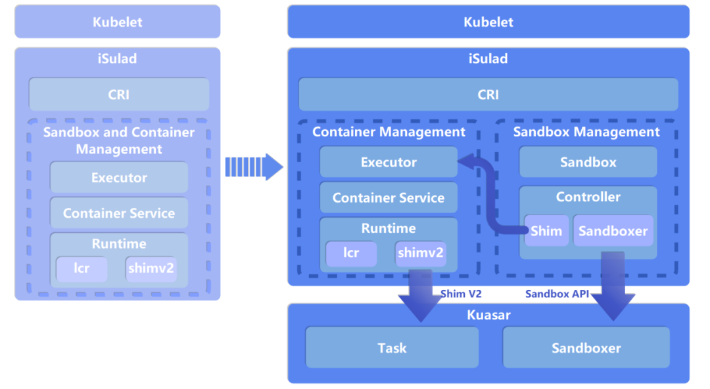
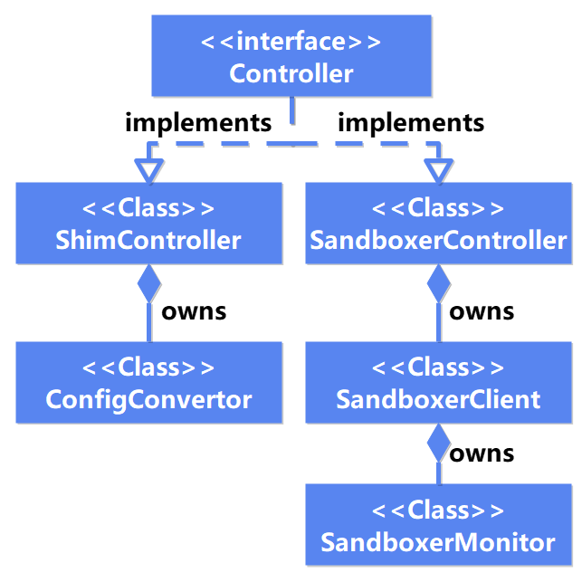
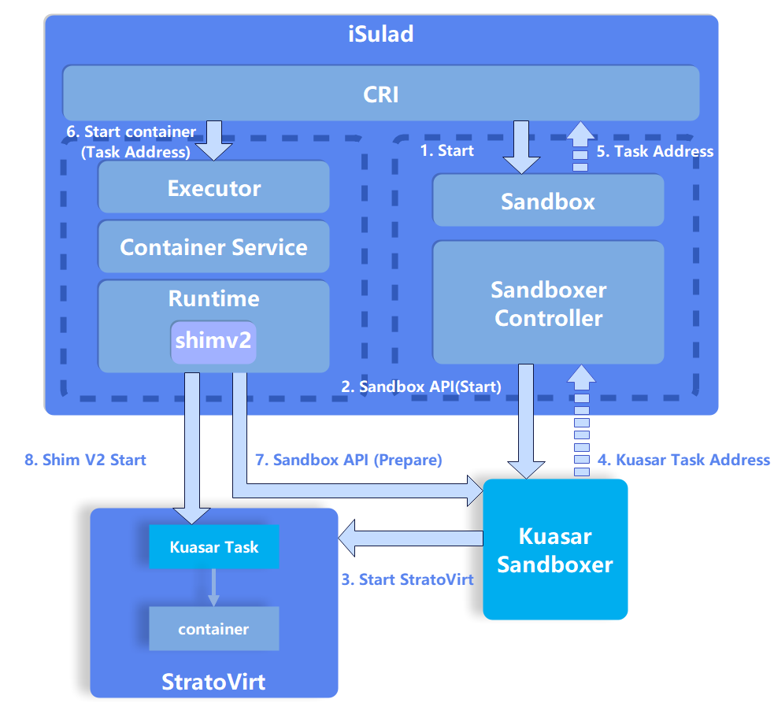

## 背景

沙箱隔离技术是一种将进程隔离到独立环境中运行的技术，可以有效地隔离进程间的相互影响，提高系统的安全性。随着容器技术的兴起，沙箱隔离技术也在云原生领域中得到了广泛的应用。例如容器编排组件 Kubernetes 的最小编排调度单元 Pod Sandbox 实际上是一个沙箱，为其中的容器提供了资源共享和安全隔离的运行环境。

然而，由于容器技术的历史原因，沙箱的概念在容器引擎和容器运行时中没有得到足够的支持。OCI 标准[1]未定义沙箱管理，导致容器引擎和容器运行时只能采用容器管理的方式管理沙箱，引发性能和稳定性问题，具体可参见第一篇 Kuasar 系列文章[2]。

事实上，容器领域一直在深入研究和探索引入沙箱管理接口的问题。举例来说，Containerd 社区于 2022 年 4 月将 Sandbox API 相关功能整合到主线[3]，这一举措对 Containerd 内部沙箱管理逻辑进行了优化。然而，令人遗憾的是，它依然使用 OCI 标准接口来调用容器运行时以管理沙箱。

2023 年 4 月 21 日，华为在 Kubecon+CloudNativeCon Europe 2023 云原生峰会上发布了多沙箱运行时 Kuasar[4]，将沙箱管理逻辑引入了容器运行时。至此，Kuasar 成为第一个支持 Sandbox API 的容器运行时。容器引擎使用 Sandbox API 直接管理沙箱成为了可能。

iSulad[5]也率先通过 Sandbox API 支持 Kuasar，提供高效和稳定的沙箱管理能力。openEuler  23.09 完成对 iSulad+Kuasar+StratoVirt 的集成，为用户提供了一个极速轻量的安全容器解决方案，具体可参见第二篇 Kuasar 系列文章[6]。

## Sandbox API 简介

```
service Controller {
	rpc Create(ControllerCreateRequest) returns (ControllerCreateResponse);
	rpc Start(ControllerStartRequest) returns (ControllerStartResponse);
	rpc Platform(ControllerPlatformRequest) returns (ControllerPlatformResponse);
	rpc Prepare(PrepareRequest) returns (PrepareResponse);
	rpc Purge(PurgeRequest) returns (PurgeResponse);
	rpc UpdateResources(UpdateResourcesRequest) returns (UpdateResourcesResponse);
	rpc Stop(ControllerStopRequest) returns (ControllerStopResponse);
	rpc Wait(ControllerWaitRequest) returns (ControllerWaitResponse);
	rpc Status(ControllerStatusRequest) returns (ControllerStatusResponse);
	rpc Shutdown(ControllerShutdownRequest) returns (ControllerShutdownResponse);
}
```

Sandbox API 的引入解决了容器引擎和容器运行时之间由来已久的痛点问题[2]：

- **引入 Sandbox 语义，增强了云原生架构上的连贯性**
- **削减 shim 进程的冗余，减小资源开销，加快启动速度**
- **缩短调用链，可靠性倍增**
- **消除 Pause 容器冗余**
- **统一沙箱接口使容器运行时支持多沙箱**

#### 生命周期管理

Sandbox API[7] 定义了容器引擎如何与容器运行时交互，其中 Controller Service 定义了沙箱的生命周期管理接口，包括创建 (Create) 、启动 (Start) 、停止 (Stop) 、等待退出 (Wait) 、状态查询 (Status) 、销毁 (Shutdown) 、平台信息查询 (Platform) 等。

通过 Sandbox API，容器引擎能够直接对沙箱进行管理，无需通过 OCI 标准接口间接管理沙箱，提高了容器引擎的性能和稳定性。

#### 资源管理

Sandbox API 还定义了沙箱的资源管理接口，包括资源准备 (Prepare) 、资源清理 (Purge) 、资源更新 (UpdateResources) 等。容器引擎可以通过这些接口管理容器资源，例如在创建容器前准备资源，运行过程中更新资源，容器退出后清理资源。

## iSulad 新架构



**图1. iSulad 架构对比图**

在 Kuasar 发布以后，iSulad 第一时间采用了新的架构以支持 Sandbox API ，使得它能够通过 Kuasar 来直接管理沙箱。

为保持已有版本的兼容性与稳定性，iSulad 只对 CRI V1 版本进行了重构升级，支持用户使用 Sandbox API 管理沙箱。CRI V1alpha 版本继续沿用 OCI 标准来处理沙箱管理请求。

#### 沙箱与容器的解耦

在新的架构中，iSulad 引入了 Sandbox 的语义，新增核心模块 Sandbox ，使其成为容器引擎的一等公民，实现了容器管理与沙箱管理的解耦。**从云原生整体架构的角度看，容器编排组件、容器引擎和容器运行时之间的沙箱管理变得更加流畅和高效，形成了一个完整的沙箱管理链路**。

以 iSulad+Kuasar+StratoVirt 极速轻量的安全容器解决方案为例，iSulad 在北向接收来自 Kubernetes 的 CRI 请求，并创建 Sandbox 对象来处理 PodSandbox 相关调用，同时使用 Executor 模块来处理 CRI 的 Container 请求。在南向，使用 Controller 模块通过 Sandbox API 调用 Kuasar 的 Sandboxer 进程来管理沙箱，同时使用 Runtime 中的 Shim V2 模块来调用 Kuasar 的 Task 进程，实现了对 StratoVirt 虚拟机中容器的管理。

#### 沙箱控制器




**图2. 沙箱控制器类图**

Sandbox API 的实现使 iSulad 能够直接通过 Controller 来管理沙箱，因此 Kuasar 容器运行时也无需创建 Pause 容器以兼容 OCI 标准，**避免了 Pause 容器的冗余**。

在新架构中，Controller 模块的设计充分考虑了对原有沙箱管理功能的兼容性，即支持用户通过Sandbox 和 Controller 模块创建普通容器(Pause 容器)作为沙箱。

如上图所示，Controller 模块对 Sandbox 提供了统一 Controller 接口，以及两种不同的实现：Sandboxer Controller 和 Shim Controller 。

- Sandboxer Controller 是对 Sandbox API 的封装，将用户对沙箱的管理请求通过 gRPC 接口转发给 Kuasar 的 Sandboxer 进程，从而使 Sandboxer 执行底层的沙箱管理逻辑。
- Shim Controller 兼容原有的基于容器管理的接口，将对 Sandbox 的管理请求转发给 Executor 模块，以便创建和管理基于 Pause 容器的沙箱。Shim Controller 的实现使用户能够在新的架构下继续使用 OCI 标准接口来管理沙箱，以兼容原有已部署的业务，确保功能的连续性。

Sandbox 和 Controller 的详细设计可以参见 iSulad 社区的设计文档[8]。

#### 简化容器调用链



**图3. 容器启动流程图**

在支持了 Sandbox API 以后，iSulad 的容器管理流程也发生了一些变化。上图以 iSulad+Kuasar+StratoVirt 解决方案为例，展示了 iSulad 从启动沙箱到启动容器的简化流程。

在图中，Kuasar Task 充当虚拟机中的 init 进程，同时也是虚拟机沙箱内容器的管理进程。它向 iSulad 提供容器管理接口 Task API ，当前解决方案中的 Task API 接口的实现与 Shim V2 类似但又不完全相同。根据 Shim V2 规范，容器引擎会调用一个 Shim V2 的二进制，创建 Shim 进程并返回 Shim 地址，用于管理沙箱、容器和资源。然而，通过调用 Sandbox API，iSulad 不再需要通过 Shim 进程来管理沙箱。相反，Sandbox API 的 Start 接口会在启动沙箱后返回一个 Task 地址，使 iSulad 能够与虚拟机中的 Kuasar Task 进程直接通信，以管理容器的生命周期。**这种设计消除 Shim 进程以减少了管理面的内存开销并缩短调用链，从而提高了整个解决方案的性能和稳定性**。

## 总结

Sandbox API 是 iSulad、Kuasar 和 StratoVirt 这三个组件构成的极速轻量的安全容器解决方案的核心纽带。通过 Sandbox API，容器引擎能够直接对沙箱进行管理，无需通过 OCI 标准接口间接管理沙箱，从而显著提高了容器引擎的性能和稳定性。Sandbox API 的引入，也为容器引擎和容器运行时之间的沙箱管理提供了一个标准化的接口，为容器领域的发展提供了新的可能性。当前 Sandbox API 的实现已经合入了 iSulad 社区的主线，用户可以通过 openEuler 23.09 体验这一全栈自研的极速轻量安全容器解决方案，具体可参见 Kuasar 系列文章[6]。

openEuler 社区一直秉承开放、协作、共赢的理念，欢迎更多的开发者参与到 iSulad、Kuasar 和 StratoVirt 的建设中来，共同推动容器领域的繁荣发展。

## 参考

[1] OCI Runtime Spec: [https://github.com/opencontainers/runtime-spec/tree/main](https://github.com/opencontainers/runtime-spec/tree/main)

[2] iSulad+Kuasar：管理面资源消耗锐减 99% 的新一代统一容器运行时解决方案 ：[https://mp.weixin.qq.com/s/uxpsV2yLVobiuYeaAhA_Lg](https://mp.weixin.qq.com/s/uxpsV2yLVobiuYeaAhA_Lg)

[3] Sandbox API : [https://github.com/containerd/containerd/issues/4131 ](https://github.com/containerd/containerd/issues/4131)

[4] 多沙箱容器运行时 Kuasar 技术揭晓！100% 启动速度提升，99% 内存开销优化 ：[https://mp.weixin.qq.com/s/4L7f8pAlt9KCoyDhkW0mUQ](https://mp.weixin.qq.com/s/4L7f8pAlt9KCoyDhkW0mUQ)

[5] iSulad: [https://gitee.com/openeuler/iSulad](https://gitee.com/openeuler/iSulad)

[6] openEuler 23.09 一键部署基于 Kuasar 的极速轻量安全容器：[https://mp.weixin.qq.com/s/oaK_uF_UGsucH7rczISg-g](https://mp.weixin.qq.com/s/oaK_uF_UGsucH7rczISg-g)

[7] sandbox.proto: [https://github.com/kuasar-io/rust-extensions/blob/main/crates/sandbox/src/protos/sandbox.proto](https://github.com/kuasar-io/rust-extensions/blob/main/crates/sandbox/src/protos/sandbox.proto)

[8] iSulad Sandbox 设计文档：[https://gitee.com/openeuler/iSulad/tree/master/docs/design/detailed/Sandbox](https://gitee.com/openeuler/iSulad/tree/master/docs/design/detailed/Sandbox)

## 加入我们

文中所述的 iSulad、Kuasar 和 StratoVirt 组件，由 CloudNative SIG、Virt SIG 共同参与，相关源码均已在 openEuler 社区开源。如果您对相关技术感兴趣，欢迎您的围观和加入。您可以添加小助手微信，加入对应 SIG 微信群。

